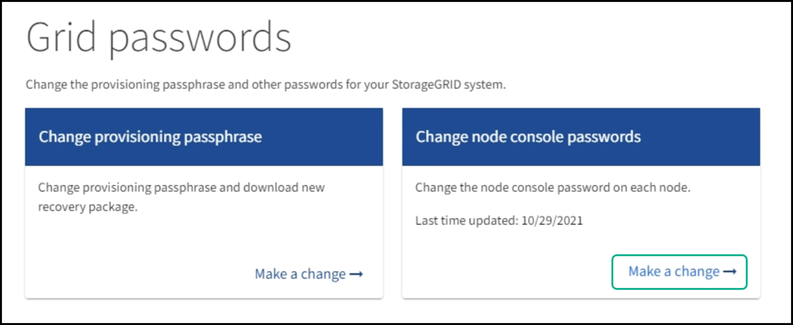
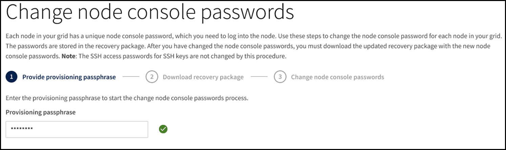

= Cambie las contraseñas de la consola de los nodos
:allow-uri-read: 
:icons: font
:imagesdir: ../media/

[role="lead"]
Cada nodo de su grid tiene una contraseña de consola de nodo única, que necesita iniciar sesión en el nodo. Siga estos pasos para cambiar cada contraseña de la consola de nodos única para cada nodo de la cuadrícula.

.Lo que necesitará
* Ha iniciado sesión en Grid Manager mediante un xref:../admin/web-browser-requirements.adoc[navegador web compatible].
* Tiene el permiso de mantenimiento o acceso raíz.
* Tiene la clave de acceso de aprovisionamiento actual.

.Acerca de esta tarea
Utilice la contraseña de la consola del nodo para iniciar sesión en un nodo como “admin” mediante SSH o en el usuario root en una conexión de la consola física/VM. El proceso de cambiar la contraseña de la consola del nodo crea nuevas contraseñas para cada nodo de la cuadrícula y almacena las contraseñas en una actualización `Passwords.txt` En el paquete de recuperación. Las contraseñas se enumeran en la columna Password del archivo Passwords.txtI.

NOTE: Hay contraseñas de acceso SSH separadas para las claves SSH que se usan para la comunicación entre nodos. Este procedimiento no cambia las contraseñas de acceso SSH.

== Acceda al asistente

. Seleccione *CONFIGURACIÓN* > *Control de acceso* > *contraseñas de cuadrícula*.
+

. Seleccione *hacer un cambio* en *Cambiar contraseñas de consola de nodo*.

== Introduzca la clave de acceso de aprovisionamiento

. Introduzca la clave de acceso de aprovisionamiento.
+

. Seleccione *continuar*.

== Descargue el paquete de recuperación actual

. Seleccione *Descargar paquete de recuperación*.
+
Puede utilizar las contraseñas antiguas del paquete de recuperación actual si se produce un error en el proceso de cambio de contraseña de cualquier nodo.

+
image::../media/node-console-download-current-recovery-package.png[Descargue el paquete de recuperación actual]

. Copie el archivo del paquete de recuperación (.zip) en dos ubicaciones seguras, seguras y independientes.
+

CAUTION: El archivo del paquete de recuperación debe estar protegido porque contiene claves de cifrado y contraseñas que se pueden usar para obtener datos del sistema StorageGRID.

. Seleccione *continuar*.

== Cambie las contraseñas de la consola de los nodos

. Seleccione *Sí* para confirmar que desea cambiar las contraseñas de la consola del nodo.
+
image::../media/node-console-start-passwords-change.png[Iniciar cambio de contraseñas]

+
Al seleccionar *Sí*, se genera un nuevo paquete de recuperación con las nuevas contraseñas. Puede que tarde unos minutos generar el nuevo paquete de recuperación con las nuevas contraseñas.

+
Cuando selecciona *Cancelar*, vuelve a la página anterior.

. Seleccione *Descargar nuevo paquete de recuperación*.
+
image::../media/node-console-download-new-recovery-package.png[Descargar nueva recuperación package.png]

. Cuando finalice la descarga:
+
.. Abra el archivo .zip.
.. Extraiga el contenido del archivo .zip.
.. Confirme que puede abrir el `Passwords.txt` y que el contenido sea legible.

. Copie el nuevo archivo del paquete de recuperación (.zip) en dos ubicaciones seguras, seguras e independientes.
+

CAUTION: No sobrescriba el paquete de recuperación antiguo.

+
Debería ver el `Passwords.txt` si no es posible, elimine el archivo extraído `Passwords.txt` Antes de copiar el paquete de recuperación en las dos ubicaciones seguras independientes. El archivo del paquete de recuperación debe estar protegido porque contiene claves de cifrado y contraseñas que se pueden usar para obtener datos del sistema StorageGRID.

. Active la casilla de verificación para indicar que ha descargado el nuevo paquete de recuperación y que ha verificado el contenido.
. Seleccione *Cambiar contraseñas de la consola del nodo* y espere a que se actualicen todas las contraseñas de los nodos. Esto puede tardar varios minutos.
+
Si se modifican contraseñas para todos los nodos, se muestra un banner verde de éxito. Vaya al paso siguiente.

+
Si se produce un error durante el proceso de actualización, un mensaje de banner enumera la cantidad de nodos que no pudieron cambiar sus contraseñas. El sistema volverá a intentar automáticamente el proceso en cualquier nodo que no haya cambiado su contraseña. Si el proceso finaliza con algunos nodos que aún no han cambiado la contraseña, aparece el botón *Reintentar*.

+
Si la actualización de la contraseña falló para uno o más nodos:

+
.. Revise los mensajes de error que aparecen en la tabla.
.. Resuelva los problemas.
.. Seleccione *Reintentar*.
+

NOTE: Al volver a intentar solo se cambian las contraseñas de la consola de nodos en los nodos que fallaron durante los intentos anteriores de cambio de contraseña.

. Una vez que se hayan cambiado las contraseñas de la consola del nodo para todos los nodos, elimine el antiguo paquete de recuperación.
. Opcionalmente, utilice el enlace *paquete de recuperación* para descargar una copia adicional del nuevo paquete de recuperación.

