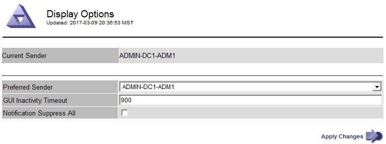

= Cambie el tiempo de espera de la sesión del explorador
:allow-uri-read: 
:icons: font
:imagesdir: ../media/

[role="lead"]
Puede controlar si los usuarios de Grid Manager y de arrendatario Manager han cerrado la sesión si están inactivos durante más de un cierto período de tiempo.

.Lo que necesitará
* Ha iniciado sesión en Grid Manager mediante un xref:../admin/web-browser-requirements.adoc[navegador web compatible].
* Tiene permisos de acceso específicos.

.Acerca de esta tarea
El valor predeterminado de tiempo de espera de inactividad de la interfaz gráfica de usuario es 900 segundos (15 minutos). Si la sesión del explorador de un usuario no está activa durante este período de tiempo, se agota el tiempo de espera de la sesión.

Según sea necesario, puede aumentar o reducir el tiempo de espera mediante la configuración de la opción de visualización tiempo de espera de inactividad de la interfaz gráfica de usuario.

Si se activa el inicio de sesión único (SSO) y se agota el tiempo de espera de la sesión del explorador de un usuario, el sistema se comporta como si el usuario seleccionara *Cerrar sesión* manualmente. El usuario debe volver a introducir sus credenciales de SSO para volver a acceder a StorageGRID. Consulte xref:configuring-sso.adoc[Configurar el inicio de sesión único].

[NOTE]
====
El tiempo de espera de la sesión de usuario también puede controlarse por lo siguiente:

* Temporizador StorageGRID independiente no configurable, que se incluye para la seguridad del sistema. De forma predeterminada, el token de autenticación de cada usuario caduca 16 horas después de que el usuario inicia sesión. Cuando caduca la autenticación de un usuario, ese usuario se cierra automáticamente, incluso si no se ha alcanzado el valor de tiempo de espera de inactividad de la interfaz gráfica de usuario. Para renovar el token, el usuario debe volver a iniciar sesión.
* Se ha agotado el tiempo de espera de la configuración del proveedor de identidades, suponiendo que SSO esté habilitado para StorageGRID.

====
.Pasos
. Seleccione *CONFIGURACIÓN* > *sistema* > *Opciones de pantalla*.
. Para *tiempo de espera de inactividad de la GUI*, introduzca un período de tiempo de espera de 60 segundos o más.
+
Configure este campo en 0 si no desea utilizar esta funcionalidad. Los usuarios se firman 16 horas después de iniciar sesión, cuando caducan sus tokens de autenticación.

+

. Seleccione *aplicar cambios*.
+
La nueva configuración no afecta a los usuarios que han iniciado sesión actualmente. Los usuarios deben iniciar sesión de nuevo o actualizar sus exploradores para que la nueva configuración de tiempo de espera tenga efecto.

