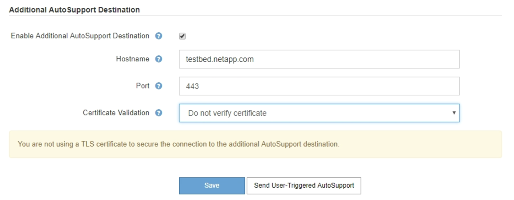

= Configure AutoSupport
:allow-uri-read: 
:icons: font
:imagesdir: ../media/

[role="lead"]
Puede habilitar la función AutoSupport y las opciones individuales de AutoSupport cuando instale StorageGRID por primera vez, o bien puede habilitarlas más adelante.

.Lo que necesitará
* Ha iniciado sesión en Grid Manager mediante un xref:../admin/web-browser-requirements.adoc[navegador web compatible].
* Tiene el permiso acceso raíz u otra configuración de cuadrícula.
* Si utilizará el protocolo HTTPS o HTTP para enviar mensajes AutoSupport, ha proporcionado acceso saliente a Internet al nodo de administración principal, ya sea directamente o mediante un servidor proxy (no se necesitan conexiones entrantes).
* Si usará el protocolo HTTPS o HTTP y desea utilizar un servidor proxy, ya lo tiene xref:configuring-admin-proxy-settings.adoc[Se configuró un servidor proxy de administrador].
* Si utilizará SMTP como protocolo para mensajes de AutoSupport, configuró un servidor de correo SMTP. La misma configuración del servidor de correo se utiliza para las notificaciones de correo electrónico de alarma (sistema heredado).

== Especifique el protocolo para los mensajes de AutoSupport

Puede utilizar cualquiera de los siguientes protocolos para enviar mensajes de AutoSupport:

* *HTTPS*: Es la configuración predeterminada y recomendada para nuevas instalaciones. El protocolo HTTPS utiliza el puerto 443. Si desea habilitar la función AutoSupport On Demand, debe usar el protocolo HTTPS.
* *HTTP*: Este protocolo no es seguro, a menos que se utilice en un entorno de confianza donde el servidor proxy se convierte a HTTPS al enviar datos a través de Internet. El protocolo HTTP utiliza el puerto 80.
* *SMTP*: Utilice esta opción si desea que se envíen mensajes de AutoSupport por correo electrónico. Si utiliza SMTP como protocolo para mensajes AutoSupport, debe configurar un servidor de correo SMTP en la página Configuración de correo electrónico heredado (*SUPPORT* > *Alarmas (heredado)* > *Configuración de correo electrónico heredado*).
+

NOTE: SMTP era el único protocolo disponible para mensajes de AutoSupport antes de la versión de StorageGRID 11.2. Si instaló inicialmente una versión anterior de StorageGRID, es posible que SMTP sea el protocolo seleccionado.

El protocolo configurado se utiliza para enviar todos los tipos de mensajes de AutoSupport.

.Pasos
. Seleccione *SUPPORT* > *Tools* > *AutoSupport*.
+
Aparece la página AutoSupport y la ficha *Configuración* está seleccionada.

+
image::../media/autosupport_settings_tab.png[Página AutoSupport con la ficha Configuración selected.png]

. Seleccione el protocolo que desea utilizar para enviar mensajes de AutoSupport.
. Si seleccionó *HTTPS*, seleccione si desea utilizar un certificado TLS para proteger la conexión con el servidor de soporte de NetApp.
+
** *Utilizar el certificado de soporte de NetApp* (predeterminado): La validación del certificado garantiza la seguridad de la transmisión de mensajes AutoSupport. El certificado de soporte de NetApp ya está instalado con el software StorageGRID.
** *No verificar certificado*: Seleccione esta opción sólo cuando tenga un buen motivo para no utilizar la validación de certificados, como cuando haya un problema temporal con un certificado.

. Seleccione *Guardar*.
+
Todos los mensajes semanales, activados por el usuario y activados por un evento se envían mediante el protocolo seleccionado.

== Desactivar los mensajes semanales de AutoSupport

De manera predeterminada, el sistema StorageGRID se configura para que envíe un mensaje de AutoSupport al soporte de NetApp una vez por semana.

Para determinar cuándo se enviará el mensaje semanal de AutoSupport, vaya a la ficha *AutoSupport* > *resultados*. En la sección *AutoSupport* semanal, consulte el valor de *próxima hora programada*.

image::../media/autosupport_weekly_next_scheduled_time.png[Hora programada siguiente para el AutoSupport semanal]

Puede deshabilitar el envío automático de mensajes semanales de AutoSupport en cualquier momento.

.Pasos
. Seleccione *SUPPORT* > *Tools* > *AutoSupport*.
. Anule la selección de la casilla de verificación *Activar AutoSupport semanal*.
. Seleccione *Guardar*.

== Deshabilite los mensajes de AutoSupport activados por un evento

De forma predeterminada, el sistema StorageGRID se configura para enviar un mensaje de AutoSupport al soporte de NetApp cuando se produce una alerta importante u otro evento significativo del sistema.

Puede deshabilitar los mensajes de AutoSupport activados por eventos en cualquier momento.

NOTE: Los mensajes de AutoSupport activados por los eventos también se suprimen cuando se suprimen las notificaciones de correo electrónico de todo el sistema. (Seleccione *CONFIGURACIÓN* > *sistema* > *Opciones de visualización*. A continuación, seleccione *notificación Suprimir todo*.)

.Pasos
. Seleccione *SUPPORT* > *Tools* > *AutoSupport*.
. Anule la selección de la casilla de verificación *Activar AutoSupport* desencadenado por eventos.
. Seleccione *Guardar*.

== Habilite AutoSupport bajo demanda

AutoSupport On Demand puede ayudar a resolver problemas en los que el soporte técnico está trabajando activamente.

De manera predeterminada, AutoSupport On Demand está deshabilitado. Al habilitar esta función, el soporte técnico puede solicitar que el sistema StorageGRID envíe mensajes de AutoSupport automáticamente. El soporte técnico también puede establecer el intervalo de sondeo para AutoSupport en consultas bajo demanda.

El soporte técnico no puede habilitar o deshabilitar AutoSupport bajo demanda.

.Pasos
. Seleccione *SUPPORT* > *Tools* > *AutoSupport*.
. Seleccione *HTTPS* para el protocolo.
. Active la casilla de verificación *Activar AutoSupport semanal*.
. Active la casilla de verificación *Activar AutoSupport a petición*.
. Seleccione *Guardar*.
+
AutoSupport On Demand está habilitado y el soporte técnico puede enviar solicitudes AutoSupport On Demand a StorageGRID.

== Desactive las comprobaciones de actualizaciones de software

De forma predeterminada, StorageGRID se pone en contacto con NetApp para determinar si hay actualizaciones de software disponibles para su sistema. Si hay disponible una revisión o versión nueva de StorageGRID, se muestra la nueva versión en la página actualización de StorageGRID.

Según sea necesario, puede desactivar opcionalmente la comprobación de actualizaciones de software. Por ejemplo, si el sistema no tiene acceso WAN, debe desactivar la comprobación para evitar errores de descarga.

.Pasos
. Seleccione *SUPPORT* > *Tools* > *AutoSupport*.
. Deseleccione la casilla de verificación *Buscar actualizaciones de software*.
. Seleccione *Guardar*.

== Añada un destino de AutoSupport adicional

Cuando se habilita AutoSupport, se envían mensajes de estado y estado al soporte de NetApp. Puede especificar un destino adicional para todos los mensajes de AutoSupport.

Para comprobar o cambiar el protocolo utilizado para enviar mensajes AutoSupport, consulte las instrucciones a. <<Especifique el protocolo para los mensajes de AutoSupport>>.

NOTE: No se puede utilizar el protocolo SMTP para enviar mensajes de AutoSupport a un destino adicional.

.Pasos
. Seleccione *SUPPORT* > *Tools* > *AutoSupport*.
. Seleccione *Activar destino AutoSupport adicional*.
+
Aparecerán los campos destino AutoSupport adicional.

+

. Introduzca el nombre de host o la dirección IP del servidor de un servidor de destino AutoSupport adicional.
+

NOTE: Puede introducir solo un destino adicional.

. Introduzca el puerto utilizado para conectarse a un servidor de destino AutoSupport adicional (el puerto predeterminado es el 80 para HTTP o el puerto 443 para HTTPS).
. Para enviar los mensajes de AutoSupport con validación de certificados, seleccione *usar paquete de CA personalizado* en el menú desplegable *validación de certificados*. A continuación, realice una de las siguientes acciones:
+
** Utilice una herramienta de edición para copiar y pegar todo el contenido de cada uno de los archivos de certificados de CA codificados con PEM en el campo *paquete de CA*, concatenado en el orden de la cadena de certificados. Debe incluir `----BEGIN CERTIFICATE----` y.. `----END CERTIFICATE----` en su selección.
+
image::../media/autosupport_certificate.png[Certificado AutoSupport]

** Seleccione *examinar*, desplácese hasta el archivo que contiene los certificados y, a continuación, seleccione *Abrir* para cargar el archivo. La validación de certificados garantiza la seguridad de la transmisión de mensajes de AutoSupport.

. Para enviar sus mensajes AutoSupport sin validación de certificados, seleccione *no verificar certificado* en el menú desplegable *validación de certificados*.
+
Seleccione esta opción sólo cuando tenga un buen motivo para no utilizar la validación de certificados, como cuando haya un problema temporal con un certificado.

+
Aparece un mensaje de precaución: "No está utilizando un certificado TLS para garantizar la conexión al destino AutoSupport adicional".

. Seleccione *Guardar*.
+
Todos los futuros mensajes de AutoSupport semanales, activados por un evento y activados por el usuario se enviarán al destino adicional.

