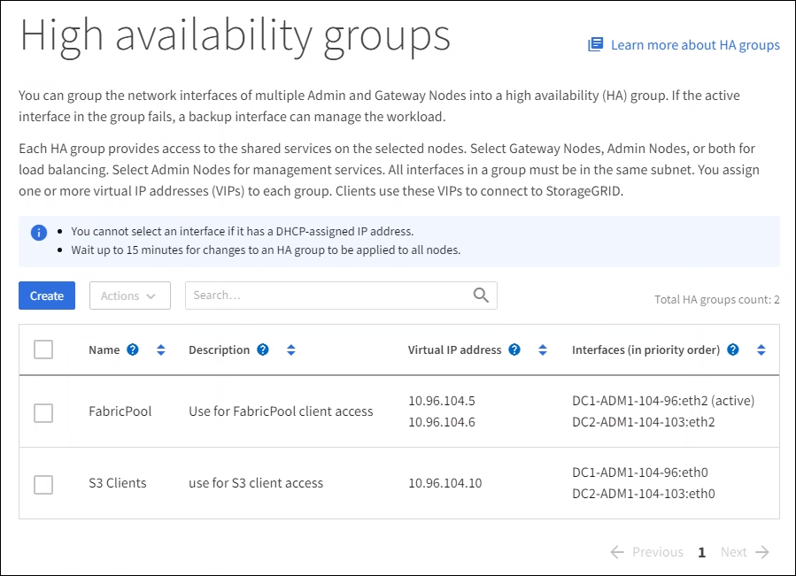

= Configuración de grupos de alta disponibilidad
:allow-uri-read: 
:icons: font
:imagesdir: ../media/

[role="lead"]
Puede configurar grupos de alta disponibilidad para proporcionar acceso de alta disponibilidad a los servicios en nodos de administración o de puerta de enlace.

.Lo que necesitará
* Ha iniciado sesión en Grid Manager mediante un xref:../admin/web-browser-requirements.adoc[navegador web compatible].
* Tiene el permiso acceso raíz.
* Si piensa utilizar una interfaz VLAN en un grupo de alta disponibilidad, ha creado la interfaz VLAN. Consulte xref:../admin/configure-vlan-interfaces.adoc[Configure las interfaces VLAN].
* Si planea utilizar una interfaz de acceso para un nodo en un grupo de alta disponibilidad, ha creado la interfaz:
+
** *Red Hat Enterprise Linux o CentOS (antes de instalar el nodo)*: xref:../rhel/creating-node-configuration-files.adoc[Crear archivos de configuración del nodo]
** *Ubuntu o Debian (antes de instalar el nodo)*: xref:../ubuntu/creating-node-configuration-files.adoc[Crear archivos de configuración del nodo]
** *Linux (después de instalar el nodo)*: xref:../maintain/linux-adding-trunk-or-access-interfaces-to-node.adoc[Linux: Añada tronco o interfaces de acceso a un nodo]
** *VMware (después de instalar el nodo)*: xref:../maintain/vmware-adding-trunk-or-access-interfaces-to-node.adoc[VMware: Añada tronco o interfaces de acceso a un nodo]

== Crear un grupo de alta disponibilidad

Cuando crea un grupo de alta disponibilidad, selecciona una o varias interfaces y las organiza por orden de prioridad. A continuación, debe asignar una o varias direcciones VIP al grupo.

Una interfaz debe ser para que un nodo de puerta de enlace o un nodo de administrador se incluyan en un grupo de alta disponibilidad. Un grupo de alta disponibilidad solo puede usar una interfaz para cualquier nodo concreto; sin embargo, se pueden usar otras interfaces para el mismo nodo en otros grupos de alta disponibilidad.

=== Acceda al asistente

. Seleccione *CONFIGURACIÓN* > *Red* > *grupos de alta disponibilidad*.
. Seleccione *Crear*.

=== Introduzca los detalles del grupo de alta disponibilidad

. Proporcione un nombre único para el grupo de alta disponibilidad.
+
image::../media/ha-group-create-wizard.png[Asistente HA Groups create]

. De forma opcional, puede introducir una descripción para el grupo de alta disponibilidad.
. Seleccione *continuar*.

=== Añada interfaces al grupo de alta disponibilidad

. Seleccione una o varias interfaces para añadirlas a este grupo de alta disponibilidad.
+
Utilice los encabezados de columna para ordenar las filas o introduzca un término de búsqueda para localizar las interfaces más rápidamente.

+
image::../media/ha_group_add_interfaces.png[Interfaces de adición de grupos de ALTA DISPONIBILIDAD]

+

NOTE: Después de crear una interfaz VLAN, espere hasta 5 minutos para que la nueva interfaz aparezca en la tabla.

+
.Directrices para seleccionar interfaces
** Debe seleccionar al menos una interfaz.
** Solo puede seleccionar una interfaz para un nodo.
** Si el grupo ha es para la protección de alta disponibilidad de los servicios Admin Node, que incluyen Grid Manager y el inquilino Manager, seleccione interfaces sólo en nodos de administrador.
** Si el grupo de alta disponibilidad está para la protección de alta disponibilidad de tráfico de cliente S3 o Swift, seleccione interfaces en nodos de administrador, nodos de puerta de enlace o ambos.
** Si el grupo ha es para la protección de alta disponibilidad del servicio CLB obsoleto, seleccione interfaces sólo en nodos de puerta de enlace.
** Si selecciona interfaces en diferentes tipos de nodos, aparece una nota informativa. Se le recuerda que si se produce una conmutación al respaldo, los servicios que proporciona el nodo que antes estaba activo podrían no estar disponibles en el nodo recién activo. Por ejemplo, un nodo de puerta de enlace de respaldo no puede ofrecer protección de alta disponibilidad de los servicios de nodo de administrador. Del mismo modo, un nodo de administrador de backup no puede realizar todos los procedimientos de mantenimiento que proporciona el nodo de administración principal.
** Si no puede seleccionar una interfaz, la casilla de verificación está desactivada. La sugerencia de herramienta proporciona más información.
+
image::../media/vlan_parent_interface_tooltip.png[Sugerencia de la herramienta de interfaz VLAN]

** No puede seleccionar una interfaz si su valor de subred o puerta de enlace entra en conflicto con otra interfaz seleccionada.
** No puede seleccionar una interfaz configurada si no tiene una dirección IP estática.

. Seleccione *continuar*.

=== Determinar el orden de prioridad

. Determine la interfaz principal y cualquier interfaz de backup (conmutación al nodo de respaldo) para este grupo de alta disponibilidad.
+
Arrastre y suelte filas para cambiar los valores de la columna *orden de prioridad*.

+
image::../media/ha_group_determine_failover.png[Los grupos DE ALTA DISPONIBILIDAD determinan el orden de prioridad]

+

IMPORTANT: Si el grupo ha proporciona acceso a Grid Manager, debe seleccionar una interfaz en el nodo de administración principal para que sea la interfaz principal. Algunos procedimientos de mantenimiento solo se pueden realizar desde el nodo de administración principal.

+
La primera interfaz de la lista es la interfaz principal. La interfaz Primary es la interfaz activa a menos que se produzca un fallo.

+
Si el grupo ha incluye más de una interfaz y la interfaz principal falla, las direcciones VIP se mueven a la interfaz de mayor prioridad disponible. Si falla esa interfaz, las direcciones VIP pasan a la siguiente interfaz de mayor prioridad que esté disponible, etc.

. Seleccione *continuar*.

=== Introduzca las direcciones IP

. En el campo *CIDR de subred*, especifique la subred VIP en notación CIDR --una dirección IPv4 seguida de una barra y la longitud de subred (0-32).
+
La dirección de red no debe tener ningún bit de host configurado. Por ejemplo: `192.16.0.0/22`.

+

NOTE: Si utiliza un prefijo de 32 bits, la dirección de red VIP también funciona como dirección de puerta de enlace y dirección VIP.

+
image::../media/ha_group_select_virtual_ips.png[HA Groups entra en VIP]

. De manera opcional, si alguno de los clientes S3, Swift, administrativos o de arrendatario accederá a estas direcciones VIP desde una subred diferente, introduzca la *dirección IP de la puerta de enlace*. La dirección de la puerta de enlace debe estar en la subred VIP.
+
Los usuarios de cliente y administrador utilizarán esta puerta de enlace para acceder a las direcciones IP virtuales.

. Introduzca una o más *direcciones IP virtuales* para el grupo ha. Puede añadir hasta 10 direcciones IP. Todos los VIP deben estar dentro de la subred VIP.
+
Debe proporcionar al menos una dirección IPv4. De manera opcional, es posible especificar direcciones IPv4 e IPv6 adicionales.

. Seleccione *Crear grupo ha* y seleccione *Finalizar*.
+
El grupo ha se ha creado y ahora puede utilizar las direcciones IP virtuales configuradas.

NOTE: Espere hasta 15 minutos para que los cambios en un grupo de alta disponibilidad se apliquen a todos los nodos.

=== Siguientes pasos

Si utilizará este grupo de ha para el equilibrio de carga, cree un extremo de equilibrio de carga para determinar el puerto y el protocolo de red y para conectar los certificados necesarios. Consulte xref:configuring-load-balancer-endpoints.adoc[Configurar puntos finales del equilibrador de carga].

== Editar un grupo de alta disponibilidad

Puede editar un grupo de alta disponibilidad para cambiar su nombre y descripción, agregar o quitar interfaces, cambiar el orden de prioridad o agregar o actualizar direcciones IP virtuales.

Por ejemplo, es posible que deba editar un grupo de alta disponibilidad si desea quitar el nodo asociado a una interfaz seleccionada en un procedimiento de retirada del sitio o nodo.

.Pasos
. Seleccione *CONFIGURACIÓN* > *Red* > *grupos de alta disponibilidad*.
+
La página grupos de alta disponibilidad muestra todos los grupos de alta disponibilidad existentes.

+

. Seleccione la casilla de comprobación del grupo de alta disponibilidad que desea editar.
. Realice una de las siguientes acciones, según lo que desee actualizar:
+
** Seleccione *acciones* > *Editar dirección IP virtual* para agregar o eliminar direcciones VIP.
** Seleccione *acciones* > *Editar grupo ha* para actualizar el nombre o la descripción del grupo, agregar o quitar interfaces, cambiar el orden de prioridad o agregar o quitar direcciones VIP.

. Si ha seleccionado *Editar dirección IP virtual*:
+
.. Actualice las direcciones IP virtuales del grupo de alta disponibilidad.
.. Seleccione *Guardar*.
.. Seleccione *Finalizar*.

. Si ha seleccionado *Editar grupo ha*:
+
.. Si lo desea, actualice el nombre o la descripción del grupo.
.. Opcionalmente, active o anule la selección de las casillas de verificación para agregar o quitar interfaces.
+

NOTE: Si el grupo ha proporciona acceso a Grid Manager, debe seleccionar una interfaz en el nodo de administración principal para que sea la interfaz principal. Algunos procedimientos de mantenimiento solo se pueden realizar desde el nodo de administración principal

.. Opcionalmente, arrastre y suelte filas para cambiar el orden de prioridad de la interfaz primaria y cualquier interfaz de copia de seguridad de este grupo ha.
.. De manera opcional, actualice las direcciones IP virtuales.
.. Seleccione *Guardar* y, a continuación, seleccione *Finalizar*.

NOTE: Espere hasta 15 minutos para que los cambios en un grupo de alta disponibilidad se apliquen a todos los nodos.

== Eliminar un grupo de alta disponibilidad

Puede eliminar uno o varios grupos de alta disponibilidad al mismo tiempo. Sin embargo, no puede eliminar un grupo ha si está enlazado a uno o más extremos de equilibrador de carga.

Para evitar que se produzcan interrupciones en el cliente, actualice las aplicaciones cliente S3 o Swift afectadas antes de quitar un grupo de alta disponibilidad. Actualice cada cliente para que se conecte mediante otra dirección IP, por ejemplo, la dirección IP virtual de un grupo ha diferente o la dirección IP configurada para una interfaz durante la instalación.

.Pasos
. Seleccione *CONFIGURACIÓN* > *Red* > *grupos de alta disponibilidad*.
. Seleccione la casilla de comprobación de cada grupo de alta disponibilidad que desea quitar. A continuación, seleccione *acciones* > *Eliminar grupo ha*.
. Revise el mensaje y seleccione *Eliminar grupo ha* para confirmar su selección.
+
Se eliminan todos los grupos de alta disponibilidad seleccionados. Aparecerá un banner verde de éxito en la página grupos de alta disponibilidad.

