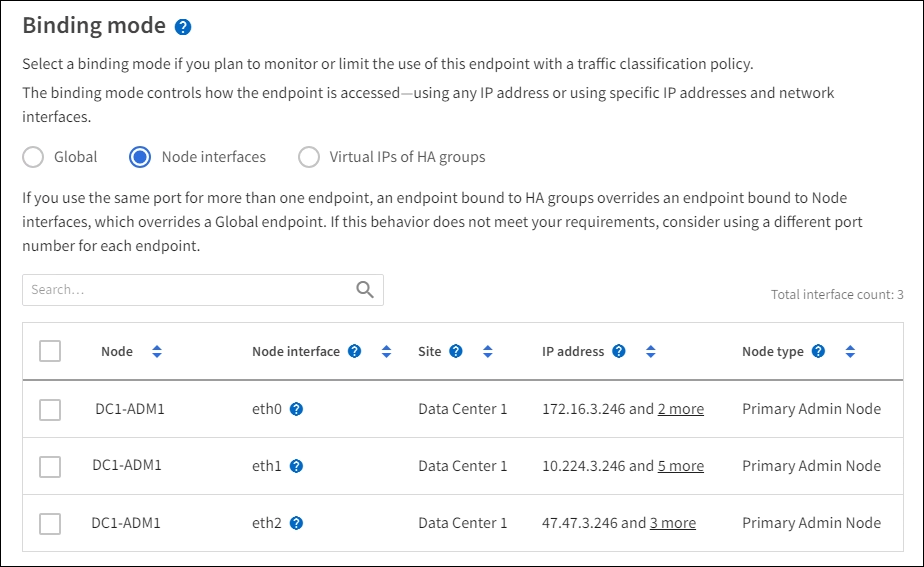

= Configurar puntos finales del equilibrador de carga
:allow-uri-read: 
:icons: font
:imagesdir: ../media/

[role="lead"]
Los extremos de equilibrador de carga determinan los puertos y los protocolos de red que los clientes S3 y Swift pueden utilizar al conectarse al equilibrador de carga StorageGRID en los nodos de puerta de enlace y administración.

.Lo que necesitará
* Ha iniciado sesión en Grid Manager mediante un xref:../admin/web-browser-requirements.adoc[navegador web compatible].
* Tiene el permiso acceso raíz.
* Si anteriormente ha reasignado un puerto que tiene intención de utilizar para el extremo de equilibrio de carga, tiene xref:../maintain/removing-port-remaps.adoc[se ha eliminado el mapa de puertos].
* Ha creado cualquier grupo de alta disponibilidad que desee utilizar. Se recomiendan los grupos de ALTA DISPONIBILIDAD, pero no es obligatorio. Consulte xref:managing-high-availability-groups.adoc[Gestión de grupos de alta disponibilidad].
* Si el punto final del equilibrador de carga será utilizado por xref:../admin/manage-s3-select-for-tenant-accounts.adoc[Inquilinos de S3 para S3 Select], No debe utilizar las direcciones IP ni las FQDN de ningún nodo de configuración básica. Sólo se permiten los dispositivos SG100 o SG1000 y los nodos de software basados en VMware para los extremos de equilibrador de carga utilizados para S3 Select.
* Ha configurado las interfaces VLAN que desea utilizar. Consulte xref:configure-vlan-interfaces.adoc[Configure las interfaces VLAN].
* Si crea un extremo de HTTPS (recomendado), tiene la información del certificado de servidor.
+

NOTE: Los cambios en el certificado de extremo pueden tardar hasta 15 minutos en aplicarse a todos los nodos.

+
** Para cargar un certificado, necesita el certificado de servidor, la clave privada de certificado y, opcionalmente, un bundle de CA.
** Para generar un certificado, se necesitan todos los nombres de dominio y las direcciones IP que utilizarán los clientes S3 o Swift para acceder al extremo. También debe conocer el asunto (nombre distintivo).
** Si desea usar el certificado API de StorageGRID S3 y Swift (que también se puede usar para conexiones directamente a nodos de almacenamiento), ya sustituyó el certificado predeterminado por un certificado personalizado firmado por una autoridad de certificado externa. Consultexref:../admin/configuring-custom-server-certificate-for-storage-node-or-clb.adoc[Configure los certificados API S3 y Swift].
+
El certificado puede utilizar caracteres comodín para representar los nombres de dominio completos de todos los nodos de administración y los nodos de puerta de enlace que ejecutan el servicio Load Balancer. Por ejemplo: `*.storagegrid._example_.com` utiliza el comodín * que se va a representar `adm1.storagegrid._example_.com` y.. `gn1.storagegrid._example_.com`. Consulte xref:configuring-s3-api-endpoint-domain-names.adoc[Configure los nombres de dominio de extremo API de S3].

== Cree un extremo de equilibrador de carga

Cada extremo de equilibrio de carga especifica un puerto, un tipo de cliente (S3 o Swift) y un protocolo de red (HTTP o HTTPS).

=== Acceda al asistente

. Seleccione *CONFIGURACIÓN* > *Red* > *terminales de equilibrador de carga*.
. Seleccione *Crear*.

=== Introduzca los detalles de los extremos

. Introduzca los detalles del extremo.
+
image::../media/load_balancer_endpoint_create_http.png[Crear extremo LB]

+
[cols="1a,3a"]
|===
| Campo | Descripción 

 a| 
Nombre
 a| 
Nombre descriptivo para el punto final, que aparecerá en la tabla de la página Load equilibrer Endpoints.

 a| 
Puerto
 a| 
Los clientes de puertos utilizarán para conectarse al servicio Load Balancer en los nodos de administración y de puerta de enlace.

Acepte el número de puerto sugerido o introduzca cualquier puerto externo que no utilice otro servicio de cuadrícula. Introduzca un valor entre 1 y 65535.

Si introduce *80* o *443*, el punto final sólo se configura en los nodos de puerta de enlace. Estos puertos están reservados en los nodos de administrador.

Consulte xref:../network/index.adoc[Directrices sobre redes] para obtener información acerca de los puertos externos.

 a| 
Tipo de cliente
 a| 
Tipo de aplicación cliente que utilizará este extremo, ya sea *S3* o *Swift*.

 a| 
Protocolo de red
 a| 
El protocolo de red que utilizarán los clientes al conectarse a este extremo.

** Seleccione *HTTPS* para una comunicación segura cifrada con TLS (recomendado). Debe asociar un certificado de seguridad para poder guardar el extremo.
** Seleccione *HTTP* para una comunicación no cifrada y menos segura. Utilice HTTP sólo para una cuadrícula que no sea de producción.

|===
. Seleccione *continuar*.

=== Seleccione el modo de encuadernación

. Seleccione un modo de enlace para que el extremo controle cómo se accede al extremo.
+
[cols="1a,3a"]
|===
| Opción | Descripción 

 a| 
Global (predeterminado)
 a| 
Los clientes pueden acceder al extremo utilizando un nombre de dominio completo (FQDN), la dirección IP de cualquier nodo de puerta de enlace o nodo de administración, o la dirección IP virtual de cualquier grupo de alta disponibilidad de cualquier red.

Utilice el ajuste *Global* (predeterminado) a menos que necesite restringir la accesibilidad de este extremo.

 a| 
Interfaces de nodos
 a| 
Los clientes deben usar la dirección IP de un nodo e interfaz de red seleccionados para acceder a este extremo.

 a| 
IP virtuales de grupos de alta disponibilidad
 a| 
Los clientes deben utilizar una dirección IP virtual de un grupo de alta disponibilidad para acceder a este extremo.

Los extremos con este modo de enlace pueden usar el mismo número de puerto, siempre que los grupos de alta disponibilidad que seleccione para los extremos no se superpongan.

Los extremos con este modo pueden usar el mismo número de puerto siempre que las interfaces que seleccione para los extremos no se superpongan.

|===
+

NOTE: Si utiliza el mismo puerto para más de un extremo, un punto final que utiliza el modo *IP virtuales de grupos de alta disponibilidad* anula un punto final utilizando el modo *interfaces de nodo*, que anula un punto final utilizando el modo *Global*.

. Si ha seleccionado *interfaces de nodo*, seleccione una o más interfaces de nodo para cada nodo de administración o nodo de puerta de enlace que desee asociar con este extremo.
+

. Si ha seleccionado *IP virtuales de grupos ha*, seleccione uno o más grupos ha.
+
image::../media/load_balancer_endpoint_ha_group_vips_binding_mode.png[Endpoint ha Group modo de enlace de VIPS]

. Si está creando un extremo *HTTP*, no necesita adjuntar un certificado. Seleccione *Crear* para agregar el nuevo punto final del equilibrador de carga. A continuación, vaya a. <<After-you-finish,Después de terminar>>. De lo contrario, seleccione *continuar* para adjuntar el certificado.

=== Adjunte el certificado

. Si está creando un extremo *HTTPS*, seleccione el tipo de certificado de seguridad que desea asociar al extremo.
+
El certificado protege las conexiones entre los clientes S3 y Swift y el servicio Load Balancer en los nodos de Admin Node o de Gateway.

+
** *Cargar certificado*. Seleccione esta opción si tiene certificados personalizados para cargar.
** *Generar certificado*. Seleccione esta opción si tiene los valores necesarios para generar un certificado personalizado.
** *Utilice los certificados StorageGRID S3 y Swift*. Seleccione esta opción si desea usar el certificado API global S3 y Swift, que también se puede usar para las conexiones directamente con nodos de almacenamiento.
+
No puede seleccionar esta opción a menos que haya sustituido el certificado API predeterminado S3 y Swift, que está firmado por la CA de grid, con un certificado personalizado firmado por una entidad de certificación externa. Consultexref:../admin/configuring-custom-server-certificate-for-storage-node-or-clb.adoc[Configure los certificados API S3 y Swift].

. Si no utiliza el certificado StorageGRID S3 y Swift, cargue o genere el certificado.
+
[role="tabbed-block"]
====
.Cargue el certificado
--
.. Seleccione *cargar certificado*.
.. Cargue los archivos de certificado de servidor requeridos:
+
*** *Certificado de servidor*: El archivo de certificado de servidor personalizado en codificación PEM.
*** *Clave privada de certificado*: Archivo de clave privada de certificado de servidor personalizado (`.key`).
+

NOTE: Las claves privadas EC deben ser de 224 bits o más. Las claves privadas RSA deben ser de 2048 bits o más.

*** *Paquete CA*: Un único archivo opcional que contiene los certificados de cada entidad emisora de certificados intermedia (CA). El archivo debe contener cada uno de los archivos de certificado de CA codificados con PEM, concatenados en el orden de la cadena de certificados.

.. Expanda *Detalles del certificado* para ver los metadatos de cada certificado que haya cargado. Si cargó un paquete de CA opcional, cada certificado aparece en su propia pestaña.
+
*** Seleccione *Descargar certificado* para guardar el archivo de certificado o seleccione *Descargar paquete de CA* para guardar el paquete de certificados.
+
Especifique el nombre del archivo de certificado y la ubicación de descarga. Guarde el archivo con la extensión `.pem`.

+
Por ejemplo: `storagegrid_certificate.pem`

*** Seleccione *Copiar certificado PEM* o *Copiar paquete de CA PEM* para copiar el contenido del certificado para pegarlo en otro lugar.

.. Seleccione *Crear*. + se crea el punto final del equilibrador de carga. El certificado personalizado se usa en todas las conexiones nuevas posteriores entre los clientes de S3 y Swift y el extremo.

--
.Generar certificado
--
.. Seleccione *generar certificado*.
.. Especifique la información del certificado:
+
*** *Nombre de dominio*: Uno o más nombres de dominio completamente cualificados que se incluirán en el certificado. Utilice un * como comodín para representar varios nombres de dominio.
*** *IP*: Una o varias direcciones IP que se incluirán en el certificado.
*** *Asunto*: X.509 asunto o nombre distinguido (DN) del propietario del certificado.
*** *Días válidos*: Número de días después de la creación que expira el certificado.

.. Seleccione *generar*.
.. Seleccione *Detalles del certificado* para ver los metadatos del certificado generado.
+
*** Seleccione *Descargar certificado* para guardar el archivo de certificado.
+
Especifique el nombre del archivo de certificado y la ubicación de descarga. Guarde el archivo con la extensión `.pem`.

+
Por ejemplo: `storagegrid_certificate.pem`

*** Seleccione *Copiar certificado PEM* para copiar el contenido del certificado para pegarlo en otro lugar.

.. Seleccione *Crear*.
+
Se crea el punto final del equilibrador de carga. El certificado personalizado se usa para todas las conexiones nuevas posteriores entre los clientes de S3 y Swift y este extremo.

--
====

=== [[después de terminar]]después de terminar

. Si utiliza un sistema de nombres de dominio (DNS), asegúrese de que el DNS incluye un registro para asociar el nombre de dominio completo de StorageGRID a cada dirección IP que utilizarán los clientes para realizar conexiones.
+
La dirección IP que introduzca en el registro DNS depende de si se utiliza un grupo de alta disponibilidad de nodos con balanceo de carga:

+
** Si ha configurado un grupo ha, los clientes se conectan a las direcciones IP virtuales de ese grupo ha.
** Si no utiliza un grupo de alta disponibilidad, los clientes se conectan al servicio de equilibrado de carga de StorageGRID mediante la dirección IP de cualquier nodo de puerta de enlace o nodo de administración.
+
También debe asegurarse de que el registro DNS hace referencia a todos los nombres de dominio de extremo requeridos, incluidos los nombres de comodín.

. Proporcione a los clientes S3 y Swift la información necesaria para conectarse al extremo:
+
** Número de puerto
** Nombre de dominio o dirección IP completos
** Los detalles de certificado necesarios

== Ver y editar puntos finales del equilibrador de carga

Puede ver detalles de los extremos de equilibrador de carga existentes, incluidos los metadatos de certificado para un extremo protegido. También puede cambiar el nombre de un extremo o el modo de enlace y actualizar los certificados asociados.

No puede cambiar el tipo de servicio (S3 o Swift), el puerto o el protocolo (HTTP o HTTPS).

* Para ver información básica de todos los puntos finales del equilibrador de carga, revise la tabla de la página puntos finales del equilibrador de carga.
+
image::../media/load_balancer_endpoint_table.png[Tabla de punto final del equilibrador de carga]

* Para ver todos los detalles acerca de un extremo específico, incluidos los metadatos del certificado, seleccione el nombre del extremo en la tabla.
+
image::../media/load_balancer_endpoint_details.png[Detalles del punto final del equilibrador de carga]

* Para editar un punto final, utilice el menú *acciones* de la página puntos finales del equilibrador de carga o la página de detalles de un punto final específico.
+

IMPORTANT: Después de editar un extremo, es posible que deba esperar hasta 15 minutos para que los cambios se apliquen a todos los nodos.

+
[cols="1a, 2a,2a"]
|===
| Tarea | Menú Actions | Detalles 

 a| 
Editar el nombre del extremo
 a| 
.. Seleccione la casilla de verificación del extremo.
.. Seleccione *acciones* > *Editar nombre de punto final*.
.. Introduzca el nuevo nombre.
.. Seleccione *Guardar*.

 a| 
.. Seleccione el nombre del extremo para mostrar los detalles.
.. Seleccione el icono de edición image:../media/icon_edit_tm.png["Icono Editar"].
.. Introduzca el nuevo nombre.
.. Seleccione *Guardar*.

 a| 
Edite el modo de enlace de punto final
 a| 
.. Seleccione la casilla de verificación del extremo.
.. Seleccione *acciones* > *Editar modo de enlace de punto final*.
.. Actualice el modo de enlace según sea necesario.
.. Seleccione *Guardar cambios*.

 a| 
.. Seleccione el nombre del extremo para mostrar los detalles.
.. Seleccione *Editar modo de enlace*.
.. Actualice el modo de enlace según sea necesario.
.. Seleccione *Guardar cambios*.

 a| 
Editar certificado de extremo
 a| 
.. Seleccione la casilla de verificación del extremo.
.. Seleccione *acciones* > *Editar certificado de punto final*.
.. Cargue o genere un nuevo certificado personalizado o comience a usar el certificado global S3 y Swift, según sea necesario.
.. Seleccione *Guardar cambios*.

 a| 
.. Seleccione el nombre del extremo para mostrar los detalles.
.. Seleccione la ficha *Certificado*.
.. Seleccione *Editar certificado*.
.. Cargue o genere un nuevo certificado personalizado o comience a usar el certificado global S3 y Swift, según sea necesario.
.. Seleccione *Guardar cambios*.

|===

== Retire los extremos del equilibrador de carga

Puede eliminar uno o varios puntos finales mediante el menú *acciones* o puede eliminar un único punto final de la página de detalles.

IMPORTANT: Para evitar que se produzcan interrupciones en el cliente, actualice las aplicaciones cliente S3 o Swift afectadas antes de eliminar un extremo de equilibrio de carga. Actualice cada cliente para que se conecte utilizando un puerto asignado a otro extremo de equilibrador de carga. Asegúrese de actualizar también la información de certificado necesaria.

* Para eliminar uno o varios puntos finales:
+
.. En la página Load Balancing, seleccione la casilla de verificación de cada extremo que desee quitar.
.. Seleccione *acciones* > *Quitar*.
.. Seleccione *OK*.

* Para eliminar un extremo de la página de detalles:
+
.. Desde la página Load equilibrador. seleccione el nombre del extremo.
.. Seleccione *Quitar* en la página de detalles.
.. Seleccione *OK*.

