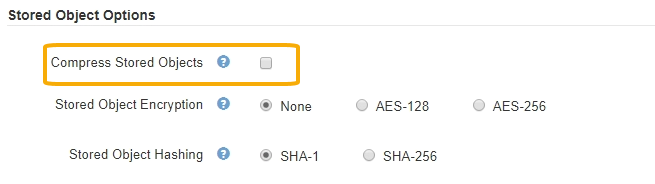

= Configurar la compresión de objetos almacenados
:allow-uri-read: 
:icons: font
:imagesdir: ../media/

[role="lead"]
Puede utilizar la opción de cuadrícula comprimir objetos almacenados para reducir el tamaño de los objetos almacenados en StorageGRID, de modo que los objetos consuman menos espacio de almacenamiento.

.Lo que necesitará
* Ha iniciado sesión en Grid Manager mediante un xref:../admin/web-browser-requirements.adoc[navegador web compatible].
* Tiene permisos de acceso específicos.

.Acerca de esta tarea
La opción de cuadrícula Compress Stored Objects está desactivada de forma predeterminada. Si habilita esta opción, StorageGRID intenta comprimir cada objeto al guardarlo utilizando una compresión sin pérdidas.

NOTE: Si cambia este ajuste, el nuevo ajuste tardará aproximadamente un minuto en aplicarse. El valor configurado se almacena en caché para el rendimiento y el escalado.

Antes de habilitar esta opción, tenga en cuenta lo siguiente:

* No debe activar la compresión a menos que sepa que los datos almacenados son comprimibles.
* Las aplicaciones que guardan objetos en StorageGRID pueden comprimir objetos antes de guardarlos. Si una aplicación cliente ya ha comprimido un objeto antes de guardarlo en StorageGRID, la activación de comprimir objetos almacenados no reducirá aún más el tamaño de un objeto.
* No active la compresión si utiliza FabricPool de NetApp con StorageGRID.
* Si la opción de cuadrícula Compress Stored Objects está habilitada, las aplicaciones cliente S3 y Swift deberían evitar realizar operaciones GET Object que especifiquen un intervalo de bytes que se devolverán. Estas operaciones de «lectura de rango» son ineficientes, ya que StorageGRID debe descomprimir de forma efectiva los objetos para acceder a los bytes solicitados. LAS operaciones GET Object que solicitan un rango pequeño de bytes de un objeto muy grande son especialmente ineficientes; por ejemplo, es ineficiente leer un rango de 10 MB de un objeto comprimido de 50 GB.
+
Si se leen rangos de objetos comprimidos, las solicitudes del cliente pueden tener un tiempo de espera.

+

NOTE: Si necesita comprimir objetos y su aplicación cliente debe utilizar lecturas de rango, aumente el tiempo de espera de lectura de la aplicación.

.Pasos
. Seleccione *CONFIGURACIÓN* > *sistema* > *Opciones de cuadrícula*.
. En la sección Opciones de objeto almacenado , active la casilla de verificación *comprimir objetos almacenados* .
+

. Seleccione *Guardar*.

