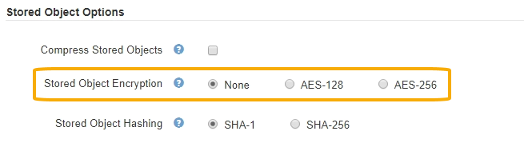

= Configurar el cifrado de objetos almacenados
:allow-uri-read: 
:icons: font
:imagesdir: ../media/

[role="lead"]
Puede cifrar objetos almacenados si desea garantizar que los datos no se puedan recuperar de forma legible si un almacén de objetos está comprometido. De forma predeterminada, los objetos no se cifran.

.Lo que necesitará
* Ha iniciado sesión en Grid Manager mediante un xref:../admin/web-browser-requirements.adoc[navegador web compatible].
* Tiene permisos de acceso específicos.

.Acerca de esta tarea
El cifrado de objetos almacenados permite el cifrado de todos los datos de objetos cuando se ingieren mediante S3 o Swift. Cuando se activa la configuración, todos los objetos recién ingeridos se cifran pero no se realiza ningún cambio en los objetos almacenados existentes. Si deshabilita el cifrado, los objetos cifrados actualmente permanecen cifrados pero los objetos recién ingeridos no se cifran.

NOTE: Si cambia este ajuste, el nuevo ajuste tardará aproximadamente un minuto en aplicarse. El valor configurado se almacena en caché para el rendimiento y el escalado.

Los objetos almacenados se pueden cifrar utilizando el algoritmo de cifrado AES‐128 o AES‐256.

La configuración de cifrado de objetos almacenados se aplica solo a objetos S3 que no se hayan cifrado mediante cifrado a nivel de bloque u objeto.

.Pasos
. Seleccione *CONFIGURACIÓN* > *sistema* > *Opciones de cuadrícula*.
. En la sección Opciones de objeto almacenado, cambie el cifrado de objetos almacenados a *Ninguno* (predeterminado), *AES-128* o *AES-256*.
+

. Seleccione *Guardar*.

