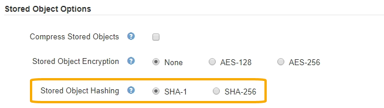

= Configurar los hash de objetos almacenados
:allow-uri-read: 
:icons: font
:imagesdir: ../media/

[role="lead"]
La opción de hash de objetos almacenados especifica el algoritmo de hash utilizado para verificar la integridad del objeto.

.Lo que necesitará
* Ha iniciado sesión en Grid Manager mediante un xref:../admin/web-browser-requirements.adoc[navegador web compatible].
* Tiene permisos de acceso específicos.

.Acerca de esta tarea
De forma predeterminada, los datos de objeto se procesan mediante el algoritmo SHA-1. El algoritmo SHA-256 requiere recursos de CPU adicionales y generalmente no se recomienda para la verificación de integridad.

NOTE: Si cambia este ajuste, el nuevo ajuste tardará aproximadamente un minuto en aplicarse. El valor configurado se almacena en caché para el rendimiento y el escalado.

.Pasos
. Seleccione *CONFIGURACIÓN* > *sistema* > *Opciones de cuadrícula*.
. En la sección Opciones de objeto almacenado, cambie el hash de objetos almacenados a *SHA-1* (predeterminado) o *SHA-256*.
+

. Seleccione *Guardar*.

