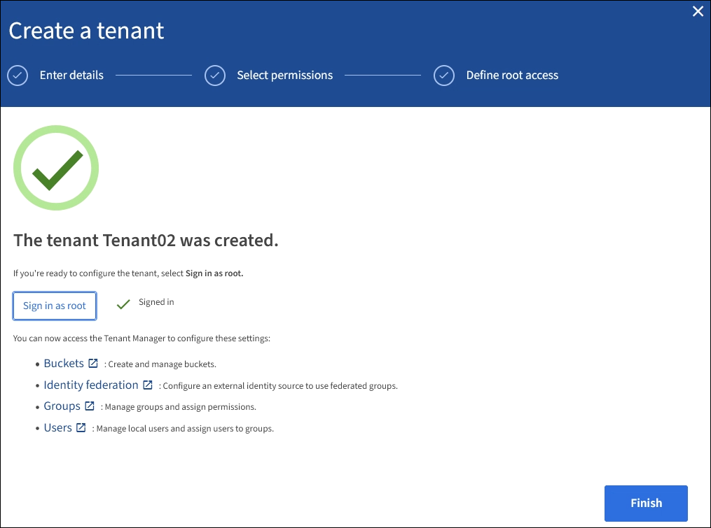

= Cree una cuenta de inquilino
:allow-uri-read: 
:icons: font
:imagesdir: ../media/

[role="lead"]
Debe crear al menos una cuenta de inquilino para controlar el acceso al almacenamiento en su sistema de StorageGRID.

Al crear una cuenta de inquilino, se especifica un nombre, un protocolo de cliente y, opcionalmente, una cuota de almacenamiento. Si se habilitó el inicio de sesión único (SSO) para StorageGRID, también se especifica qué grupo federado tiene permiso de acceso raíz para configurar la cuenta de inquilino. Si StorageGRID no utiliza el inicio de sesión único, también debe especificar si la cuenta de inquilino utilizará su propio origen de identidad y configurar la contraseña inicial para el usuario raíz local del inquilino.

Grid Manager proporciona un asistente que le guía por los pasos para crear una cuenta de arrendatario. Los pasos varían en función de si xref:using-identity-federation.adoc[federación de identidades] y.. xref:configuring-sso.adoc[inicio de sesión único] Están configurados y si la cuenta de Grid Manager que utiliza para crear la cuenta de arrendatario pertenece a un grupo de administración con el permiso acceso raíz.

.Lo que necesitará
* Ha iniciado sesión en Grid Manager mediante un xref:../admin/web-browser-requirements.adoc[navegador web compatible].
* Tiene permisos de acceso específicos.
* Si la cuenta de arrendatario utilizará el origen de identidad configurado para el Administrador de grid y desea otorgar permiso de acceso raíz para la cuenta de arrendatario a un grupo federado, ha importado ese grupo federado en el Gestor de grid. No es necesario asignar ningún permiso de Grid Manager a este grupo de administración. Consulte xref:managing-admin-groups.adoc[instrucciones para administrar grupos de administración].

.Pasos
. Seleccione *ARRENDATARIOS*.
. Seleccione *Crear* e introduzca la siguiente información para el arrendatario:
+
.. *Nombre*: Introduzca un nombre para la cuenta de arrendatario. Los nombres de inquilinos no tienen que ser únicos. Cuando se crea la cuenta de arrendatario, recibe un ID de cuenta numérico único.
.. *Descripción* (opcional): Introduzca una descripción que le ayude a identificar al inquilino.
.. *Tipo de cliente*: Seleccione el tipo de cliente de *S3* o *Swift*.
.. *Cuota de almacenamiento* (opcional): Si desea que este arrendatario tenga una cuota de almacenamiento, introduzca un valor numérico para la cuota y seleccione las unidades correctas (GB, TB o PB).
+
image::../media/tenant_create_wizard_step_1.png[Página de cuentas de inquilino: En blanco]

. Seleccione *continuar* y configure el inquilino S3 o Swift.

[role="tabbed-block"]
====
.Inquilino de S3
--
Seleccione los permisos apropiados para el arrendatario. Algunos de estos permisos tienen requisitos adicionales. Para obtener más detalles, consulte la ayuda en línea de cada permiso.

* Permitir los servicios de plataforma
* Utilizar su propio origen de identidad (seleccionable solo si no se utiliza SSO)
* Permitir selección de S3 (consulte xref:manage-s3-select-for-tenant-accounts.adoc[Gestione S3 Select para cuentas de inquilinos])

--
.Inquilino de Swift
--
Si el inquilino utilizará su propia fuente de identidad, seleccione *usar su propia fuente de identidad* (seleccionable sólo si no se utiliza SSO).

--
====
. Seleccione *continuar* y defina el acceso raíz para la cuenta de arrendatario.

[role="tabbed-block"]
====
.federación de identidades no configurada
--
. Introduzca una contraseña para el usuario raíz local.
. Seleccione *Crear arrendatario*.

--
.SSO habilitado
--
Cuando SSO está habilitado para StorageGRID, el inquilino debe utilizar el origen de identidad configurado para Grid Manager. Ningún usuario local puede iniciar sesión. Especifique qué grupo federado tiene permiso de acceso raíz para configurar la cuenta de inquilino.

. Seleccione un grupo federado existente en Grid Manager para tener el permiso de acceso raíz inicial para el arrendatario.
+

NOTE: Si dispone de los permisos adecuados, se mostrarán los grupos federados existentes del Gestor de grid al seleccionar el campo. De lo contrario, introduzca el nombre exclusivo del grupo.

. Seleccione *Crear arrendatario*.

--
.SSO no está habilitado
--
. Complete los pasos descritos en la tabla en función de si el inquilino gestionará sus propios grupos y usuarios o utilizará el origen de identidad configurado para Grid Manager.
+
[cols="1a,3a"]
|===
| Si el inquilino... | Realice lo siguiente... 

 a| 
Administrar sus propios grupos y usuarios
 a| 
.. Seleccione *usar la propia fuente de identidad*.
+
*Nota*: Si esta casilla de verificación está seleccionada y desea utilizar la federación de identidades para grupos de arrendatarios y usuarios, el arrendatario debe configurar su propio origen de identidad. Consulte xref:../tenant/index.adoc[instrucciones para el uso de cuentas de inquilino].

.. Especifique una contraseña para el usuario raíz local del arrendatario y, a continuación, seleccione *Crear arrendatario*.
.. Seleccione *Iniciar sesión como root* para configurar el arrendatario, o seleccione *Finalizar* para configurar el arrendatario más tarde.

 a| 
Utilice los grupos y usuarios configurados para Grid Manager
 a| 
.. Realice una o ambas de las siguientes acciones:
+
*** Seleccione un grupo federado existente en el Gestor de grid que tenga el permiso de acceso raíz inicial para el arrendatario.
+
*Nota*: Si dispone de los permisos adecuados, los grupos federados existentes de Grid Manager aparecen cuando seleccione el campo. De lo contrario, introduzca el nombre exclusivo del grupo.

*** Especifique una contraseña para el usuario raíz local del inquilino.

.. Seleccione *Crear arrendatario*.

|===

--
====
. Para iniciar sesión en el inquilino ahora:
+
** Si tiene acceso a Grid Manager en un puerto restringido, seleccione *restringido* en la tabla arrendatario para obtener más información sobre cómo acceder a esta cuenta de arrendatario.
+
La dirección URL del administrador de inquilinos tiene el siguiente formato:

+
`https://_FQDN_or_Admin_Node_IP:port_/?accountId=_20-digit-account-id_/`

+
*** `_FQDN_or_Admin_Node_IP_` Es un nombre de dominio completo o la dirección IP de un nodo de administrador
*** `_port_` es el puerto de solo inquilino
*** `_20-digit-account-id_` Es el ID de cuenta único del inquilino

** Si está accediendo a Grid Manager en el puerto 443 pero no ha establecido una contraseña para el usuario raíz local, en la tabla Tenants del Grid Manager, seleccione *Iniciar sesión* e introduzca las credenciales de un usuario en el grupo federado de acceso raíz.
** Si va a acceder a Grid Manager en el puerto 443 y establece una contraseña para el usuario raíz local:
+
... Seleccione *Iniciar sesión como root* para configurar el arrendatario ahora.
+
Al iniciar sesión, aparecen enlaces para configurar bloques o contenedores, federación de identidades, grupos y usuarios.

+

... Seleccione los vínculos para configurar la cuenta de arrendatario.
+
Cada enlace abre la página correspondiente en el Administrador de arrendatarios. Para completar la página, consulte xref:../tenant/index.adoc[instrucciones para el uso de cuentas de inquilino].

... De lo contrario, seleccione *Finalizar* para acceder al arrendatario más adelante.

. Para acceder al inquilino más adelante:
+
[cols="1a,2a"]
|===
| Si está usando... | Realice una de estas... 

 a| 
Puerto 443
 a| 
** En Grid Manager, seleccione *ARRENDATARIOS* y seleccione *Iniciar sesión* a la derecha del nombre del arrendatario.
** Introduzca la URL del inquilino en un navegador web:
+
`https://_FQDN_or_Admin_Node_IP_/?accountId=_20-digit-account-id_/`

+
*** `_FQDN_or_Admin_Node_IP_` Es un nombre de dominio completo o la dirección IP de un nodo de administrador
*** `_20-digit-account-id_` Es el ID de cuenta único del inquilino

 a| 
Un puerto restringido
 a| 
** En Grid Manager, seleccione *ARRENDATARIOS* y seleccione *restringido*.
** Introduzca la URL del inquilino en un navegador web:
+
`https://_FQDN_or_Admin_Node_IP:port_/?accountId=_20-digit-account-id_`

+
*** `_FQDN_or_Admin_Node_IP_` Es un nombre de dominio completo o la dirección IP de un nodo de administrador
*** `_port_` es el puerto restringido solo para inquilinos
*** `_20-digit-account-id_` Es el ID de cuenta único del inquilino

|===

.Información relacionada
* xref:controlling-access-through-firewalls.adoc[Controlar el acceso mediante firewalls]
* xref:manage-platform-services-for-tenants.adoc[Gestione servicios de plataformas para cuentas de inquilinos de S3]

