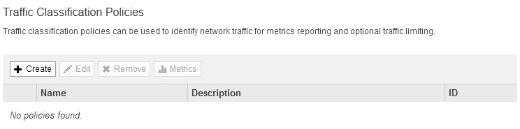
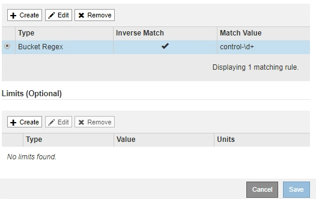
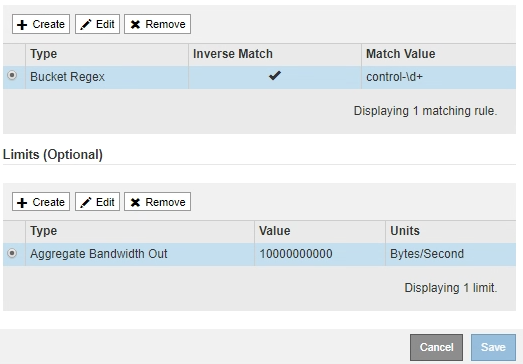

= Cree directivas de clasificación de tráfico
:allow-uri-read: 
:icons: font
:imagesdir: ../media/

[role="lead"]
Cree políticas de clasificación de tráfico si desea supervisar y, opcionalmente, limitar el tráfico de red por bloque, inquilino, subred IP o extremo de equilibrador de carga. De manera opcional, puede establecer límites para una política en función del ancho de banda, el número de solicitudes simultáneas o la tasa de solicitudes.

.Lo que necesitará
* Ha iniciado sesión en Grid Manager mediante un xref:../admin/web-browser-requirements.adoc[navegador web compatible].
* Tiene el permiso acceso raíz.
* Ha creado cualquier punto final de equilibrador de carga que desee que coincida.
* Ha creado los inquilinos que desea que coincidan.

.Pasos
. Seleccione *CONFIGURACIÓN* > *Red* > *Clasificación de tráfico*.
+
Aparece la página Directivas de clasificación del tráfico.

+

. Seleccione *Crear*.
+
Aparece el cuadro de diálogo Crear directiva de clasificación de tráfico.

+
image::../media/traffic_classification_policy_create.png[Directiva de clasificación de tráfico: Crear]

. En el campo *Nombre*, escriba un nombre para la directiva.
+
Introduzca un nombre descriptivo para poder reconocer la política.

. Opcionalmente, agregue una descripción para la directiva en el campo *Descripción*.
+
Por ejemplo, describa a qué se aplica esta política de clasificación del tráfico y a qué se limitará.

. Cree una o varias reglas coincidentes para la política.
+
Las reglas coincidentes controlan qué entidades se verán afectadas por esta directiva de clasificación de tráfico. Por ejemplo, seleccione arrendatario si desea que esta directiva se aplique al tráfico de red de un arrendatario específico. O seleccione Endpoint si desea que esta directiva se aplique al tráfico de red en un extremo de equilibrio de carga específico.

+
.. Seleccione *Crear* en la sección *Reglas coincidentes*.
+
Aparece el cuadro de diálogo Crear regla de coincidencia.

+
image::../media/traffic_classification_policy_create_matching_rule.png[Crear regla de coincidencia]

.. En la lista desplegable *Tipo*, seleccione el tipo de entidad que se incluirá en la regla de coincidencia.
.. En el campo *valor de coincidencia*, escriba un valor de coincidencia basado en el tipo de entidad elegido.
+
*** Bucket: Introduzca un nombre de bloque.
*** Bucket Regex: Introduzca una expresión regular que se utilizará para coincidir con un conjunto de nombres de bloques.
+
La expresión regular no está anclada. Utilice el delimitador {caret} para que coincida al principio del nombre del bloque y utilice el delimitador $ para que coincida al final del nombre.

*** CIDR: Introduzca una subred IPv4, en notación CIDR, que coincida con la subred deseada.
*** Extremo: Seleccione un extremo de la lista de extremos existentes. Estos son los puntos finales de equilibrador de carga definidos en la página de extremos de equilibrador de carga. Consulte xref:configuring-load-balancer-endpoints.adoc[Configurar puntos finales del equilibrador de carga].
*** Inquilino: Seleccione un inquilino de la lista de arrendatarios existentes. La coincidencia de inquilinos se basa en la propiedad del bloque al que se va a acceder. El acceso anónimo a un bloque coincide con el inquilino al que pertenece el bloque.

.. Si desea hacer coincidir todo el tráfico de red _excepto_ que sea coherente con el valor Type and Match que acaba de definir, active la casilla de verificación *Inverse* . De lo contrario, deje la casilla de verificación sin seleccionar.
+
Por ejemplo, si desea que esta directiva se aplique a todos los puntos finales del equilibrador de carga excepto uno, especifique el punto final del equilibrador de carga que se excluirá y seleccione *Inverse*.

+

IMPORTANT: Para una directiva que contiene varios matchers donde al menos uno es un matcher inverso, tenga cuidado de no crear una política que coincida con todas las solicitudes.

.. Seleccione *aplicar*.
+
La regla se crea y se muestra en la tabla Reglas coincidentes.

+

.. Repita estos pasos para cada regla que desee crear para la política.
+

NOTE: El tráfico que coincide con cualquier regla se gestiona mediante la directiva.

. De manera opcional, crear límites para la política.
+

NOTE: Aunque no cree límites, StorageGRID recopila métricas para poder supervisar el tráfico de red que se ajuste a la directiva.

+
.. Seleccione *Crear* en la sección *límites*.
+
Se muestra el cuadro de diálogo Crear límite.

+
image::../media/traffic_classification_policy_create_limit.png[Crear límite]

.. En el menú desplegable *Tipo*, seleccione el tipo de límite que desea aplicar a la directiva.
+
En la siguiente lista, *in* hace referencia al tráfico de clientes S3 o Swift en el equilibrador de carga StorageGRID, y *OUT* hace referencia al tráfico desde el equilibrador de carga a clientes S3 o Swift.

+
*** Ancho de banda del agregado en
*** Ancho de banda del agregado agotado
*** Solicitudes de lectura simultáneas
*** Solicitudes de escritura simultáneas
*** Ancho de banda por solicitud en
*** Ancho de banda por solicitud agotado
*** Tasa de solicitud de lectura
*** Tasa de solicitudes de escritura
+
[NOTE]
====
Puede crear políticas para limitar el ancho de banda agregado o para limitar el ancho de banda por solicitud. Sin embargo, StorageGRID no puede limitar ambos tipos de ancho de banda a la vez. Los límites de ancho de banda agregados pueden imponer un impacto adicional mínimo en el rendimiento en el tráfico no limitado.

====
+
Para los límites de ancho de banda, StorageGRID aplica la política que mejor se adapte al tipo de conjunto de límites. Por ejemplo, si tiene una directiva que limita el tráfico en una sola dirección, entonces el tráfico en la dirección opuesta será ilimitado, aunque haya tráfico que coincida con las directivas adicionales que tengan límites de ancho de banda. StorageGRID implementa coincidencias «mejores» para límites de ancho de banda en el siguiente orden:

+
**** Dirección IP exacta (/máscara 32)
**** Nombre exacto del cucharón
**** Regex. Cucharón
**** Inquilino
**** Extremo
**** Coincidencias CIDR no exactas (no /32)
**** Coincidencias inversas

.. En el campo *valor*, introduzca un valor numérico para el tipo de límite elegido.
+
Las unidades esperadas se muestran cuando se selecciona un límite.

.. Seleccione *aplicar*.
+
El límite se crea y se muestra en la tabla límites.

+

.. Repita estos pasos para cada límite que desee agregar a la directiva.
+
Por ejemplo, si desea crear un límite de ancho de banda de 40 Gbps para un nivel de acuerdo de nivel de servicio, cree un límite de ancho de banda del agregado en el límite y un límite de ancho de banda de agregado en y establezca cada uno de entre 1 y 40 Gbps.

+

NOTE: Para convertir megabytes por segundo a gigabits por segundo, multiplique por ocho. Por ejemplo, 125 MB/s equivale a 1,000 Mbps o 1 Gbps.

. Cuando termine de crear reglas y límites, seleccione *Guardar*.
+
La directiva se guarda y se muestra en la tabla Directivas de clasificación del tráfico.

+
image::../media/traffic_classification_policies_main_screen_w_examples.png[Ejemplo de Directiva de tráfico]

+
El tráfico del cliente S3 y Swift ahora se gestiona de acuerdo con las políticas de clasificación del tráfico. Puede ver los gráficos de tráfico y comprobar que las directivas están aplicando los límites de tráfico que espera. Consulte xref:viewing-network-traffic-metrics.adoc[Ver las métricas de tráfico de red].

