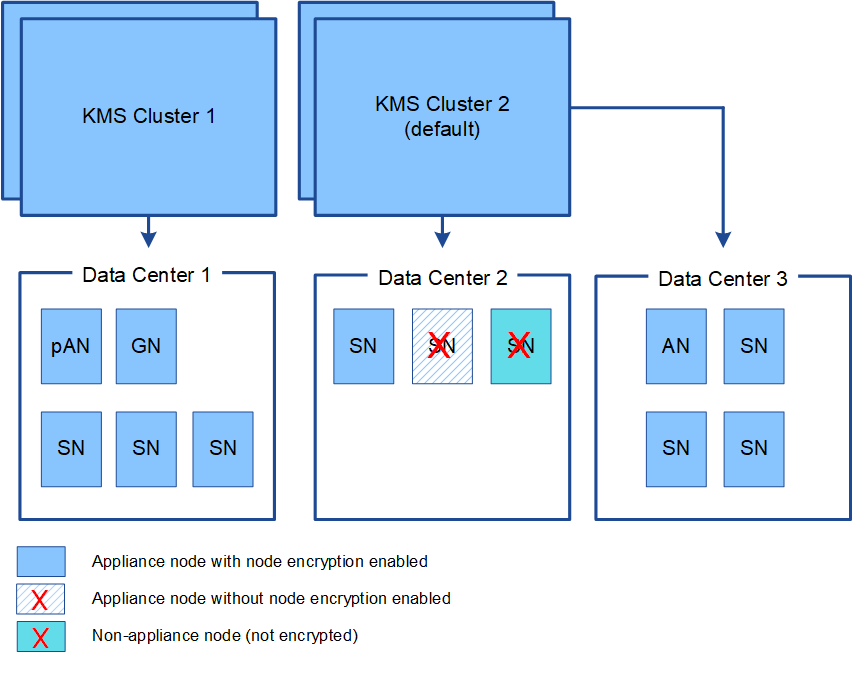

= Consideraciones y requisitos para usar un servidor de gestión de claves
:allow-uri-read: 
:icons: font
:imagesdir: ../media/

[role="lead"]
Antes de configurar un servidor de gestión de claves (KMS) externo, debe comprender las consideraciones y los requisitos.

== ¿Cuáles son los requisitos de KMIP?

StorageGRID admite la versión KMIP 1.4.

http://docs.oasis-open.org/kmip/spec/v1.4/os/kmip-spec-v1.4-os.html["Especificación del protocolo de interoperabilidad de gestión de claves versión 1.4"^]

Las comunicaciones entre los nodos del dispositivo y el KMS configurado utilizan conexiones TLS seguras. StorageGRID admite los siguientes cifrados TLS v1.2 para KMIP:

* TLS_ECDHE_RSA_WITH_AES_256_GCM_SHA384
* TLS_ECDHE_ECDSA_WITH_AES_256_GCM_SHA384

Debe asegurarse de que cada nodo de dispositivo que utilice cifrado de nodo tenga acceso de red al clúster KMS o KMS configurado para el sitio.

La configuración del firewall de red debe permitir que cada nodo del dispositivo se comunique a través del puerto que se utiliza para las comunicaciones del protocolo de interoperabilidad de gestión de claves (KMIP). El puerto KMIP predeterminado es 5696.

== ¿Qué dispositivos son compatibles?

Puede usar un servidor de administración de claves (KMS) para administrar las claves de cifrado de cualquier dispositivo StorageGRID de la cuadrícula que tenga activada la configuración *cifrado de nodos*. Este ajuste solo se puede habilitar durante la fase de configuración de hardware de la instalación del dispositivo mediante el instalador de StorageGRID Appliance.

IMPORTANT: No se puede habilitar el cifrado de nodos después de que se añade un dispositivo a la cuadrícula y no se puede usar la gestión de claves externa en los dispositivos que no tienen el cifrado de nodos habilitado.

Puede usar el KMS configurado para los siguientes dispositivos StorageGRID y nodos de dispositivos:

[cols="1a,1a"]
|===
| Dispositivo | Tipo de nodo 

 a| 
Aplicación de servicios SG1000
 a| 
El nodo de administrador o el nodo de puerta de enlace

 a| 
Servicio de atención al cliente SG100
 a| 
El nodo de administrador o el nodo de puerta de enlace

 a| 
Dispositivo de almacenamiento SG6000
 a| 
Nodo de almacenamiento

 a| 
Dispositivo de almacenamiento SG5700
 a| 
Nodo de almacenamiento

 a| 
Dispositivo de almacenamiento SG5600
 a| 
Nodo de almacenamiento

|===
No puede usar el KMS configurado para nodos basados en software (sin dispositivo), incluidos los siguientes:

* Nodos puestos en marcha como máquinas virtuales (VM)
* Nodos implementados en motores de contenedor en hosts Linux

Los nodos puestos en marcha en estas otras plataformas pueden utilizar el cifrado fuera de StorageGRID a nivel de almacén de datos o disco.

== ¿Cuándo se deben configurar los servidores de gestión de claves?

Para una instalación nueva, normalmente debe configurar uno o más servidores de gestión de claves en Grid Manager antes de crear inquilinos. Este orden garantiza que los nodos estén protegidos antes de que se almacenen datos de objeto en ellos.

Puede configurar los servidores de gestión de claves en Grid Manager antes o después de instalar los nodos de dispositivo.

== ¿Cuántos servidores de gestión de claves necesito?

Puede configurar uno o varios servidores de gestión de claves externos para proporcionar claves de cifrado a los nodos de dispositivos en el sistema StorageGRID. Cada KMS proporciona una única clave de cifrado a los nodos de dispositivos StorageGRID en un único sitio o a un grupo de sitios.

StorageGRID admite el uso de clústeres KMS. Cada clúster de KMS contiene varios servidores de gestión de claves replicados que comparten configuraciones de configuración y claves de cifrado. Se recomienda usar clústeres KMS para la gestión de claves porque mejora las funcionalidades de conmutación por error de una configuración de alta disponibilidad.

Por ejemplo, supongamos que el sistema StorageGRID tiene tres sitios de centro de datos. Podría configurar un clúster KMS para proporcionar una clave a todos los nodos de dispositivos en el centro de datos 1 y un segundo clúster KMS para proporcionar una clave a todos los nodos de dispositivos de los demás sitios. Al agregar el segundo clúster KMS, puede configurar un KMS predeterminado para el Centro de datos 2 y el Centro de datos 3.

Tenga en cuenta que no puede utilizar KMS para nodos que no son de dispositivo ni para los que no tenían activada la configuración de *cifrado de nodos* durante la instalación.

== ¿Qué ocurre cuando se gira una clave?

Como práctica recomendada para la seguridad, debe girar periódicamente la clave de cifrado utilizada por cada KMS configurado.

Al girar la clave de cifrado, utilice el software KMS para pasar de la última versión utilizada de la clave a una nueva versión de la misma clave. No gire a una clave completamente diferente.

CAUTION: Nunca intente girar una clave cambiando el nombre de clave (alias) del KMS en el Gestor de cuadrícula. En su lugar, gire la clave actualizando la versión de la clave en el software KMS. Utilice el mismo alias de clave para las claves nuevas que se usaron para las claves anteriores. Si cambia el alias de clave para un KMS configurado, es posible que StorageGRID no pueda descifrar los datos.

Cuando la nueva versión de clave esté disponible:

* Se distribuye automáticamente a los nodos de dispositivos cifrados del sitio o de los sitios asociados con el KMS. La distribución debe producirse dentro de una hora a partir de la cual se gira la clave.
* Si el nodo de dispositivo cifrado está sin conexión cuando se distribuye la nueva versión de clave, el nodo recibirá la nueva clave en cuanto se reinicie.
* Si la nueva versión de clave no se puede utilizar para cifrar los volúmenes del dispositivo por cualquier motivo, se activa la alerta *error de rotación de clave de cifrado KMS* para el nodo del dispositivo. Es posible que deba ponerse en contacto con el soporte técnico para obtener ayuda para resolver esta alerta.

== ¿Puedo reutilizar un nodo de dispositivo después de cifrar?

Si necesita instalar un dispositivo cifrado en otro sistema StorageGRID, primero debe retirar el nodo grid para mover los datos del objeto a otro nodo. A continuación, puede usar el instalador del dispositivo StorageGRID para borrar la configuración de KMS. Al borrar la configuración KMS se deshabilita la configuración *cifrado de nodos* y se elimina la asociación entre el nodo del dispositivo y la configuración KMS del sitio StorageGRID.

NOTE: Sin acceso a la clave de cifrado KMS, no se puede acceder a los datos que queden en el dispositivo y queden bloqueados de forma permanente.

.Información relacionada
* xref:../sg100-1000/index.adoc[Servicios de aplicaciones SG100 y SG1000]
* xref:../sg6000/index.adoc[Dispositivos de almacenamiento SG6000]
* xref:../sg5700/index.adoc[Dispositivos de almacenamiento SG5700]
* xref:../sg5600/index.adoc[Dispositivos de almacenamiento SG5600]

