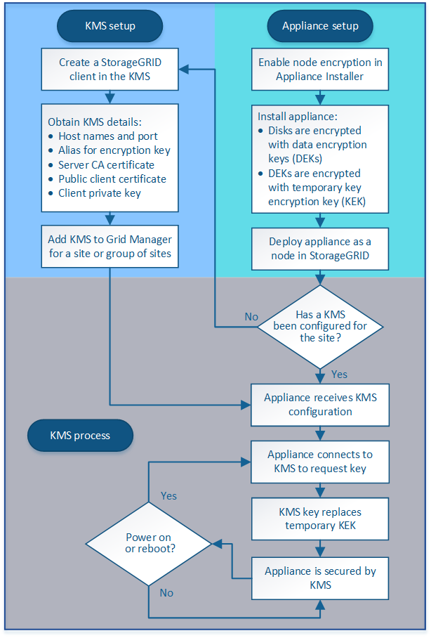

= Información general de la configuración de KMS y dispositivos
:allow-uri-read: 
:icons: font
:imagesdir: ../media/

[role="lead"]
Antes de poder usar un servidor de gestión de claves (KMS) para proteger los datos de StorageGRID en los nodos de los dispositivos, debe completar dos tareas de configuración: Configurar uno o más servidores KMS y habilitar el cifrado de nodos de los nodos de los dispositivos. Cuando estas dos tareas de configuración se completan, el proceso de gestión de claves se realiza de forma automática.

El diagrama de flujo muestra los pasos de alto nivel para usar un KMS para proteger los datos de StorageGRID en los nodos de los dispositivos.

El diagrama de flujo muestra la configuración de KMS y la configuración de dispositivos que se producen en paralelo; sin embargo, puede configurar los servidores de gestión de claves antes o después de habilitar el cifrado de nodos para los nodos de la aplicación nuevos, en función de sus requisitos.

== Configurar el servidor de gestión de claves (KMS)

La configuración de un servidor de gestión de claves incluye los siguientes pasos de alto nivel.

[cols="1a,1a"]
|===
| Paso | Consulte 

 a| 
Acceda al software KMS y añada un cliente para StorageGRID a cada clúster KMS o KMS.
 a| 
xref:kms-configuring-storagegrid-as-client.adoc[Configure StorageGRID como cliente en KMS]

 a| 
Obtenga la información necesaria para el cliente StorageGRID en el KMS.
 a| 
xref:kms-configuring-storagegrid-as-client.adoc[Configure StorageGRID como cliente en KMS]

 a| 
Agregue el KMS al Gestor de cuadrícula, asígnelo a un único sitio o a un grupo predeterminado de sitios, cargue los certificados necesarios y guarde la configuración de KMS.
 a| 
xref:kms-adding.adoc[Añadir un servidor de gestión de claves (KMS)]

|===

== Configure el aparato

La configuración de un nodo de dispositivo para el uso de KMS incluye los siguientes pasos de alto nivel.

. Durante la fase de configuración de hardware de la instalación del dispositivo, utilice el instalador del dispositivo StorageGRID para activar el ajuste *cifrado de nodos* del dispositivo.
+

IMPORTANT: No puede activar el ajuste *cifrado de nodos* después de agregar un dispositivo a la cuadrícula y no puede utilizar la administración de claves externa para dispositivos que no tienen el cifrado de nodos activado.

. Ejecute el instalador del dispositivo StorageGRID. Durante la instalación, se asigna una clave de cifrado de datos aleatoria (DEK) a cada volumen de la cabina, como se indica a continuación:
+
** Los depósitos se utilizan para cifrar los datos en cada volumen. Estas claves se generan utilizando el cifrado de disco de Linux Unified Key Setup (LUKS) en el sistema operativo del dispositivo y no se pueden cambiar.
** Cada DEK individual se cifra mediante una clave de cifrado de clave maestra (KEK). El KEK inicial es una clave temporal que cifra los depósitos hasta que el dispositivo pueda conectarse al KMS.

. Añada el nodo del dispositivo a StorageGRID.

Si quiere más información, consulte lo siguiente:

* xref:../sg100-1000/index.adoc[Servicios de aplicaciones SG100 y SG1000]
* xref:../sg6000/index.adoc[Dispositivos de almacenamiento SG6000]
* xref:../sg5700/index.adoc[Dispositivos de almacenamiento SG5700]
* xref:../sg5600/index.adoc[Dispositivos de almacenamiento SG5600]

== Proceso de cifrado de gestión de claves (se produce automáticamente)

El cifrado de gestión de claves incluye los siguientes pasos de alto nivel que se realizan automáticamente.

. Al instalar un dispositivo con el cifrado de nodos activado en la cuadrícula, StorageGRID determina si existe una configuración KMS para el sitio que contiene el nodo nuevo.
+
** Si ya se ha configurado un KMS para el sitio, el dispositivo recibe la configuración de KMS.
** Si aún no se ha configurado un KMS para el sitio, el KEK temporal continúa encriptado los datos del dispositivo hasta que configura un KMS para el sitio y el dispositivo recibe la configuración de KMS.

. El dispositivo usa la configuración KMS para conectarse al KMS y solicitar una clave de cifrado.
. El KMS envía una clave de cifrado al dispositivo. La nueva clave del KMS sustituye al KEK temporal y ahora se utiliza para cifrar y descifrar los depósitos de los volúmenes del dispositivo.
+

IMPORTANT: Los datos que existan antes de que el nodo del dispositivo cifrado se conecte al KMS configurado se cifran con una clave temporal. Sin embargo, los volúmenes de los dispositivos no se deben considerar protegidos de la eliminación del centro de datos hasta que la clave temporal se sustituya por la clave de cifrado KMS.

. Si el dispositivo está encendido o reiniciado, se vuelve a conectar con el KMS para solicitar la clave. La tecla, que se guarda en la memoria volátil, no puede sobrevivir a una pérdida de energía o un reinicio.

