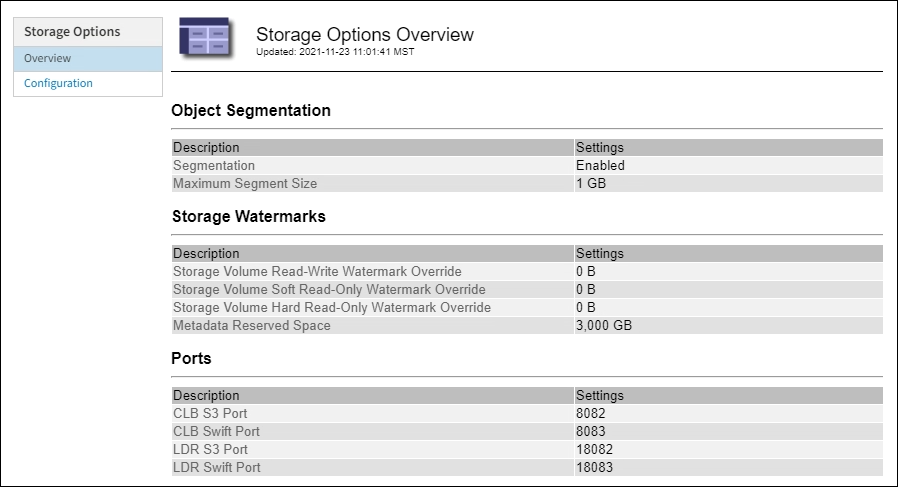

= Gestionar opciones de almacenamiento
:allow-uri-read: 
:icons: font
:imagesdir: ../media/

[role="lead"]
Las opciones de almacenamiento incluyen la configuración de segmentación de objetos, los valores actuales para las marcas de agua del volumen de almacenamiento y la configuración de espacio reservado de metadatos. También es posible ver los puertos S3 y Swift que utiliza el servicio CLB obsoleto en los nodos de puerta de enlace y el servicio LDR en los nodos de almacenamiento.

Para obtener información acerca de las asignaciones de puertos, consulte xref:summary-ip-addresses-and-ports-for-client-connections.adoc[Resumen: Direcciones IP y puertos para conexiones cliente].

