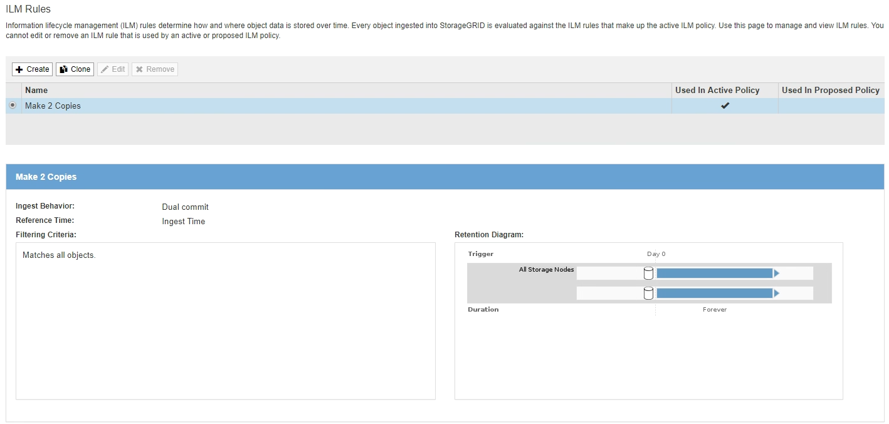

= Acceda al asistente Create ILM Rule
:allow-uri-read: 
:icons: font
:imagesdir: ../media/

[role="lead"]
Las reglas de ILM permiten gestionar la ubicación de los datos de objetos con el tiempo. Para crear una regla de ILM, debe usar el asistente Create ILM Rule.

NOTE: Si crea la regla de ILM predeterminada para una política, utilice este procedimiento en su lugar: xref:creating-default-ilm-rule.adoc[Cree una regla de ILM predeterminada].

.Lo que necesitará
* Ha iniciado sesión en Grid Manager mediante un xref:../admin/web-browser-requirements.adoc[navegador web compatible].
* Tiene permisos de acceso específicos.
* Si desea especificar a qué cuentas de arrendatario se aplica esta regla, tiene el permiso Cuentas de arrendatario o conoce el ID de cuenta de cada cuenta.
* Si desea que la regla filtre objetos en los metadatos del último acceso, las actualizaciones de la hora del último acceso deben habilitarse en bloque para S3 o mediante contenedor para Swift.
* Si crea copias replicadas, debe configurar todos los pools de almacenamiento o los pools de almacenamiento en el cloud que planea utilizar. Consulte xref:creating-storage-pool.adoc[Cree el pool de almacenamiento] y.. xref:creating-cloud-storage-pool.adoc[Cree el pool de almacenamiento en el cloud].
* Si crea copias con código de borrado, configuró un perfil de código de borrado. Consulte xref:creating-erasure-coding-profile.adoc[Cree un perfil de código de borrado].
* Usted está familiarizado con el xref:data-protection-options-for-ingest.adoc[opciones de protección de datos para consumo].
* Si necesita crear una regla conforme para usarla con el bloqueo de objetos S3, ya está familiarizado con la xref:requirements-for-s3-object-lock.adoc[Requisitos para el bloqueo de objetos de S3].
* Opcionalmente, ha visto el vídeo: https://netapp.hosted.panopto.com/Panopto/Pages/Viewer.aspx?id=beffbe9b-e95e-4a90-9560-acc5013c93d8["Vídeo: Reglas de ILM para StorageGRID: Introducción"^].
+
[link=https://netapp.hosted.panopto.com/Panopto/Pages/Viewer.aspx?id=beffbe9b-e95e-4a90-9560-acc5013c93d8]
image::../media/video-screenshot-ilm-rules.png[Vídeo: Reglas de ILM para StorageGRID: Introducción]

.Acerca de esta tarea
Al crear reglas de ILM:

* Considere la topología y las configuraciones de almacenamiento del sistema StorageGRID.
* Considere qué tipos de copias de objetos desea hacer (replicadas o codificadas por borrado) y el número de copias de cada objeto que se necesitan.
* Determinar qué tipos de metadatos de objetos se usan en las aplicaciones que se conectan al sistema StorageGRID. Las reglas de ILM filtran los objetos en función de sus metadatos.
* Considere dónde desea que las copias de objetos se coloquen a lo largo del tiempo.
* Decida qué opción se debe usar para la opción de protección de datos durante el procesamiento (equilibrado, estricto o Dual Commit).

.Pasos
. Seleccione *ILM* > *Reglas*.
+
Aparece la página ILM Rules, con la regla general, haga 2 copias, seleccionada.

+

+

NOTE: La página ILM Rules tiene un aspecto ligeramente diferente si se habilitó la configuración global de bloqueo de objetos S3 para el sistema StorageGRID. La tabla de resumen incluye una columna *compatible* y los detalles de la regla seleccionada incluyen un campo *compatible*.

. Seleccione *Crear*.
+
Aparece el paso 1 (definir datos básicos) del asistente Crear regla de ILM. Utilice la página definir conceptos básicos para definir a qué objetos se aplica la regla.

