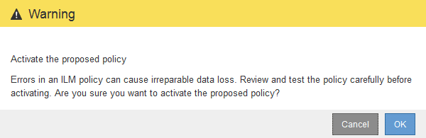

= Active la política de ILM
:allow-uri-read: 
:icons: font
:imagesdir: ../media/

[role="lead"]
Después de añadir reglas de ILM a una política de ILM propuesta, simular la política y confirmar que se comporta como esperaba, está listo para activar la política propuesta.

.Lo que necesitará
* Ha iniciado sesión en Grid Manager mediante un xref:../admin/web-browser-requirements.adoc[navegador web compatible].
* Tiene permisos de acceso específicos.
* Ha guardado y simulado la política de ILM propuesta.

CAUTION: Los errores de un política de ILM pueden provocar la pérdida de datos irrecuperable. Revise y simule cuidadosamente la directiva antes de activarla para confirmar que funcionará según lo previsto.

CAUTION: Cuando se activa una nueva política de ILM, StorageGRID la utiliza para gestionar todos los objetos, incluidos los existentes y los objetos recién procesados. Antes de activar una nueva política de ILM, revise los cambios que se produzcan en la ubicación de los objetos replicados y los códigos de borrado existentes. El cambio de la ubicación de un objeto existente podría dar lugar a problemas temporales de recursos cuando se evalúan e implementan las nuevas colocaciones.

.Acerca de esta tarea
Cuando activa una política de ILM, el sistema distribuye la nueva política a todos los nodos. Sin embargo, es posible que la nueva directiva activa no surta efecto hasta que todos los nodos de grid estén disponibles para recibir la nueva directiva. En algunos casos, el sistema espera a implementar una nueva directiva activa para garantizar que los objetos de la cuadrícula no se eliminen accidentalmente.

* Si realiza cambios en las políticas que aumentan la redundancia o la durabilidad de los datos, estos cambios se implementan de inmediato. Por ejemplo, si activa una nueva política que incluye una regla de tres copias en lugar de una regla de dos copias, dicha política se implementará de forma inmediata porque aumenta la redundancia de datos.
* Si realiza cambios en las políticas que podrían reducir la redundancia o la durabilidad de los datos, dichos cambios no se implementarán hasta que todos los nodos de grid estén disponibles. Por ejemplo, si activa una nueva directiva que utiliza una regla de dos copias en lugar de una regla de tres copias, la nueva directiva se marcará como "'activo'", pero no entrará en vigor hasta que todos los nodos estén en línea y disponibles.

.Pasos
. Cuando esté listo para activar una directiva propuesta, seleccione la directiva en la página políticas de ILM y seleccione *Activar*.
+
Aparecerá un mensaje de advertencia en el que se le pedirá que confirme que desea activar la directiva propuesta.

+

+
Aparece un mensaje en el mensaje de advertencia si la regla predeterminada de la directiva no conserva objetos para siempre. En este ejemplo, el diagrama de retención muestra que la regla predeterminada eliminará objetos después de 2 años. Debe escribir *2* en el cuadro de texto para reconocer que cualquier objeto que no coincida con otra regla de la política se eliminará de StorageGRID después de 2 años.

+
image::../media/ilm_policy_default_rule_not_forever_prompt.png[Regla predeterminada de la política de ILM no siempre preguntar]

. Seleccione *OK*.

.Resultado
Cuando se activa una nueva política de ILM:

* La política se muestra con un estado de política activo en la tabla de la página ILM Policies. La entrada Fecha de inicio indica la fecha y la hora en que se activó la directiva.
+
image::../media/ilm_policies_active_and_historical.gif[Políticas de ILM: Activas e históricas]

* La directiva anteriormente activa se muestra con un estado de directiva histórico. Las entradas Fecha de inicio y Fecha de finalización indican cuándo se ha activado la directiva y cuándo ha dejado de estar en vigor.

.Información relacionada
xref:example-6-changing-ilm-policy.adoc[Ejemplo 6: Cambiar una política de ILM]
