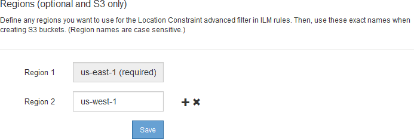

= Configurar regiones (opcional solo S3)
:allow-uri-read: 
:icons: font
:imagesdir: ../media/

[role="lead"]
Las reglas de ILM pueden filtrar objetos en función de las regiones donde se crean bloques S3, lo que permite almacenar objetos de diferentes regiones en distintas ubicaciones de almacenamiento. Si desea usar una región de bloque de S3 como filtro de una regla, primero debe crear las regiones que pueden usar los bloques del sistema.

.Lo que necesitará
* Ha iniciado sesión en Grid Manager mediante un xref:../admin/web-browser-requirements.adoc[navegador web compatible].
* Tiene permisos de acceso específicos.

.Acerca de esta tarea
Al crear un bloque de S3, puede especificar que el bloque se cree en una región determinada. El establecimiento de una región permite que el bloque se aproxime geográficamente a los usuarios, lo que ayuda a optimizar la latencia, minimizar los costes y cumplir con los requisitos normativos.

Cuando se crea una regla de ILM, se recomienda utilizar la región asociada con un bloque de S3 como filtro avanzado. Por ejemplo, puede diseñar una regla que solo se aplique a los objetos en cubos S3 creados en la región US-West-2. Luego, puede especificar que las copias de esos objetos se coloquen en nodos de almacenamiento en un centro de datos dentro de la región para optimizar la latencia.

Al configurar regiones, siga estas directrices:

* De forma predeterminada, se considera que todos los cucharones pertenecen a la región US-East-1.
* Debe crear las regiones mediante Grid Manager para poder especificar una región no predeterminada al crear cubos con el Administrador de inquilinos o la API de Gestión de inquilinos, o con el elemento de solicitud LocationConstraint para las solicitudes de la API PUT Bucket de S3. Se produce un error si una solicitud PUT Bucket utiliza una región que no se ha definido en StorageGRID.
* Debe usar el nombre exacto de la región cuando cree el bloque de S3. Los nombres de región distinguen mayúsculas de minúsculas y deben contener al menos 2 caracteres y no más de 32. Los caracteres válidos son números, letras y guiones.
+

NOTE: No se considera que la UE sea un alias para la ue-oeste-1. Si desea utilizar la región UE o eu-West-1, debe usar el nombre exacto.

* No se puede eliminar ni modificar una región si actualmente se utiliza dentro de la política de ILM activa o la política de ILM propuesta.
* Si la región utilizada como filtro avanzado en una regla de ILM no es válida, todavía es posible agregar esa regla a la directiva propuesta. Sin embargo, se produce un error si intenta guardar o activar la directiva propuesta. (Una región no válida puede resultar si utiliza una región como filtro avanzado en una regla de ILM, pero después la elimina, o si utiliza la API de gestión de grid para crear una regla y especificar una región que no haya definido.)
* Si elimina una región después de utilizarla para crear un bloque de S3, deberá volver a agregar la región si alguna vez desea utilizar el filtro avanzado restricción de ubicaciones para buscar objetos en ese bloque.

.Pasos
. Seleccione *ILM* > *Regiones*.
+
Aparece la página Regiones, con las regiones definidas actualmente en la lista. *Región 1* muestra la región predeterminada, `us-east-1`, que no se puede modificar ni eliminar.

+

. Para agregar una región:
+
.. Seleccione el icono de inserción image:../media/icon_plus_sign_black_on_white.gif["insertar icono"] a la derecha de la última entrada.
.. Introduzca el nombre de una región que desea utilizar al crear bloques de S3.
+
Debe utilizar este nombre de región exacto como elemento de solicitud LocationConstraint al crear el bloque de S3 correspondiente.

. Para eliminar una región no utilizada, seleccione el icono de eliminación image:../media/icon_nms_delete_new.gif["icono de eliminar"].
+
Aparece un mensaje de error si intenta eliminar una región que se utiliza actualmente en la directiva activa o la directiva propuesta.

+
image::../media/ilm_regions_error_message.gif[Mensaje si no se puede eliminar la región]

. Cuando haya terminado de realizar los cambios, seleccione *Guardar*.
+
Ahora puede seleccionar estas regiones en la lista *restricción de ubicaciones* de la página filtro avanzado del asistente Crear regla ILM. Consultexref:using-advanced-filters-in-ilm-rules.adoc[Usar filtros avanzados en las reglas de ILM].

