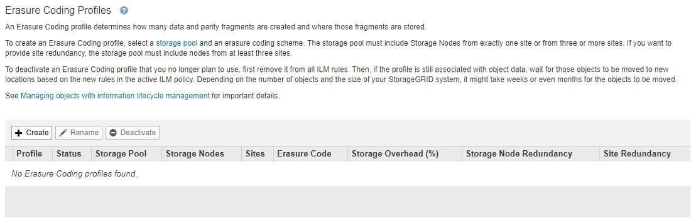
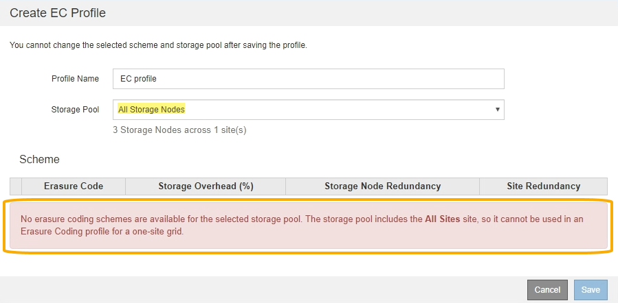
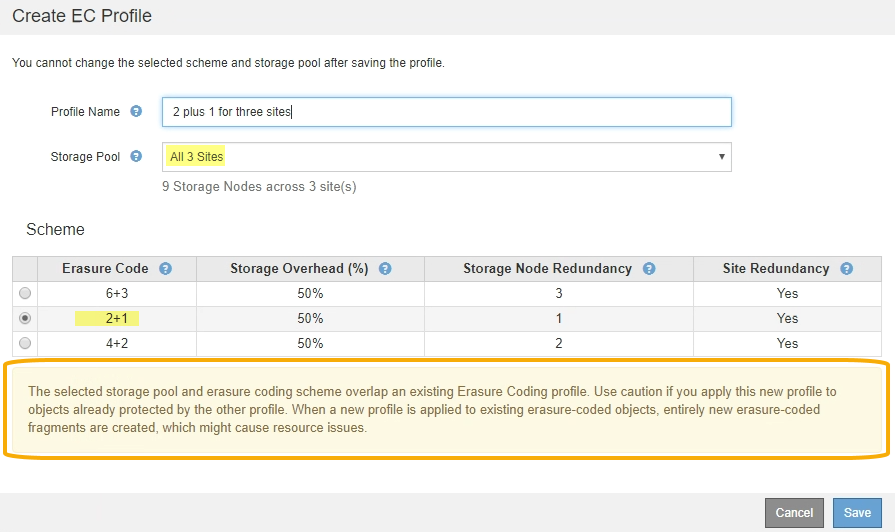

= Cree un perfil de código de borrado
:allow-uri-read: 
:icons: font
:imagesdir: ../media/

[role="lead"]
Para crear un perfil de código de borrado, debe asociar un pool de almacenamiento que contiene nodos de almacenamiento con un esquema de código de borrado. Esta asociación determina el número de fragmentos de datos y de paridad creados y el lugar en el que el sistema distribuye estos fragmentos.

.Lo que necesitará
* Ha iniciado sesión en Grid Manager mediante un xref:../admin/web-browser-requirements.adoc[navegador web compatible].
* Tiene permisos de acceso específicos.
* Ha creado un grupo de almacenamiento que incluye exactamente un sitio o un grupo de almacenamiento que incluye tres o más sitios. No hay esquemas de codificación de borrado disponibles para un pool de almacenamiento que únicamente tenga dos ubicaciones.

.Acerca de esta tarea
Los pools de almacenamiento utilizados en los perfiles de código de borrado deben incluir exactamente un sitio o tres o más. Si desea proporcionar redundancia del sitio, el pool de almacenamiento debe tener al menos tres sitios.

NOTE: Debe seleccionar un pool de almacenamiento que contenga nodos de almacenamiento. No se pueden usar nodos de archivado para los datos codificados mediante borrado.

.Pasos
. Seleccione *ILM* > *codificación de borrado*.
+
Aparece la página Perfiles de código de borrado.

+

. Seleccione *Crear*.
+
Aparece el cuadro de diálogo Crear perfil de EC.

+
image::../media/create_ec_profile_page.png[Crear página de perfil de EC]

. Introduzca un nombre único para el perfil de código de borrado.
+
Los nombres de perfiles de código de borrado deben ser únicos. Se produce un error de validación si utiliza el nombre de un perfil existente, incluso si dicho perfil se ha desactivado.

+

NOTE: El nombre del perfil de código de borrado se anexa al nombre del pool de almacenamiento en la instrucción de ubicación de una regla de ILM.

+
image::../media/storage_pool_and_erasure_coding_profile.png[Nombre del pool de almacenamiento y del perfil de EC]

. Seleccione el pool de almacenamiento que ha creado para este perfil de código de borrado.
+

NOTE: Si el grid incluye actualmente un solo sitio, no podrá utilizar el pool de almacenamiento predeterminado, todos los nodos de almacenamiento o cualquier pool de almacenamiento que incluya el sitio predeterminado, todos los sitios. Este comportamiento impide que el perfil de código de borrado no sea válido si se agrega un segundo sitio.

+

NOTE: Si un pool de almacenamiento incluye exactamente dos sitios, no podrá utilizar ese pool de almacenamiento para codificar el borrado. No hay esquemas de codificación de borrado disponibles para un pool de almacenamiento que tenga dos ubicaciones.

+
Cuando se selecciona un pool de almacenamiento, se muestra la lista de esquemas de codificación de borrado disponibles, según la cantidad de nodos de almacenamiento y sitios del pool.

+
image::../media/create_ec_profile_three_sites.png[Crear perfil EC tres sitios]

+
La siguiente información se incluye para cada esquema de codificación de borrado disponible:

+
** *Código de borrado*: El nombre del esquema de código de borrado en el formato siguiente: Fragmentos de datos + fragmentos de paridad.
** *Gastos generales de almacenamiento (%)*: El almacenamiento adicional necesario para fragmentos de paridad en relación con el tamaño de los datos del objeto. Sobrecarga del almacenamiento = número total de fragmentos de paridad / número total de fragmentos de datos.
** *Redundancia del nodo de almacenamiento*: El número de nodos de almacenamiento que se pueden perder manteniendo la capacidad de recuperar datos del objeto.
** *Redundancia del sitio*: Si el código de borrado seleccionado permite recuperar los datos del objeto si se pierde un sitio.
+
Para admitir la redundancia de sitios, el pool de almacenamiento seleccionado debe incluir varios sitios, cada uno con nodos de almacenamiento suficientes para permitir la pérdida de cualquier sitio. Por ejemplo, para admitir la redundancia del sitio con un esquema de codificación de borrado 6+3, el pool de almacenamiento seleccionado debe incluir al menos tres sitios con al menos tres nodos de almacenamiento en cada sitio.

+
Los mensajes se muestran en estos casos:

+
** El pool de almacenamiento seleccionado no proporciona redundancia de sitio. Se espera el siguiente mensaje cuando el grupo de almacenamiento seleccionado incluye sólo un sitio. Puede utilizar este perfil de código de borrado en reglas de ILM para protegerse contra fallos de nodos.
+
image::../media/create_ec_profile_no_site_redundancy.png[Crear perfil de EC sin redundancia de sitio]

** El pool de almacenamiento seleccionado no cumple con los requisitos de ningún esquema de codificación de borrado. Por ejemplo, se espera el siguiente mensaje cuando el grupo de almacenamiento seleccionado incluye exactamente dos sitios. Si desea utilizar la codificación de borrado para proteger los datos de los objetos, debe seleccionar un pool de almacenamiento con exactamente un sitio o un pool de almacenamiento con tres o más ubicaciones.
+
image::../media/ec_profile_error.png[Error al borrar el perfil de código]

** El grid incluye un solo sitio y seleccionó el pool de almacenamiento predeterminado, todos los nodos de almacenamiento o cualquier pool de almacenamiento que incluya el sitio predeterminado, todos los sitios.
+

** El esquema de codificación de borrado y el pool de almacenamiento seleccionados se superponen con otro perfil de código de borrado.
+

+
En este ejemplo, aparece un mensaje de advertencia porque otro perfil de código de borrado está utilizando el esquema 2+1 y el grupo de almacenamiento del otro perfil también utiliza uno de los sitios del grupo de almacenamiento todos los 3 sitios.

+
Aunque no se le impide crear este nuevo perfil, debe tener mucho cuidado al empezar a utilizarlo en la política de ILM. Si este nuevo perfil se aplica a los objetos existentes con código de borrado ya protegidos por otro perfil, StorageGRID creará un conjunto de fragmentos de objeto completamente nuevo. No reutilizará los fragmentos 2+1 existentes. Los problemas de los recursos se pueden producir al migrar de un perfil de codificación de borrado a otro, aunque los esquemas de codificación de borrado sean los mismos.

. Si se muestra más de un esquema de codificación de borrado, seleccione el que desee utilizar.
+
Al decidir qué esquema de codificación de borrado utilizar, debe equilibrar la tolerancia a fallos (lograda mediante más segmentos de paridad) con los requisitos del tráfico de red en las reparaciones (más fragmentos equivale a más tráfico de red). Por ejemplo, al decidir entre un esquema 4+2 y un esquema 6+3, seleccione el esquema 6+3 si se requiere paridad adicional y tolerancia a fallos. Seleccione el esquema 4+2 si los recursos de red están limitados para reducir el uso de la red durante las reparaciones de nodo.

. Seleccione *Guardar*.

