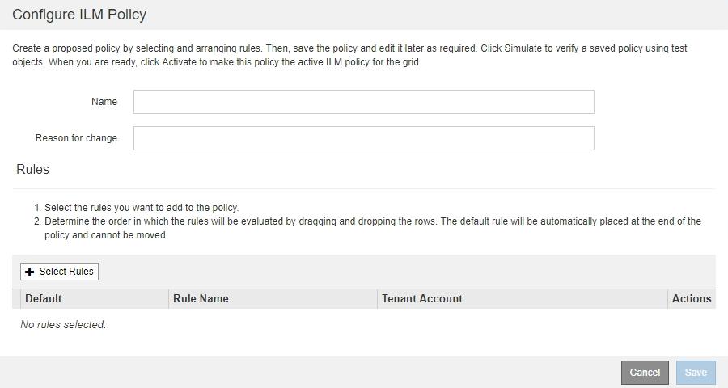

= Cree una política de ILM propuesta
:allow-uri-read: 
:icons: font
:imagesdir: ../media/

[role="lead"]
Puede crear una política de ILM propuesta desde cero o clonar la política activa actual si desea empezar con el mismo conjunto de reglas.

NOTE: Si se habilitó el ajuste global de bloqueo de objetos S3, utilice este procedimiento en su lugar: xref:creating-ilm-policy-after-s3-object-lock-is-enabled.adoc[Cree una política de ILM después de habilitar el bloqueo de objetos de S3].

.Lo que necesitará
* Ha iniciado sesión en Grid Manager mediante un xref:../admin/web-browser-requirements.adoc[navegador web compatible].
* Tiene permisos de acceso específicos.
* Ha creado las reglas de ILM que desea añadir a la política propuesta. Según sea necesario, puede guardar una directiva propuesta, crear reglas adicionales y, a continuación, editar la directiva propuesta para agregar las nuevas reglas.
* Ya tienes xref:creating-default-ilm-rule.adoc[Se ha creado una regla de ILM predeterminada] para la directiva que no contiene ningún filtro.
* Opcionalmente, ha visto el vídeo: https://netapp.hosted.panopto.com/Panopto/Pages/Viewer.aspx?id=c929e94e-353a-4375-b112-acc5013c81c7["Vídeo: Políticas de ILM de StorageGRID"^]
+
[link=https://netapp.hosted.panopto.com/Panopto/Pages/Viewer.aspx?id=c929e94e-353a-4375-b112-acc5013c81c7]
image::../media/video-screenshot-ilm-policies.png[Vídeo: Políticas de ILM de StorageGRID]

.Acerca de esta tarea
Algunos de los motivos típicos para crear una política de ILM propuesta son:

* Ha añadido un sitio nuevo y debe utilizar nuevas reglas de ILM para colocar objetos en dicho sitio.
* Se está decomisionando un sitio y es necesario eliminar todas las reglas que hacen referencia al sitio.
* Se ha agregado un nuevo inquilino que tiene requisitos especiales de protección de datos.
* Comenzó a utilizar un pool de almacenamiento en el cloud.

IMPORTANT: Utilice la política integrada del sistema, la directiva de copias base 2, sólo en sistemas de prueba. La regla hacer 2 copias de esta política utiliza el pool de almacenamiento todos los nodos de almacenamiento, que contiene todos los sitios. Si su sistema StorageGRID tiene más de un sitio, es posible que se coloquen dos copias de un objeto en el mismo sitio.

.Pasos
. Seleccione *ILM* > *políticas*.
+
Aparece la página ILM Policies. En esta página puede revisar la lista de políticas propuestas, activas e históricas; crear, editar, o elimine una política propuesta; clone la política activa o vea los detalles de cualquier política.

+
image::../media/ilm_policies_page.gif[Políticas de ILM]

. Determine cómo desea crear la política de ILM propuesta.
+
[cols="1a,2a"]
|===
| Opción | Pasos 

 a| 
Cree una nueva directiva propuesta que no tenga reglas ya seleccionadas
 a| 
.. Si actualmente existe una política ILM propuesta, seleccione esa política y seleccione *Quitar*.
+
No puede crear una nueva directiva propuesta si ya existe una propuesta.

.. Seleccione *Crear directiva propuesta*.

 a| 
Crear una directiva propuesta basada en la política activa
 a| 
.. Si actualmente existe una política ILM propuesta, seleccione esa política y seleccione *Quitar*.
+
No puede clonar la política activa si ya existe una política propuesta.

.. Seleccione la directiva activa de la tabla.
.. Seleccione *Clonar*.

 a| 
Edite la directiva propuesta existente
 a| 
.. Seleccione la directiva propuesta en la tabla.
.. Seleccione *Editar*.

|===
+
Se muestra el cuadro de diálogo Configurar política de ILM.

+
Si va a crear una nueva directiva propuesta, todos los campos estarán en blanco y no se seleccionará ninguna regla.

+

+
Si va a clonar la directiva activa, el campo *Nombre* muestra el nombre de la directiva activa, adjunto por un número de versión ("'v2'" en el ejemplo). Las reglas utilizadas en la directiva activa se seleccionan y se muestran en su orden actual.

+
image::../media/ilm_policies_version.gif[Versión de políticas de ILM]

. Introduzca un nombre único para la directiva propuesta en el campo *Nombre*.
+
Debe introducir al menos 1 y no más de 64 caracteres. Si clona la política activa, puede utilizar el nombre actual con el número de versión añadido o puede introducir un nuevo nombre.

. Introduzca el motivo por el que está creando una nueva directiva propuesta en el campo *motivo del cambio*.
+
Debe introducir al menos 1 y no más de 128 caracteres.

. Para agregar reglas a la directiva, seleccione *Seleccionar reglas*.
+
Aparece el cuadro de diálogo Seleccionar reglas para la directiva, con todas las reglas definidas en la lista. Si está clonando una política:

+
** Se seleccionan las reglas que utiliza la política que se está clonando.
** Si la política que está clonando usa reglas sin filtros que no sean la regla predeterminada, se le solicitará que elimine todas las reglas, excepto una de ellas.
** Si la regla predeterminada utiliza un filtro o la hora de referencia no corriente, se le solicitará que seleccione una nueva regla predeterminada.
** Si la regla predeterminada no era la última regla, un botón le permite mover la regla al final de la nueva directiva.
+
image::../media/ilm_policies_select_rules_for_policy.png[Políticas de ILM Seleccione reglas para la política]

. Seleccione un nombre de regla o el icono más detalles image:../media/icon_nms_more_details.gif["icono para más detalles"] para ver la configuración de esa regla.
+
Este ejemplo muestra los detalles de una regla de ILM que realiza dos copias replicadas en dos sitios.

+
image::../media/ilm_rule_summary_page.png[Página de resumen de reglas de ILM]

. En la sección *Seleccionar regla predeterminada*, seleccione una regla predeterminada para la directiva propuesta.
+
La regla predeterminada se aplica a cualquier objeto que no coincida con otra regla de la política. La regla predeterminada no puede utilizar ningún filtro y siempre se evalúa en último lugar.

+

NOTE: Si no aparece ninguna regla en la sección Select Default Rule, debe salir de la página de la política de ILM y. xref:creating-default-ilm-rule.adoc[Cree una regla de ILM predeterminada].

+

IMPORTANT: No utilice la regla convertir 2 copias en stock como regla predeterminada para una directiva. La regla make 2 copies utiliza un único pool de almacenamiento, todos los nodos de almacenamiento, que contiene todos los sitios. Si su sistema StorageGRID tiene más de un sitio, es posible que se coloquen dos copias de un objeto en el mismo sitio.

. En la sección *Seleccionar otras reglas*, seleccione cualquier otra regla que desee incluir en la directiva.
+
Las demás reglas se evalúan antes de la regla predeterminada y deben utilizar al menos un filtro (cuenta de inquilino, nombre de bloque, filtro avanzado o tiempo de referencia no corriente).

. Cuando haya terminado de seleccionar reglas, seleccione *aplicar*.
+
Se muestran las reglas seleccionadas. La regla predeterminada está al final, con las demás reglas encima.

+
image::../media/ilm_policies_selected_rules.png[Reglas seleccionadas de ILM]

+
[NOTE]
====
Aparece una advertencia si la regla predeterminada no conserva objetos para siempre. Al activar esta política, debe confirmar que desea que StorageGRID elimine objetos cuando transcurra las instrucciones de colocación de la regla predeterminada (a menos que un ciclo de vida de bloque mantenga los objetos durante más tiempo).

image::../media/ilm_policy_default_rule_not_forever.png[Regla predeterminada de la política de ILM no siempre]

====
. Arrastre y suelte las filas de las reglas no predeterminadas para determinar el orden en el que se evaluarán estas reglas.
+
No se puede mover la regla predeterminada.

+

IMPORTANT: Debe confirmar que las reglas de ILM se encuentran en el orden correcto. Cuando se activa la directiva, las reglas del orden indicado evalúan los objetos nuevos y existentes, empezando por la parte superior.

. Según sea necesario, seleccione el icono de eliminación image:../media/icon_nms_delete_new.gif["icono de eliminar"] Para eliminar cualquier regla que no desee en la directiva o seleccione *Seleccionar reglas* para agregar más reglas.
. Cuando haya terminado, seleccione *Guardar*.
+
La página ILM Policies se actualiza:

+
** La política que ha guardado se muestra como propuesta. Las políticas propuestas no tienen fechas de inicio y finalización.
** Los botones *Simulate* y *Activate* están activados.
+
image::../media/ilm_policy_proposed_policy_saved.png[Se ha guardado la política propuesta de ILM]

. Vaya a. xref:simulating-ilm-policy.adoc[Simule una política de gestión de la vida útil].

.Información relacionada
* xref:what-ilm-policy-is.adoc[Qué es una política de ILM]
* xref:managing-objects-with-s3-object-lock.adoc[Gestione objetos con S3 Object Lock]

