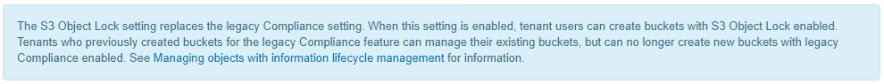

= Habilite el bloqueo de objetos de S3 globalmente
:allow-uri-read: 
:icons: font
:imagesdir: ../media/

[role="lead"]
Si una cuenta de inquilino de S3 tiene que cumplir con los requisitos de normativa al guardar datos de objetos, debe habilitar el bloqueo de objetos de S3 para todo el sistema StorageGRID. Al habilitar el ajuste global de bloqueo de objetos de S3, cualquier usuario inquilino de S3 puede crear y gestionar bloques y objetos con S3 Object Lock.

.Lo que necesitará
* Tiene el permiso acceso raíz.
* Ha iniciado sesión en Grid Manager mediante un xref:../admin/web-browser-requirements.adoc[navegador web compatible].
* Ha revisado el flujo de trabajo de bloqueo de objetos de S3 y debe comprender estas consideraciones.
* La regla predeterminada de la política de ILM activa es compatible.
+
** xref:creating-default-ilm-rule.adoc[Cree una regla de ILM predeterminada]
** xref:creating-ilm-policy.adoc[Cree una política de ILM]

.Acerca de esta tarea
Un administrador de grid debe habilitar la configuración global de bloqueo de objetos S3 para permitir a los usuarios inquilinos crear nuevos bloques con el bloqueo de objetos S3 habilitado. Una vez que este ajuste está activado, no se puede desactivar.

NOTE: Si habilitó la opción de cumplimiento global mediante una versión anterior de StorageGRID, la opción de bloqueo de objetos S3 se habilita en StorageGRID 11.6. Puede seguir utilizando StorageGRID para gestionar la configuración de los bloques compatibles existentes; sin embargo, no puede crear nuevos bloques compatibles. Consulte https://["Base de conocimientos de NetApp: Cómo gestionar bloques heredados que cumplen con la normativa StorageGRID 11.5"^].

.Pasos
. Seleccione *CONFIGURACIÓN* > *sistema* > *S3 Object Lock*.
+
Se muestra la página S3 Object Lock Settings.

+
image::../media/s3_object_lock_global_setting.png[Configuración global de bloqueo de objetos de S3]

+
Si ha habilitado la configuración de cumplimiento global con una versión anterior de StorageGRID, la página incluye la siguiente nota:

+

. Seleccione *Activar el bloqueo de objetos S3*.
. Seleccione *aplicar*.
+
Aparece un cuadro de diálogo de confirmación que le recuerda que no puede deshabilitar el bloqueo de objetos S3 después de estar activado.

+
image::../media/s3_object_lock_global_setting_confirm.png[Confirmación de la configuración global del bloqueo de objetos de S3]

. Si está seguro de que desea activar de forma permanente el bloqueo de objetos S3 para todo el sistema, seleccione *Aceptar*.
+
Al seleccionar *Aceptar*:

+
** Si la regla predeterminada de la política de ILM activa es compatible, el bloqueo de objetos S3 ahora está habilitado para toda la cuadrícula y no puede deshabilitarse.
** Si la regla predeterminada no es compatible, aparece un error que indica que debe crear y activar una nueva política de ILM que incluya una regla de cumplimiento como regla predeterminada. Seleccione *Aceptar*, cree una nueva directiva propuesta, simule y actívela.
+
image::../media/s3_object_lock_global_setting_error.gif[Error de configuración global de bloqueo de objetos de S3]

.Después de terminar
Después de habilitar la configuración global de bloqueo de objetos S3, es posible que deba hacerlo xref:../ilm/creating-default-ilm-rule.adoc[cree una regla predeterminada] eso es compatible y. xref:creating-ilm-policy-after-s3-object-lock-is-enabled.adoc[Cree una política de ILM] eso es conforme. Una vez activada la configuración, la política de ILM puede incluir de manera opcional una regla predeterminada que cumpla las normativas y una regla predeterminada que no sea compatible. Por ejemplo, puede que desee usar una regla no conforme a la normativa que no tenga filtros para los objetos de los bloques que no tengan habilitado el bloqueo de objetos S3.

.Información relacionada
* xref:managing-objects-with-s3-object-lock.adoc#comparing-s3-object-lock-to-legacy-compliance[Compare el bloqueo de objetos de S3 con el cumplimiento de normativas heredado]

