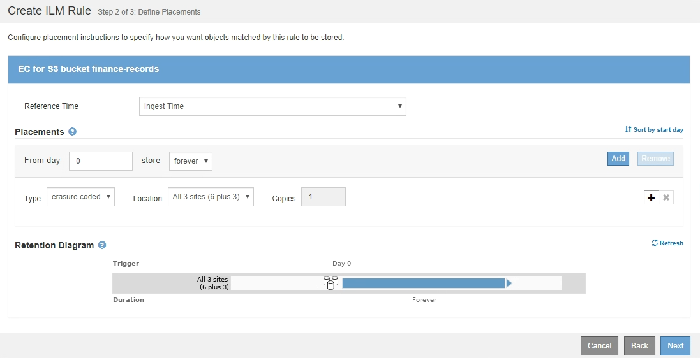

= Ejemplo 1: Reglas de ILM y políticas para el almacenamiento de objetos
:allow-uri-read: 
:icons: font
:imagesdir: ../media/

[role="lead"]
Es posible usar las siguientes reglas y políticas de ejemplo como punto de inicio al definir una política de ILM para cumplir con los requisitos de retención y protección de objetos.

CAUTION: Las siguientes reglas y políticas de ILM son solo ejemplos. Existen varias formas de configurar las reglas de ILM. Antes de activar una nueva directiva, simule la política propuesta para confirmar que funcionará con el fin de proteger el contenido de las pérdidas.

== Regla 1 de ILM, por ejemplo 1: Copiar datos de objetos en dos centros de datos

Esta regla de ILM de ejemplo copia los datos de objetos en dos pools de almacenamiento en dos centros de datos.

[cols="1a,2a"]
|===
| Definición de regla | Valor de ejemplo 

 a| 
Pools de almacenamiento
 a| 
Dos pools de almacenamiento, cada uno en centros de datos diferentes, llamados Storage Pool DC1 y Storage Pool DC2.

 a| 
Nombre de regla
 a| 
Dos copias dos centros de datos

 a| 
Tiempo de referencia
 a| 
Tiempo de ingesta

 a| 
Colocación del contenido
 a| 
El día 0, mantenga dos copias replicadas para siempre: Una en el DC1 del pool de almacenamiento y otra en el DC2 del pool de almacenamiento.

|===
image::../media/ilm_rule_two_copies_two_data_centers.png[Regla 1 de ILM, por ejemplo 1: Copiar datos de objetos en dos centros de datos]

== Regla 2 de ILM por ejemplo 1: Perfil de código de borrado con coincidencia de bloques

Esta regla de ILM de ejemplo utiliza un perfil de código de borrado y un bloque de S3 para determinar dónde y cuánto tiempo se almacena el objeto.

[cols="1a,2a"]
|===
| Definición de regla | Valor de ejemplo 

 a| 
Perfil de código de borrado
 a| 
* Un único pool de almacenamiento en tres centros de datos (los 3 sitios)
* Utilice un esquema de codificación de borrado de 6+3

 a| 
Nombre de regla
 a| 
EC para registros financieros de bloques de S3

 a| 
Tiempo de referencia
 a| 
Tiempo de ingesta

 a| 
Colocación del contenido
 a| 
Para los objetos del bloque de S3 denominados registros financieros, cree una copia con código de borrado en el pool especificado por el perfil de código de borrado. Guarde esta copia para siempre.

|===

== Política de ILM, por ejemplo 1

El sistema StorageGRID permite diseñar políticas de ILM sofisticadas y complejas; sin embargo, en la práctica, la mayoría de las políticas de ILM son simples.

Una política de ILM típica de una topología de varios sitios puede incluir reglas de ILM como las siguientes:

* Durante la ingesta, use la codificación de borrado 6+3 para almacenar todos los objetos que pertenecen al bloque de S3 denominado `finance-records` en tres centros de datos.
* Si un objeto no coincide con la primera regla de ILM, utilice la regla de ILM predeterminada de la política, dos copias de dos centros de datos, para almacenar una copia de ese objeto en dos centros de datos, DC1 y DC2.
+
image::../media/policy_1_configured_policy.png[Política de ILM, por ejemplo 1]

