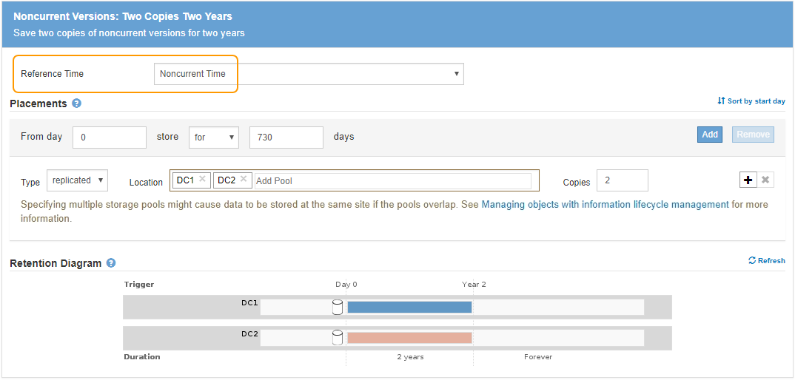

= Ejemplo 4: Reglas de ILM y políticas para objetos con versiones de S3
:allow-uri-read: 
:icons: font
:imagesdir: ../media/

[role="lead"]
Si tiene un bloque de S3 con el control de versiones activado, puede gestionar las versiones de objetos no actuales incluyendo reglas en su política de ILM que utilicen *tiempo no corriente* como tiempo de referencia.

Como se muestra en este ejemplo, puede controlar la cantidad de almacenamiento que utilizan los objetos con versiones utilizando instrucciones de colocación diferentes para las versiones de objetos no actuales.

CAUTION: Las siguientes reglas y políticas de ILM son solo ejemplos. Existen varias formas de configurar las reglas de ILM. Antes de activar una nueva directiva, simule la política propuesta para confirmar que funcionará con el fin de proteger el contenido de las pérdidas.

NOTE: Si crea políticas de ILM para gestionar versiones de objetos no actuales, tenga en cuenta que debe conocer el UUID o el CBID de la versión del objeto para simular la política. Para buscar el UUID y el CBID de un objeto, utilice Búsqueda de metadatos de objetos mientras el objeto sigue estando actualizado. Consulte xref:verifying-ilm-policy-with-object-metadata-lookup.adoc[Comprobar una política de ILM con la búsqueda de metadatos de objetos].

.Información relacionada
* xref:how-objects-are-deleted.adoc[Cómo se eliminan los objetos]

== Regla 1 de ILM, por ejemplo 4: Guarde tres copias durante 10 años

Esta regla de ILM de ejemplo almacena una copia de cada objeto en tres centros de datos durante 10 años.

Esta regla se aplica a todos los objetos, con o sin versiones.

[cols="1a,2a"]
|===
| Definición de regla | Valor de ejemplo 

 a| 
Pools de almacenamiento
 a| 
Tres pools de almacenamiento, cada uno en centros de datos diferentes, denominados DC1, DC2 y DC3.

 a| 
Nombre de regla
 a| 
Tres copias diez años

 a| 
Tiempo de referencia
 a| 
Tiempo de ingesta

 a| 
Colocación del contenido
 a| 
En el día 0, guarde tres copias replicadas durante 10 años (3,652 días), una en CD1, una en DC2 y una en CD3. Al final de 10 años, elimine todas las copias del objeto.

|===
image::../media/ilm_rule_1_example_4.png[Regla 1 de ILM, por ejemplo 4: Guarde tres copias durante 5 años]

== Regla de ILM 2 por ejemplo 4: Guarde dos copias de las versiones no corrientes durante 2 años

Esta regla de ILM de ejemplo almacena dos copias de las versiones no actuales de un objeto con versiones de S3 durante 2 años.

Dado que la regla 1 de ILM se aplica a todas las versiones del objeto, debe crear otra regla para filtrar las versiones no actuales. Esta regla utiliza la opción *tiempo no corriente* para tiempo de referencia.

En este ejemplo, sólo se almacenan dos copias de las versiones no corrientes, y esas copias se almacenarán durante dos años.

[cols="1a,2a"]
|===
| Definición de regla | Valor de ejemplo 

 a| 
Pools de almacenamiento
 a| 
Dos pools de almacenamiento, cada uno en centros de datos diferentes, denominados DC1 y DC2.

 a| 
Nombre de regla
 a| 
Versiones no corrientes: Dos copias dos años

 a| 
Tiempo de referencia
 a| 
Hora no actual

 a| 
Colocación del contenido
 a| 
El día 0 en relación con la hora no corriente (es decir, a partir del día en que la versión del objeto se convierte en la versión no actual), mantenga dos copias replicadas de las versiones de objeto no corrientes durante 2 años (730 días), una en DC1 y otra en DC2. Al final de 2 años, elimine las versiones no actuales.

|===

== Política de ILM, por ejemplo 4: Objetos con versiones de S3

Si desea administrar versiones anteriores de un objeto de forma diferente a la versión actual, las reglas que utilizan *Hora no corriente* como Hora de referencia deben aparecer en la directiva ILM antes de las reglas que se aplican a la versión actual del objeto.

Una política de ILM para objetos con versiones de S3 puede incluir reglas de ILM como las siguientes:

* Mantenga las versiones antiguas (no actuales) de cada objeto durante 2 años, a partir del día en que la versión se volvió no actual.
+

NOTE: Las reglas de tiempo no corrientes deben aparecer en la directiva antes de las reglas que se aplican a la versión de objeto actual. De lo contrario, las versiones de objeto no actuales nunca serán coincidentes con la regla de tiempo no corriente.

* Cuando se procesa, cree tres copias replicadas y almacene una copia en cada uno de los tres centros de datos. Guarde copias de la versión actual del objeto durante 10 años.

image::../media/ilm_policy_example_4.png[Política de ILM, por ejemplo 4]

Al simular la directiva de ejemplo, se esperaría que los objetos de prueba se evaluaran de la siguiente manera:

* Cualquier versión de objeto no actual se haría coincidir con la primera regla. Si una versión de objeto no actual tiene más de 2 años, ILM lo elimina de forma permanente (todas las copias de la versión no actual se eliminan de la cuadrícula).
+

NOTE: Para simular versiones de objeto no actuales, debe utilizar el UUID o CBID de esa versión. Mientras el objeto sigue siendo actual, puede utilizar Búsqueda de metadatos de objetos para buscar su UUID y CBID.

* La versión actual del objeto coincidiría con la segunda regla. Cuando la versión actual del objeto se ha almacenado durante 10 años, el proceso ILM agrega un marcador DELETE como la versión actual del objeto, y hace que la versión anterior del objeto "'no actual'". La próxima vez que se realice la evaluación de ILM, esta versión no actual coincide con la primera regla. Como resultado, la copia en DC3 se purga y las dos copias en DC1 y DC2 se almacenan durante dos años más.

