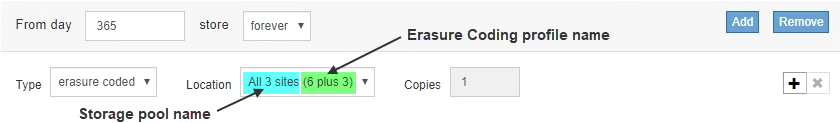

= Cambie el nombre de un perfil de código de borrado
:allow-uri-read: 
:icons: font
:imagesdir: ../media/

[role="lead"]
Es posible que desee cambiar el nombre de un perfil de código de borrado para que sea más obvio lo que hace el perfil.

.Lo que necesitará
* Ha iniciado sesión en Grid Manager mediante un xref:../admin/web-browser-requirements.adoc[navegador web compatible].
* Tiene permisos de acceso específicos.

.Pasos
. Seleccione *ILM* > *codificación de borrado*.
+
Aparece la página Perfiles de código de borrado. Los botones *Renombrar* y *Desactivar* están desactivados.

+
image::../media/ec_profiles_rename_deactivate_disabled.png[Borrar perfiles de código Cambiar nombre Desactivar]

. Seleccione el perfil al que desea cambiar el nombre.
+
Los botones *Renombrar* y *Desactivar* se activan.

. Seleccione *Cambiar nombre*.
+
Aparece el cuadro de diálogo Cambiar nombre de perfil EC.

+

. Introduzca un nombre único para el perfil de código de borrado.
+
El nombre del perfil de código de borrado se anexa al nombre del pool de almacenamiento en la instrucción de ubicación de una regla de ILM.

+

+

NOTE: Los nombres de perfiles de código de borrado deben ser únicos. Se produce un error de validación si utiliza el nombre de un perfil existente, incluso si dicho perfil se ha desactivado.

. Seleccione *Guardar*.

