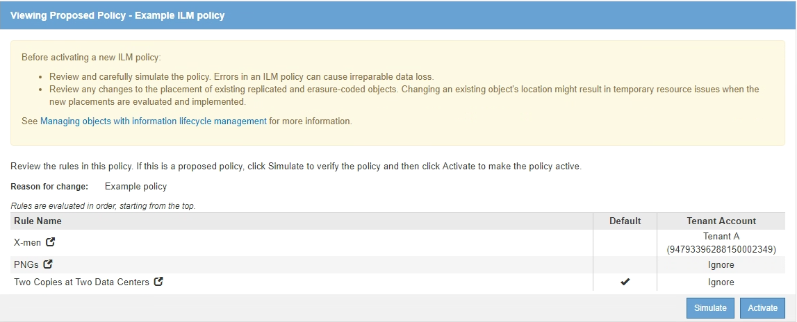

= Simule una política de gestión de la vida útil
:allow-uri-read: 
:icons: font
:imagesdir: ../media/

[role="lead"]
Debe simular una directiva propuesta en objetos de prueba antes de activar la directiva y aplicarla a los datos de producción. La ventana de simulación proporciona un entorno independiente que es seguro para las políticas de prueba antes de que se activen y apliquen a los datos en el entorno de producción.

.Lo que necesitará
* Ha iniciado sesión en Grid Manager mediante un xref:../admin/web-browser-requirements.adoc[navegador web compatible].
* Tiene permisos de acceso específicos.
* Conoce el bucket/object-key o el contenedor/nombre de objeto de Swift para cada objeto que desea probar y ya ha ingerido esos objetos.

.Acerca de esta tarea
Debe seleccionar cuidadosamente los objetos que desea que pruebe la directiva propuesta. Para simular una política completamente, debe probar al menos un objeto para cada filtro en cada regla.

Por ejemplo, si una política incluye una regla para que coincida con los objetos del bloque A y otra regla para que coincidan con los objetos del bloque B, debe seleccionar al menos un objeto del bloque A y un objeto del bloque B para probar la política a fondo. También debe seleccionar al menos un objeto de otro bloque para probar la regla predeterminada.

Al simular una directiva, se aplican las siguientes consideraciones:

* Después de realizar cambios en una directiva, guarde la directiva propuesta. A continuación, simule el comportamiento de la directiva propuesta guardada.
* Cuando se simula una política, las reglas de ILM en la política filtran los objetos de prueba, de modo que se puede ver qué regla se aplicó a cada objeto. Sin embargo, no se crean copias de objeto y no se coloca ningún objeto. Al ejecutar una simulación no se modifican los datos, las reglas ni la política de ningún modo.
* La página Simulation conserva los objetos probados hasta que se cierra, se aleja o se actualiza la página políticas de ILM.
* Simulation devuelve el nombre de la regla coincidente. Para determinar qué pool de almacenamiento o perfil de código de borrado está activo, puede ver el diagrama de retención seleccionando el nombre de la regla o el icono más detalles image:../media/icon_nms_more_details.gif["icono para más detalles"].
* Si está habilitada la versión de S3, la política solo se simula con respecto a la versión actual del objeto.

.Pasos
. Seleccione y organice las reglas y guarde la política propuesta.
+
La directiva de este ejemplo tiene tres reglas:

+
[cols="1a,1a,1a,1a"]
|===
| Nombre de regla | Filtro | Tipo de copias | Retención 

 a| 
Hombres-X.
 a| 
** Inquilinoa
** Metadatos del usuario (series=x-men)

 a| 
2 copias en dos centros de datos
 a| 
2 años

 a| 
PNs
 a| 
La clave termina con .png
 a| 
2 copias en dos centros de datos
 a| 
5 años

 a| 
Dos copias dos centros de datos
 a| 
_Ninguno_
 a| 
2 copias en dos centros de datos
 a| 
Para siempre

|===
+

. Use un cliente S3 o Swift o el xref:../tenant/use-s3-console.adoc[Consola de S3 de experimental], Que está disponible en el Administrador de arrendatarios para cada arrendatario, procese los objetos necesarios para probar cada regla.
. Seleccione *simular*.
+
Aparecerá el cuadro de diálogo Directiva de gestión de la vida útil de Simulation.

. En el campo *Object*, introduzca el bucket/object-key de S3 o el nombre de objeto/contenedor de Swift para un objeto de prueba y seleccione *Simulate*.
+
[NOTE]
====
Aparece un mensaje si especifica un objeto que no se ha ingerido.

image::../media/object_not_available_for_simulation.gif[Mensaje si especifica el objeto que falta]

====
. En *resultados de Simulation*, confirme que cada objeto estaba coincidente con la regla correcta.
+
En el ejemplo, la `Havok.png` y.. `Warpath.jpg` Los objetos estaban correctamente emparejados con la regla X-men. La `Fullsteam.png` objeto, que no incluye `series=x-men` Los metadatos del usuario no se corresponden con la regla X-men, pero se emparejaron correctamente con la regla PNG. La regla predeterminada no se ha utilizado porque los tres objetos coinciden con otras reglas.

+
image::../media/ilm_policy_simulation_results.gif[Resultados de simulación]

== Ejemplo 1: Verifique las reglas al simular una política de ILM propuesta

En este ejemplo se muestra cómo comprobar las reglas al simular una directiva propuesta.

En este ejemplo, la *política de ILM de ejemplo* se está simulando contra los objetos ingeridos en dos bloques. La política incluye tres reglas, como sigue:

* La primera regla, *dos copias, dos años para el segmento a*, se aplica sólo a los objetos en el bloque a.
* La segunda regla, *objetos EC > 1 MB*, se aplica a todos los cubos pero filtra a los objetos superiores a 1 MB.
* La tercera regla, *dos copias, dos centros de datos*, es la regla por defecto. No incluye ningún filtro ni utiliza el tiempo de referencia no corriente.

image::../media/saved_policy_for_simulation.png[Política guardada para Simulation]

.Pasos
. Después de agregar las reglas y guardar la directiva, seleccione *simular*.
+
Se muestra el cuadro de diálogo Simulate ILM Policy.

. En el campo *Object*, introduzca el bucket/object-key de S3 o el nombre de objeto/contenedor de Swift para un objeto de prueba y seleccione *Simulate*.
+
Aparecen los resultados de Simulation, mostrando qué regla de la directiva coincide con cada objeto probado.

+
image::../media/simulate_policy_screen.png[Pantalla simular directiva]

. Confirme que cada objeto se ha coincidido con la regla correcta.
+
En este ejemplo:

+
.. `bucket-a/bucket-a object.pdf` coincide correctamente con la primera regla, que filtra los objetos de `bucket-a`.
.. `bucket-b/test object greater than 1 MB.pdf` está en `bucket-b`, así que no coincide con la primera regla. En lugar de ello, la segunda regla coincide correctamente, que filtra los objetos de más de 1 MB.
.. `bucket-b/test object less than 1 MB.pdf` no coincide con los filtros de las dos primeras reglas, por lo que se colocará por la regla predeterminada, que no incluye ningún filtro.

== Ejemplo 2: Reordenación de reglas al simular una política de ILM propuesta

En este ejemplo se muestra cómo puede reordenar las reglas para cambiar los resultados al simular una directiva.

En este ejemplo, se está simulando la política *Demo*. Esta política, que está destinada a encontrar objetos que tienen metadatos de usuario de series=x-men, incluye tres reglas de la siguiente manera:

* La primera regla, *PNgs*, filtra los nombres de clave que terminan en `.png`.
* La segunda regla, *X-men*, se aplica sólo a los objetos para el arrendatario A y filtros para `series=x-men` metadatos del usuario.
* La última regla, *dos copias dos centros de datos*, es la regla predeterminada, que coincide con cualquier objeto que no coincida con las dos primeras reglas.

image::../media/simulate_reorder_rules_pngs_rule.png[Ejemplo 2: Reordenación de reglas al simular una política de ILM propuesta]

.Pasos
. Después de agregar las reglas y guardar la directiva, seleccione *simular*.
. En el campo *Object*, introduzca el bucket/object-key de S3 o el nombre de objeto/contenedor de Swift para un objeto de prueba y seleccione *Simulate*.
+
Aparecen los resultados de Simulation, mostrando que `Havok.png` El objeto coincide con la regla *PNgs*.

+
image::../media/simulate_reorder_rules_pngs_result.gif[Ejemplo 2: Reordenación de reglas al simular una política de ILM propuesta]

+
Sin embargo, la regla que el `Havok.png` El objeto fue ideado para probar la regla *X-men*.

. Para resolver el problema, vuelva a ordenar las reglas.
+
.. Seleccione *Finalizar* para cerrar la página simular política de ILM.
.. Seleccione *Editar* para editar la directiva.
.. Arrastre la regla *X-men* hasta la parte superior de la lista.
+
image::../media/simulate_reorder_rules_correct_rule.png[Simular - Reordenar reglas - Regla correcta]

.. Seleccione *Guardar*.

. Seleccione *simular*.
+
Los objetos probados anteriormente se vuelven a evaluar con la directiva actualizada y se muestran los nuevos resultados de simulación. En el ejemplo, la columna Regla conciliada muestra que `Havok.png` Ahora Object coincide con la regla de metadatos X-men, según lo esperado. La columna coincidencia anterior muestra que la regla PNG coincide con el objeto de la simulación anterior.

+
image::../media/simulate_reorder_rules_correct_result.gif[Ejemplo 2: Reordenación de reglas al simular una política de ILM propuesta]

+

NOTE: Si permanece en la página Configure Policies, puede volver a simular una política después de realizar cambios sin tener que volver a introducir los nombres de los objetos de prueba.

== Ejemplo 3: Corrección de una regla al simular una política de ILM propuesta

Este ejemplo muestra cómo simular una política, corregir una regla en la política y continuar con la simulación.

En este ejemplo, se está simulando la política *Demo*. Esta política está destinada a encontrar objetos que tienen `series=x-men` metadatos del usuario. Sin embargo, se produjeron resultados inesperados al simular esta política con la `Beast.jpg` objeto. En lugar de coincidir con la regla de metadatos de X-men, el objeto coincide con la regla predeterminada, dos copias de dos centros de datos.

image::../media/simulate_results_for_object_wrong_metadata.png[Ejemplo 3: Corrección de una regla al simular una política de ILM propuesta]

Cuando un objeto de prueba no coincide con la regla esperada de la directiva, debe examinar cada regla de la directiva y corregir cualquier error.

.Pasos
. Para cada regla de la política, consulte la configuración de reglas seleccionando el nombre de la regla o el icono más detalles image:../media/icon_nms_more_details.gif["icono para más detalles"] en cualquier cuadro de diálogo en el que se muestre la regla.
. Revise la cuenta de arrendatario de la regla, el tiempo de referencia y los criterios de filtrado.
+
En este ejemplo, los metadatos de la regla X-men incluyen un error. El valor de los metadatos se introdujo como «'x-men1'» en lugar de «'x-men'».

+
image::../media/simulate_rules_select_rule_popup_with_wrong_metadata.png[Ejemplo 3: Corrección de una regla al simular una política de ILM propuesta]

. Para resolver el error, corrija la regla de la siguiente manera:
+
** Si la regla forma parte de la política propuesta, puede clonar la regla o quitar la regla de la política y editarla.
** Si la regla forma parte de la política activa, debe clonar esa regla. No puede editar ni eliminar una regla de la directiva activa.
+
[cols="1a,3a"]
|===
| Opción | Descripción 

 a| 
Clone la regla
 a| 
... Seleccione *ILM* > *Reglas*.
... Seleccione la regla incorrecta y seleccione *Clonar*.
... Cambie la información incorrecta y seleccione *Guardar*.
... Seleccione *ILM* > *políticas*.
... Seleccione la directiva propuesta y seleccione *Editar*.
... Seleccione *Seleccionar reglas*.
... Active la casilla de verificación de la nueva regla, desactive la casilla de verificación de la regla original y seleccione *aplicar*.
... Seleccione *Guardar*.

 a| 
Edite la regla
 a| 
... Seleccione la directiva propuesta y seleccione *Editar*.
... Seleccione el icono de eliminar image:../media/icon_nms_delete_new.gif["icono de eliminar"] Para eliminar la regla incorrecta y seleccione *Guardar*.
... Seleccione *ILM* > *Reglas*.
... Seleccione la regla incorrecta y seleccione *Editar*.
... Cambie la información incorrecta y seleccione *Guardar*.
... Seleccione *ILM* > *políticas*.
... Seleccione la directiva propuesta y seleccione *Editar*.
... Seleccione la regla corregida, seleccione *aplicar* y seleccione *Guardar*.

|===

. Vuelva a ejecutar la simulación.
+

NOTE: Dado que aleja de la página ILM Policies para editar la regla, los objetos que introdujo anteriormente para la simulación ya no se muestran. Debe volver a introducir los nombres de los objetos.

+
En este ejemplo, la regla X-men corregida ahora coincide con `Beast.jpg` objeto basado en `series=x-men` los metadatos del usuario, según lo esperado.

+
image::../media/simulate_results_for_object_corrected_metadata.gif[Ejemplo 3: Corrección de una regla al simular una política de ILM propuesta]

