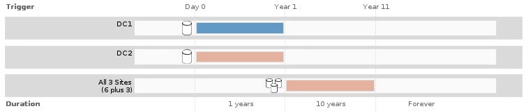

= Paso 2 de 3: Definir colocaciones
:allow-uri-read: 
:icons: font
:imagesdir: ../media/

[role="lead"]
El paso 2 (definir ubicaciones) del asistente para crear regla de ILM permite definir las instrucciones de ubicación que determinan la cantidad de objetos que se almacenan, el tipo de copias (replicadas o codificadas para borrado), la ubicación del almacenamiento y el número de copias.

.Acerca de esta tarea
Una regla de ILM puede incluir una o varias instrucciones de ubicación. Cada instrucción de colocación se aplica a un único período de tiempo. Cuando utilice más de una instrucción, los períodos de tiempo deben ser contiguos y al menos una instrucción debe comenzar en el día 0. Las instrucciones pueden continuar para siempre o hasta que ya no necesite ninguna copia de objeto.

Cada instrucción de colocación puede tener varias líneas si desea crear diferentes tipos de copias o utilizar diferentes ubicaciones durante ese período de tiempo.

Esta regla de ILM de ejemplo crea dos copias replicadas para el primer año. Cada copia se guarda en una agrupación de almacenamiento de un sitio diferente. Después de un año, se realiza y se guarda una copia con código de borrado al 2+1 en una sola instalación.

image::../media/ilm_create_ilm_rule_wizard_2.png[Página 2 del Asistente para crear reglas de ILM]

.Pasos
. En *tiempo de referencia*, seleccione el tipo de tiempo que se utilizará al calcular la hora de inicio de una instrucción de colocación.
+
[cols="1a,2a"]
|===
| Opción | Descripción 

 a| 
Tiempo de ingesta
 a| 
Hora a la que se ingirió el objeto.

 a| 
Hora del último acceso
 a| 
Hora a la que se recuperó por última vez el objeto (leído o visualizado).

*Nota:* para utilizar esta opción, las actualizaciones de la hora de último acceso deben estar habilitadas para el contenedor S3 bucket o Swift. Consulte xref:using-last-access-time-in-ilm-rules.adoc[Utilice la hora del último acceso en las reglas de ILM].

 a| 
Hora no actual
 a| 
El tiempo que una versión de objeto se volvió no actual porque se ingirió una nueva versión y la reemplazó como la versión actual.

*Nota:* el tiempo no corriente se aplica sólo a los objetos S3 en bloques habilitados para versionado.

Puede utilizar esta opción para reducir el impacto del almacenamiento de objetos con versiones mediante el filtrado de versiones de objetos no actuales. Consulte xref:example-4-ilm-rules-and-policy-for-s3-versioned-objects.adoc[Ejemplo 4: Reglas de ILM y políticas para objetos con versiones de S3].

 a| 
Hora de creación definida por el usuario
 a| 
Hora especificada en los metadatos definidos por el usuario.

|===
+

NOTE: Si desea crear una regla compatible, debe seleccionar *tiempo de procesamiento*.

. En la sección *colocaciones*, seleccione un tiempo de inicio y una duración para el primer período de tiempo.
+
Por ejemplo, es posible que desee especificar dónde almacenar los objetos durante el primer año ("días 0 durante 365 días"). Al menos una instrucción debe comenzar en el día 0.

. Si desea crear copias replicadas:
+
.. En la lista desplegable *Tipo*, seleccione *replicado*.
.. En el campo *ubicación*, seleccione *Agregar pool* para cada pool de almacenamiento que desee agregar.
+
*Si especifica sólo un pool de almacenamiento*, tenga en cuenta que StorageGRID sólo puede almacenar una copia replicada de un objeto en un nodo de almacenamiento dado. Si su grid incluye tres nodos de almacenamiento y selecciona 4 como el número de copias, solo se realizarán tres copias: Una copia para cada nodo de almacenamiento.

+

NOTE: Se activa la alerta *colocación de ILM inalcanzable* para indicar que la regla ILM no se pudo aplicar completamente.

+
*Si especifica más de una agrupación de almacenamiento*, tenga en cuenta estas reglas:

+
*** La cantidad de copias no puede ser mayor que la cantidad de pools de almacenamiento.
*** Si el número de copias es igual al número de pools de almacenamiento, se almacena una copia del objeto en cada pool de almacenamiento.
*** Si el número de copias es menor que el número de pools de almacenamiento, el sistema distribuye las copias para mantener el uso de disco entre los pools equilibrados, a la vez que garantiza que ningún sitio obtenga más de una copia de un objeto.
*** Si los pools de almacenamiento se superponen (contienen los mismos nodos de almacenamiento), es posible que todas las copias del objeto se guarden en un solo sitio. Por este motivo, no especifique el pool de almacenamiento predeterminado todos los nodos de almacenamiento y otro pool de almacenamiento.
+
image::../media/ilm_rule_with_multiple_storage_pools.png[Instrucciones de colocación para múltiples pools de almacenamiento]

.. Seleccione el número de copias que desea realizar.
+
Aparecerá una advertencia si cambia el número de copias a 1. Una regla de ILM que crea solo una copia replicada en cualquier periodo de tiempo pone los datos en riesgo de pérdida permanente. Consulte xref:why-you-should-not-use-single-copy-replication.adoc[Por qué no se debe utilizar la replicación de copia única].

+
image::../media/ilm_create_ilm_rule_warning_for_1_copy.png[Crear advertencia de la página 2 de regla de ILM para 1 copia]

+
Para evitar estos riesgos, siga uno o varios de estos procedimientos:

+
*** Aumentar el número de copias durante el período de tiempo.
*** Seleccione el icono de signo más image:../media/icon_plus_sign_black_on_white.gif["signo más negro en blanco"] para crear copias adicionales durante el período de tiempo. A continuación, seleccione un pool de almacenamiento diferente o un pool de almacenamiento cloud.
*** Seleccione *Código de borrado* para Tipo, en lugar de *replicado*. Puede ignorar con toda tranquilidad esta advertencia si esta regla ya crea varias copias para todos los períodos de tiempo.

.. Si ha especificado sólo una agrupación de almacenamiento, ignore el campo *ubicación temporal*.
+

NOTE: Las ubicaciones temporales están obsoletas y se eliminarán en un lanzamiento futuro. Consulte xref:using-storage-pool-as-temporary-location-deprecated.adoc[Usar un pool de almacenamiento como ubicación temporal (obsoleto)].

. Si desea crear una copia con código de borrado:
+
.. En la lista desplegable *Tipo*, seleccione *Código de borrado*.
+
El número de copias cambia a 1. Aparece una advertencia si la regla no tiene un filtro avanzado para ignorar objetos de 200 KB o menos.

+
image::../media/ilm_rule_warning_for_ec_size.png[Advertencia de regla de ILM para el tamaño de EC]

+

IMPORTANT: El código de borrado se adapta mejor a los objetos de más de 1 MB. No utilice la codificación de borrado para objetos de menos de 200 KB con el fin de evitar la sobrecarga de gestión de fragmentos codificados con borrado de muy pequeño tamaño.

.. Si aparece la advertencia de tamaño de objeto, seleccione *Atrás* para volver al paso 1. A continuación, seleccione *filtrado avanzado* y establezca el filtro Tamaño del objeto (MB) en cualquier valor superior a 0.2.
.. Seleccione la ubicación de almacenamiento.
+
La ubicación de almacenamiento de una copia codificada con borrado incluye el nombre del pool de almacenamiento seguido del nombre del perfil de la codificación de borrado.

+
image::../media/storage_pool_and_erasure_coding_profile.png[Nombre del pool de almacenamiento y del perfil de EC]

. Si lo desea, puede agregar periodos de tiempo diferentes o crear copias adicionales en diferentes ubicaciones:
+
** Seleccione el icono más para crear copias adicionales en una ubicación diferente durante el mismo período de tiempo.
** Seleccione *Agregar* para agregar un período de tiempo diferente a las instrucciones de colocación.
+

NOTE: Los objetos se eliminan automáticamente al final del período de tiempo final, a menos que el período de tiempo final finalice con *para siempre*.

. Si desea almacenar objetos en un pool de almacenamiento en cloud:
+
.. En la lista desplegable *Tipo*, seleccione *replicado*.
.. En el campo *ubicación*, seleccione *Agregar grupo*. A continuación, seleccione un pool de almacenamiento en el cloud.
+
image::../media/ilm_cloud_storage_pool.gif[Añadir un pool de almacenamiento en cloud a una instrucción de colocación]

+
Cuando utilice Cloud Storage Pools, tenga en cuenta estas reglas:

+
*** No puede seleccionar más de un pool de almacenamiento en cloud mediante una única instrucción de colocación. De forma similar, no puede seleccionar un pool de almacenamiento en cloud ni un pool de almacenamiento en la misma instrucción de ubicación.
+
image::../media/ilm_cloud_storage_pool_error.gif[Regla de ILM > error del pool de almacenamiento en cloud]

*** Solo puede almacenar una copia de un objeto en cualquier Cloud Storage Pool en concreto. Aparece un mensaje de error si configura *copias* en 2 o más.
+
image::../media/ilm_cloud_storage_pool_error_one_copy.gif[Regla de ILM: Error del pool de almacenamiento en cloud si más de una copia]

*** No puede almacenar más de una copia de objetos en ningún pool de almacenamiento en cloud al mismo tiempo. Aparecerá un mensaje de error si varias ubicaciones que utilizan un Cloud Storage Pool tienen fechas superpuestas o si varias líneas en la misma ubicación utilizan un Cloud Storage Pool.
+
image::../media/ilm_rule_cloud_storage_pool_error_overlapping_dates.png[Error de pool de almacenamiento en cloud de la regla ILM que se superpone fechas]

*** Puede almacenar un objeto en un pool de almacenamiento en cloud al mismo tiempo que el objeto se almacena como copias replicadas o codificadas de borrado en StorageGRID. Sin embargo, como se muestra en este ejemplo, debe incluir más de una línea en la instrucción de colocación para el período de tiempo, de modo que pueda especificar el número y los tipos de copias para cada ubicación.
+
image::../media/ilm_cloud_storage_pool_multiple_locations.png[Regla de ILM > el pool de almacenamiento en cloud y otras ubicaciones]

. Seleccione *Actualizar* para actualizar el Diagrama de retención y confirmar las instrucciones de colocación.
+
Cada línea del diagrama muestra dónde y cuándo se colocarán las copias de objeto. El tipo de copia está representado por uno de los siguientes iconos:

+
[cols="1a,2a"]
|===

 a| 
image:../media/icon_nms_replicated.gif["Para copias replicadas"]
 a| 
Copia replicada

 a| 
image:../media/icon_nms_erasure_coded.gif["Icono para una copia con código de borrado"]
 a| 
Copia con código de borrado

 a| 
image:../media/icon_cloud_storage_pool.gif["Icono de Cloud Storage Pool"]
 a| 
Copia de Cloud Storage Pool

|===
+
En este ejemplo, se guardarán dos copias replicadas en dos agrupaciones de almacenamiento (DC1 y DC2) durante un año. A continuación, se guardará una copia codificada con borrado durante 10 años adicionales utilizando un esquema de codificación de borrado de 6+3 en tres ubicaciones. Transcurridos 11 años, los objetos se eliminarán de StorageGRID.

+

. Seleccione *Siguiente*.
+
Aparece el paso 3 (definir comportamiento de procesamiento).

.Información relacionada
* xref:what-ilm-rule-is.adoc[Qué es una regla de ILM]
* xref:managing-objects-with-s3-object-lock.adoc[Gestione objetos con S3 Object Lock]
* xref:step-3-of-3-define-ingest-behavior.adoc[Paso 3 de 3: Definir el comportamiento de la ingesta]

