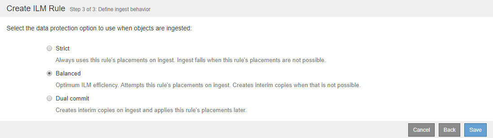

= Paso 3 de 3: Definir el comportamiento de la ingesta
:allow-uri-read: 
:icons: font
:imagesdir: ../media/

[role="lead"]
El paso 3 (definir comportamiento de la ingesta) del asistente Crear regla de ILM permite elegir cómo se protegen los objetos filtrados por esta regla mientras se ingieren.

.Acerca de esta tarea
StorageGRID puede hacer copias provisionales y poner en cola los objetos para la evaluación de ILM más tarde, o puede hacer copias para cumplir las instrucciones de colocación de la regla de forma inmediata.

.Pasos
. Seleccione la opción de protección de datos que se va a utilizar cuando se ingieren los objetos:
+
[cols="1a,2a"]
|===
| Opción | Descripción 

 a| 
Estricto
 a| 
Siempre utiliza las colocaciones de esta regla durante el procesamiento. La ingesta falla cuando las colocaciones de esta regla no son posibles.

 a| 
Equilibrado
 a| 
Eficiencia óptima de ILM. Intenta colocar esta regla en el procesamiento. Crea copias provisionales cuando eso no es posible.

 a| 
Registro doble
 a| 
Crea copias provisionales en el procesamiento y aplica las colocaciones de esta regla más adelante.

|===
+
Balance ofrece una combinación de seguridad de datos y eficiencia que es adecuada en la mayoría de los casos. La confirmación estricta o doble se utiliza generalmente para satisfacer requisitos específicos.

+
Consulte xref:data-protection-options-for-ingest.adoc[Opciones de protección de datos para consumo] y.. xref:advantages-disadvantages-of-ingest-options.adoc[Ventajas, inconvenientes y limitaciones de las opciones de protección de datos] si quiere más información.

+
[NOTE]
====
Aparece un mensaje de error si selecciona la opción estricta o equilibrada y la regla utiliza una de estas ubicaciones:

** Un pool de almacenamiento en cloud desde el día 0
** Un nodo de archivado al día 0
** Un pool de almacenamiento en cloud o un nodo de archivado cuando la regla utiliza un tiempo de creación definido por el usuario como tiempo de referencia

====
. Seleccione *Guardar*.
+
Se guarda la regla ILM. La regla no estará activa hasta que se agregue a una política de ILM y esa política se active.

.Información relacionada
* xref:example-5-ilm-rules-and-policy-for-strict-ingest-behavior.adoc[Ejemplo 5: Reglas de ILM y política para el comportamiento de consumo estricto]
* xref:creating-ilm-policy.adoc[Cree una política de ILM]

