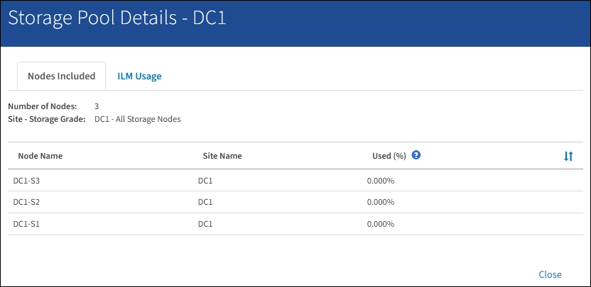

= Ver detalles del pool de almacenamiento
:allow-uri-read: 
:icons: font
:imagesdir: ../media/

[role="lead"]
Es posible ver los detalles de un pool de almacenamiento para determinar dónde se usa el pool de almacenamiento y para ver qué nodos y calidades de almacenamiento se incluyen.

.Lo que necesitará
* Ha iniciado sesión en Grid Manager mediante un xref:../admin/web-browser-requirements.adoc[navegador web compatible].
* Tiene permisos de acceso específicos.

.Pasos
. Seleccione *ILM* > *agrupaciones de almacenamiento*.
+
Aparece la página Storage Pools. Esta página enumera todos los pools de almacenamiento definidos.

+
image::../media/storage_pools_page_with_pools.png[Página de pools de almacenamiento en Pools.png]

+
En la tabla se incluye la siguiente información para cada pool de almacenamiento que incluye los nodos de almacenamiento:

+
** *Nombre*: El nombre exclusivo para mostrar de la agrupación de almacenamiento.
** *Espacio usado*: Cantidad de espacio que se está utilizando actualmente para almacenar objetos en la agrupación de almacenamiento.
** *Espacio libre*: La cantidad de espacio que queda disponible para almacenar objetos en la agrupación de almacenamiento.
** *Capacidad total*: El tamaño de la agrupación de almacenamiento, que equivale a la cantidad total de espacio útil para los datos de los objetos de todos los nodos de la agrupación de almacenamiento .
** *Uso de ILM*: Cómo se utiliza actualmente el pool de almacenamiento. Un pool de almacenamiento puede no utilizarse o utilizarse en una o varias reglas de ILM, perfiles de código de borrado o ambos.
+

NOTE: No se puede quitar un pool de almacenamiento si se está utilizando.

. Para ver los detalles de una agrupación de almacenamiento específica, seleccione su botón de opción y seleccione *Ver detalles*.
+
Aparecerá el mensaje Detalles del grupo de almacenamiento modal.

. Consulte la ficha *nodos incluidos* para obtener información sobre los nodos de almacenamiento o los nodos de archivo incluidos en la agrupación de almacenamiento.
+

+
En la tabla se incluye la siguiente información para cada nodo:

+
** Nombre del nodo
** Nombre del sitio
** Usado (%): Para los nodos de almacenamiento, el porcentaje del espacio útil total para los datos de objeto que se han usado. Este valor no incluye metadatos de objetos.
+

NOTE: El mismo valor usado (%) también se muestra en el gráfico almacenamiento usado - datos de objeto para cada nodo de almacenamiento (seleccione *NODOS* > *_nodo de almacenamiento_* > *almacenamiento*).

. Seleccione la pestaña *uso de ILM* para determinar si el pool de almacenamiento se está utilizando actualmente en cualquier regla de ILM o perfil de código de borrado.
+
En este ejemplo, el pool de almacenamiento de DC1 se utiliza en tres reglas de ILM: Dos reglas que están en la política de ILM activa y una regla que no está en la política activa.

+
image::../media/storage_pools_details_ilm.png[Detalles de los pools de almacenamiento ILM]

+

NOTE: No se puede quitar un pool de almacenamiento si se utiliza en una regla de ILM.

+
En este ejemplo, el grupo de almacenamiento All 3 Sites se utiliza en un perfil de código de borrado. A su vez, un perfil de código de borrado lo utiliza una regla de ILM en la política de ILM activa.

+
image::../media/storage_pools_details_ilm_ec.png[Detalles del pool de almacenamiento ILM EC]

+

NOTE: No se puede quitar un pool de almacenamiento si se utiliza en un perfil de código de borrado.

. Si lo desea, visite la página *Reglas ILM* para obtener más información y administrar las reglas que utilizan el pool de almacenamiento.
+
Consulte las instrucciones para trabajar con las reglas de ILM.

. Cuando haya terminado de ver los detalles de la agrupación de almacenamiento, seleccione *Cerrar*.

.Información relacionada
xref:working-with-ilm-rules-and-ilm-policies.adoc[Trabaje con las reglas de ILM y las políticas de ILM]
