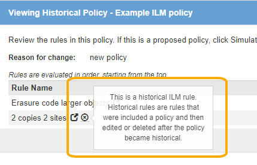

= Trabaje con las reglas de ILM y las políticas de ILM
:allow-uri-read: 
:icons: font
:imagesdir: ../media/

[role="lead"]
Una vez creadas las reglas de ILM y una política de ILM, puede seguir trabajando con ellas, modificando su configuración a medida que cambian sus requisitos de almacenamiento.

.Lo que necesitará
* Ha iniciado sesión en Grid Manager mediante un xref:../admin/web-browser-requirements.adoc[navegador web compatible].
* Tiene permisos de acceso específicos.

== Elimine una regla de ILM

Para que la lista de reglas de ILM actuales pueda ser manejable, elimine las reglas de ILM que no pueda usar.

No puede eliminar una regla de ILM si actualmente se encuentra en uso en la política activa o en la política propuesta. Si necesita eliminar una regla de ILM que utilice una política, primero debe realizar estos pasos:

. Clone la política activa o edite la política propuesta.
. Quite la regla de ILM de la política.
. Guarde, simule y active la nueva directiva para asegurarse de que los objetos están protegidos como se espera.

.Pasos
. Seleccione *ILM* > *Reglas*.
. Revise la entrada de tabla de la regla que desea quitar.
+
Confirme que la regla no se utiliza en la política de ILM activa o en la política de ILM propuesta.

. Si la regla que desea eliminar no está en uso, seleccione el botón de opción y seleccione *Quitar*.
. Seleccione *Aceptar* para confirmar que desea eliminar la regla ILM.
+
La regla de ILM se elimina.

+
[NOTE]
====
Si elimina una regla que se utiliza en una política histórica, a. image:../media/icon_ilm_rule_historical.png["Icono Historial de regla de ILM"] aparece un icono para la regla cuando se visualiza la política, lo que indica que la regla se ha convertido en una regla histórica.

====

== Editar una regla de ILM

Es posible que deba editar una regla de ILM para cambiar un filtro o una instrucción de ubicación.

No se puede editar una regla si se está utilizando en la política de ILM propuesta o en la política de ILM activa. En su lugar, puede clonar estas reglas y hacer los cambios necesarios en la copia clonada. Tampoco puede editar la regla de gestión del ciclo de vida de la información (hacer 2 copias) o las reglas de gestión del ciclo de vida de la información creadas antes de la versión 10.3 de StorageGRID.

NOTE: Antes de agregar una regla editada a la política de ILM activa, tenga en cuenta que un cambio en las instrucciones de ubicación de un objeto puede provocar un aumento de la carga en el sistema.

.Pasos
. Seleccione *ILM* > *Reglas*.
+
Aparece la página ILM Rules. Esta página muestra todas las reglas disponibles e indica qué reglas se están utilizando en la directiva activa o en la directiva propuesta.

+
image::../media/ilm_rules_page_with_edit_and_clone_enabled.png[Página ILM Rules]

. Seleccione una regla que no se esté utilizando y seleccione *Editar*.
+
Se abrirá el asistente Editar regla de ILM.

+
image::../media/edit_ilm_rule_step_1.png[Editar la página Regla de ILM]

. Complete las páginas del asistente Edit ILM Rule, siguiendo los pasos de xref:access-create-ilm-rule-wizard.adoc[Creación de una regla de ILM] y.. xref:using-advanced-filters-in-ilm-rules.adoc[uso de filtros avanzados], según sea necesario.
+
Al editar una regla de ILM, no puede cambiar su nombre.

. Seleccione *Guardar*.
+
[NOTE]
====
Si edita una regla que se utiliza en una política histórica, una image:../media/icon_ilm_rule_historical.png["Icono Historial de regla de ILM"] aparece un icono para la regla cuando se visualiza la política, lo que indica que la regla se ha convertido en una regla histórica.

====

== Clonar una regla de ILM

No se puede editar una regla si se está utilizando en la política de ILM propuesta o en la política de ILM activa. En su lugar, puede clonar una regla y hacer los cambios necesarios en la copia clonada. A continuación, si es necesario, puede eliminar la regla original de la directiva propuesta y sustituirla por la versión modificada. No puede clonar una regla de ILM si se creó con StorageGRID versión 10.2 o anterior.

Antes de añadir una regla clonada a la política de ILM activa, tenga en cuenta que un cambio en las instrucciones de ubicación de un objeto puede provocar un aumento de la carga en el sistema.

.Pasos
. Seleccione *ILM* > *Reglas*.
+
Aparece la página ILM Rules.

+
image::../media/ilm_rules_page_with_edit_and_clone_enabled.png[Página Regla de ILM]

. Seleccione la regla ILM que desea clonar y seleccione *Clonar*.
+
Se abrirá el asistente Crear regla de ILM.

. Actualice la regla clonada siguiendo los pasos para editar una regla de ILM y usando filtros avanzados.
+
Al clonar una regla de ILM, debe introducir un nombre nuevo.

. Seleccione *Guardar*.
+
Se crea la nueva regla de ILM.

== Ver la cola de actividades de la política de ILM

Puede ver el número de objetos que hay en la cola que se van a evaluar en comparación con la política de ILM en cualquier momento. Puede ser conveniente supervisar la cola de procesamiento de ILM para determinar el rendimiento del sistema. Una cola grande puede indicar que el sistema no puede seguir el ritmo de la tasa de ingesta, la carga de las aplicaciones cliente es demasiado alta o que existe alguna condición anormal.

.Pasos
. Seleccione *Panel*.
+
image::../media/grid_manager_dashboard.png[De la interfaz de gestión de grid]

. Supervise la sección Information Lifecycle Management (ILM).
+
Puede seleccionar el signo de interrogación image:../media/icon_nms_question.png["icono de signo de interrogación"] para ver una descripción de los elementos de esta sección.

