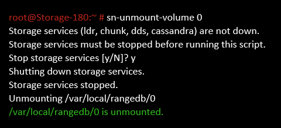

= Identifique y desmonte los volúmenes de almacenamiento que han fallado
:allow-uri-read: 
:icons: font
:imagesdir: ../media/

[role="lead"]
Al recuperar un nodo de almacenamiento con volúmenes de almacenamiento con fallos, se deben identificar y desmontar los volúmenes con errores. Debe verificar que solo los volúmenes de almacenamiento con errores se hayan reformateado como parte del procedimiento de recuperación.

.Lo que necesitará
Debe iniciar sesión en Grid Manager mediante un xref:../admin/web-browser-requirements.adoc[navegador web compatible].

.Acerca de esta tarea
Debe recuperar Lo antes posible. de volúmenes de almacenamiento con errores.

El primer paso del proceso de recuperación es detectar volúmenes que se han desvinculado, se deben desmontar o se producen errores de I/O. Si los volúmenes con fallos siguen conectados pero tienen un sistema de archivos dañado de forma aleatoria, es posible que el sistema no detecte ningún daño en partes del disco que no estén en uso o no estén asignados.

NOTE: Debe finalizar este procedimiento antes de realizar los pasos manuales para recuperar los volúmenes, como añadir o volver a conectar los discos, detener el nodo, iniciar el nodo o reiniciar. De lo contrario, cuando ejecute el `reformat_storage_block_devices.rb` script, puede encontrar un error del sistema de archivos que provoca el bloqueo o el error del script.

NOTE: Repare el hardware y conecte correctamente los discos antes de ejecutar el `reboot` comando.

CAUTION: Identifique cuidadosamente los volúmenes de almacenamiento fallidos. Utilizará esta información para verificar qué volúmenes se deben reformatear. Una vez que un volumen se ha reformateado, no se pueden recuperar los datos del volumen.

Para recuperar correctamente los volúmenes de almacenamiento con fallos, es necesario conocer los nombres de los dispositivos de los volúmenes de almacenamiento con errores y sus ID de volumen.

En la instalación, a cada dispositivo de almacenamiento se le asigna un identificador único universal (UUID) del sistema de archivos y se monta en un directorio de configuración en el nodo de almacenamiento utilizando ese UUID del sistema de archivos asignado. El UUID del sistema de archivos y el directorio rangedb se muestran en la `/etc/fstab` archivo. El nombre del dispositivo, el directorio rangedb y el tamaño del volumen montado se muestran en el Administrador de grid.

En el siguiente ejemplo, dispositivo `/dev/sdc` Tiene un tamaño de volumen de 4 TB, se monta a. `/var/local/rangedb/0`, utilizando el nombre del dispositivo `/dev/disk/by-uuid/822b0547-3b2b-472e-ad5e-e1cf1809faba` en la /`etc/fstab` archivo:

image::../media/mounting_storage_devices.gif[Muestra de tamaño de volumen]

.Pasos
. Complete los siguientes pasos para registrar los volúmenes de almacenamiento que han fallado y sus nombres de dispositivo:
+
.. Seleccione *SUPPORT* > *Tools* > *Topología de cuadrícula*.
.. Seleccione *sitio* *nodo de almacenamiento fallido* *LDR* *almacenamiento* *Descripción general* *Principal* y busque almacenes de objetos con alarmas.
+
image::../media/ldr_storage_object_stores.gif[Sección de almacenes de objetos]

.. Seleccione *site* *Failed Storage Node* *SSM* *Resources* *Overview* *Main*. Determine el punto de montaje y el tamaño del volumen de cada volumen de almacenamiento con error identificado en el paso anterior.
+
Los almacenes de objetos están numerados en notación hexadecimal. Por ejemplo, 0000 es el primer volumen y 000F es el decimosexto volumen. En el ejemplo, el almacén de objetos con un ID de 0000 corresponde a. `/var/local/rangedb/0` Con nombre de dispositivo sdc y un tamaño de 107 GB.

+
image::../media/ssm_storage_volumes.gif[ejemplo que muestra almacenes de objetos y puntos de montaje]

. Inicie sesión en el nodo de almacenamiento con errores:
+
.. Introduzca el siguiente comando: `ssh admin@_grid_node_IP_`
.. Introduzca la contraseña que aparece en `Passwords.txt` archivo.
.. Introduzca el siguiente comando para cambiar a la raíz: `su -`
.. Introduzca la contraseña que aparece en `Passwords.txt` archivo.

+
Cuando ha iniciado sesión como root, el símbolo del sistema cambia de `$` para `#`.

. Ejecute el siguiente script para detener los servicios de almacenamiento y desmontar un volumen de almacenamiento con errores:
+
`sn-unmount-volume object_store_ID`

+
La `object_store_ID` Es el ID del volumen de almacenamiento con errores. Por ejemplo, especifique `0` En el comando de un almacén de objetos con ID 0000.

. Si se le solicita, pulse *y* para detener los servicios de almacenamiento en el nodo de almacenamiento.
+

NOTE: Si los servicios de almacenamiento ya se han detenido, no se le solicitará. El servicio Cassandra se ha detenido solo para el volumen 0.

+

+
En unos segundos, los servicios de almacenamiento se detienen y el volumen se desasocia. Aparecen mensajes que indican cada paso del proceso. El mensaje final indica que el volumen no está asociado.

