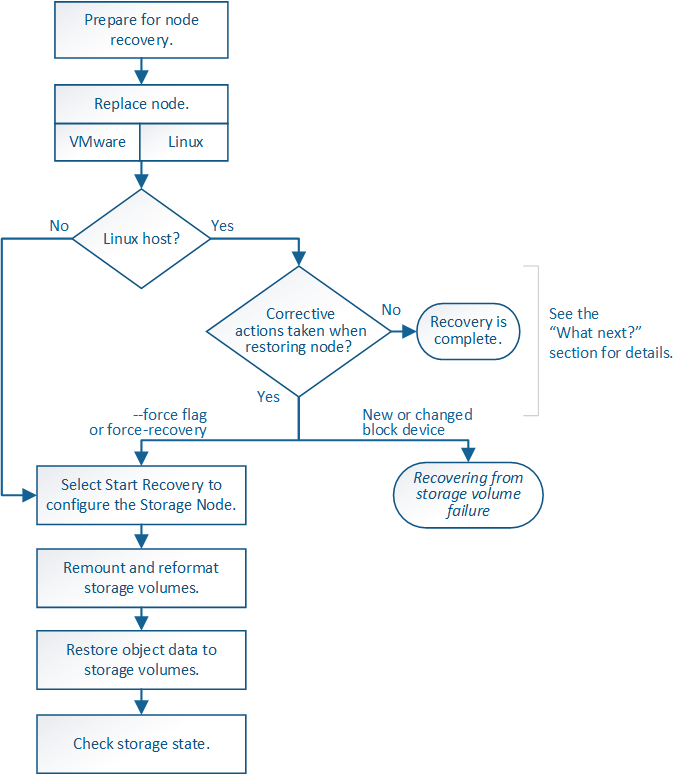

= Recupere datos de un fallo de unidad del sistema
:allow-uri-read: 
:icons: font
:imagesdir: ../media/

[role="lead"]
Si falló la unidad del sistema en un nodo de almacenamiento basado en software, el nodo de almacenamiento no está disponible para el sistema StorageGRID. Debe completar un conjunto específico de tareas para recuperar el sistema de un fallo de unidad.

.Acerca de esta tarea
Utilice este procedimiento para recuperarse de un error de la unidad del sistema en un nodo de almacenamiento basado en software. Este procedimiento incluye los pasos a seguir si alguno de los volúmenes de almacenamiento también presenta errores o no se puede volver a montar.

NOTE: Este procedimiento se aplica únicamente a nodos de almacenamiento basados en software. Debe seguir un procedimiento diferente para recuperar un nodo de almacenamiento del dispositivo.

xref:recovering-storagegrid-appliance-storage-node.adoc[Recupere el nodo de almacenamiento del dispositivo]

