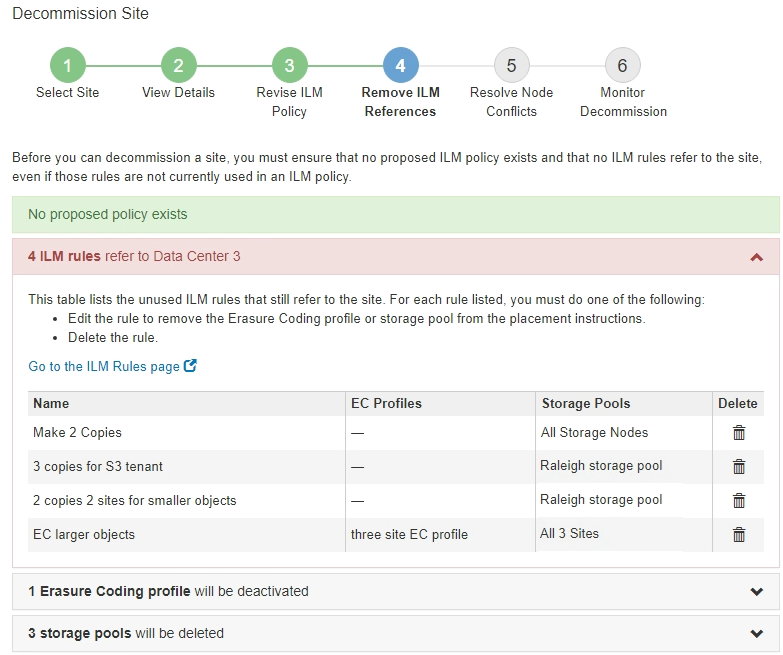

= Paso 4: Eliminar referencias de ILM
:allow-uri-read: 
:icons: font
:imagesdir: ../media/

[role="lead"]
En el paso 4 (Eliminar referencias de ILM) del asistente del sitio de desmisión, puede quitar la directiva propuesta si existe y eliminar o editar las reglas de ILM que todavía no se utilicen en el sitio.

.Acerca de esta tarea
Se le impide iniciar el procedimiento de retirada de instalaciones en estos casos:

* Existe una política de ILM propuesta. Si tiene una política propuesta, debe eliminarla.
* Cualquier regla de ILM se refiere al sitio, incluso si esa regla no se usa en ninguna política de ILM. Debe eliminar o editar todas las reglas que hacen referencia al sitio.

.Pasos
. Si aparece una directiva propuesta, elimínela.
+
image::../media/decommission_site_step_4_proposed_policy.png[Política propuesta de retirada del emplazamiento paso 4]

+
.. Seleccione *Eliminar directiva propuesta*.
.. Seleccione *Aceptar* en el cuadro de diálogo de confirmación.

. Determine si alguna regla de ILM sin usar se refiere al sitio.
+

+
Cualquier regla de ILM que se enumera sigue haciendo referencia al sitio, pero no se utiliza en ninguna política. En el ejemplo:

+
** La regla de stock *hacer 2 copias* utiliza la agrupación de almacenamiento predeterminada del sistema *todos los nodos de almacenamiento*, que utiliza el sitio todos los sitios.
** La regla *3 copias no utilizadas para el inquilino S3* se refiere a la piscina de almacenamiento *Raleigh*.
** La norma *2 Copy 2 no utilizada para objetos más pequeños* se refiere a la piscina de almacenamiento *Raleigh*.
** Las reglas *EC más grandes* no utilizadas utilizan el sitio de Raleigh en el perfil de codificación de borrado *todos los 3 sitios*.
** Si no aparece ninguna regla de ILM, seleccione *Siguiente* para ir a *Paso 5 (resolver conflictos de nodos)*.
+
xref:step-5-resolve-node-conflicts.adoc[Paso 5: Resolver conflictos de nodos (e iniciar retirada)]

+

NOTE: Cuando StorageGRID destransfiere el sitio, desactiva automáticamente todos los perfiles de código de borrado que no se utilicen y hacen referencia al sitio, y elimina automáticamente todos los pools de almacenamiento no utilizados que hacen referencia al sitio. El pool de almacenamiento predeterminado del sistema todos los nodos de almacenamiento se elimina porque utiliza el sitio todos los sitios.

** Si aparece una o varias reglas de ILM, vaya al paso siguiente.

. Edite o elimine cada regla no utilizada:
+
** Para editar una regla, vaya a la página ILM Rules y actualice todas las ubicaciones que utilizan un perfil de código de borrado o un pool de almacenamiento que hace referencia al sitio. A continuación, vuelva a *Paso 4 (Eliminar referencias de ILM)*.
+

NOTE: Para obtener más detalles, consulte las instrucciones para gestionar objetos con gestión del ciclo de vida de la información.

** Para eliminar una regla, seleccione el icono de papelera image:../media/icon_trash_can.png["CAN de papelera de iconos"] Y seleccione *OK*.
+

IMPORTANT: Debe eliminar la regla de stock *hacer 2 copias* antes de poder retirar un sitio.

. Confirme que no existe ninguna política de ILM propuesta, que no haya reglas de ILM sin usar consulte el sitio y que el botón *Siguiente* esté activado.
+
image::../media/decommission_site_step_4_no_policy_or_rules.png[Retirada del emplazamiento Paso 4 no hay normas ni políticas]

. Seleccione *Siguiente*.
+

NOTE: Los pools de almacenamiento restantes y los perfiles de código de borrado que hacen referencia al sitio no serán válidos cuando se elimine el sitio. Cuando StorageGRID destransfiere el sitio, desactiva automáticamente todos los perfiles de código de borrado que no se utilicen y hacen referencia al sitio, y elimina automáticamente todos los pools de almacenamiento no utilizados que hacen referencia al sitio. El pool de almacenamiento predeterminado del sistema todos los nodos de almacenamiento se elimina porque utiliza el sitio todos los sitios.

+
Aparece el paso 5 (resolver conflictos de nodos).

