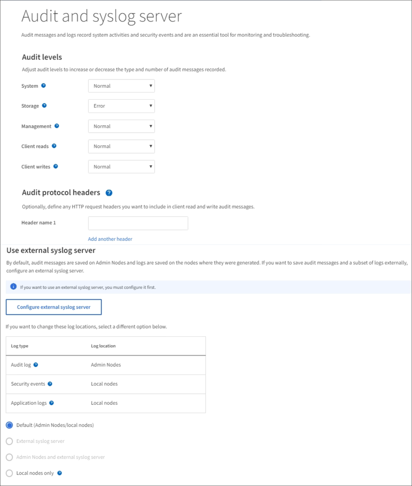

= Configure un servidor de syslog externo
:allow-uri-read: 
:icons: font
:imagesdir: ../media/

[role="lead"]
Si desea guardar registros de auditoría, registros de aplicaciones y registros de eventos de seguridad en una ubicación fuera de la cuadrícula, utilice este procedimiento para configurar un servidor de syslog externo.

.Lo que necesitará
* Ha iniciado sesión en Grid Manager mediante un xref:../admin/web-browser-requirements.adoc[navegador web compatible].
* Tiene permisos de acceso raíz o de mantenimiento.
* Tiene un servidor de syslog con la capacidad para recibir y almacenar los archivos de registro. Para obtener más información, consulte xref:../monitor/considerations-for-external-syslog-server.adoc[Consideraciones sobre el servidor de syslog externo].
* Tiene las certificaciones de servidor y cliente correctas si tiene previsto utilizar TLS o RELP/TLS.

.Acerca de esta tarea
Si desea enviar información de auditoría a un servidor de syslog externo, primero debe configurar el servidor externo.

El envío de información de auditoría a un servidor de syslog externo permite:

* Recopilar y gestionar información de auditoría, como mensajes de auditoría, registros de aplicaciones y eventos de seguridad, de forma más eficiente
* Reduzca el tráfico de red en los nodos de administrador, ya que la información de auditoría se transfiere directamente de los distintos nodos de almacenamiento al servidor de syslog externo, sin tener que atravesar un nodo de administración
+

CAUTION: Cuando se envían registros a un servidor de syslog externo, los registros únicos superiores a 8192 bytes se truncarán al final del mensaje para ajustarse a las limitaciones comunes en las implementaciones de servidores de syslog externos.

+

NOTE: Para maximizar las opciones de recuperación completa de datos en caso de un fallo del servidor de syslog externo, se mantienen hasta 20 GB de registros locales de registros de auditoría (localaudit.log) en cada nodo.

+

NOTE: Si las opciones de configuración disponibles en este procedimiento no son lo suficientemente flexibles para satisfacer sus requisitos, se pueden aplicar opciones de configuración adicionales mediante la API privada `audit-destinations` puntos finales. Por ejemplo, es posible usar diferentes servidores de syslog para diferentes grupos de nodos.

== Acceda al asistente de configuración del servidor de syslog

.Pasos
. Seleccione *CONFIGURACIÓN* > *Supervisión* > *servidor de auditoría y syslog*.
+

. En la página servidor de auditoría y syslog, seleccione *Configurar servidor de syslog externo*. Si ha configurado previamente un servidor de syslog externo, seleccione *Editar servidor de syslog externo*.

=== Introduzca la información de syslog

image::../media/enter-syslog-info.png[Introduzca la información de syslog]

. Introduzca un nombre de dominio completo válido o una dirección IPv4 o IPv6 para el servidor de syslog externo en el campo *Host*.
. Introduzca el puerto de destino en el servidor de syslog externo (debe ser un entero entre 1 y 65535). El puerto predeterminado es 514.
. Seleccione el protocolo utilizado para enviar información de auditoría al servidor de syslog externo.
+
Se recomienda TLS o RELP/TLS. Debe cargar un certificado de servidor para usar cualquiera de estas opciones.

+
El uso de certificados ayuda a proteger las conexiones entre el grid y el servidor de syslog externo. Para obtener más información, consulte xref:../admin/using-storagegrid-security-certificates.adoc[Use los certificados de seguridad StorageGRID].

+
Todas las opciones de protocolo requieren compatibilidad con el servidor de syslog externo y su configuración. Debe elegir una opción que sea compatible con el servidor de syslog externo.

+

NOTE: El protocolo de registro de eventos fiable (RELP) amplía la funcionalidad del protocolo syslog para proporcionar una entrega fiable de los mensajes de eventos. El uso de RELP puede ayudar a evitar la pérdida de información de auditoría si el servidor syslog externo tiene que reiniciarse.

. Seleccione *continuar*.
. [[attach-certificate]]Si ha seleccionado *TLS* o *RELP/TLS*, cargue los siguientes certificados:
+
** *Certificados de CA del servidor*: Uno o más certificados de CA de confianza para verificar el servidor syslog externo (en codificación PEM). Si se omite, se utilizará el certificado de CA de cuadrícula predeterminado. El archivo que cargue aquí puede ser un bundle de CA.
** *Certificado de cliente*: Certificado de cliente para la autenticación al servidor syslog externo (en codificación PEM).
** *Clave privada de cliente*: Clave privada para el certificado de cliente (en codificación PEM).
+

NOTE: Si utiliza un certificado de cliente, también debe usar una clave privada de cliente. Si proporciona una clave privada cifrada, también debe proporcionar la contraseña. No hay ninguna ventaja de seguridad significativa por el uso de una clave privada cifrada, ya que la clave y la frase de contraseña deben almacenarse; se recomienda usar una clave privada no cifrada, si está disponible, para facilitar la utilización.

+
... Seleccione *Buscar* para el certificado o la clave que desee utilizar.
... Seleccione el archivo de certificado o el archivo de claves.
... Seleccione *Abrir* para cargar el archivo.

+
Aparece una comprobación verde junto al certificado o el nombre del archivo de claves, notificándole que se ha cargado correctamente.

. Seleccione *continuar*.

=== Permite gestionar el contenido de syslog

image::../media/manage-syslog-content.png[Permite gestionar el contenido de syslog]

. Seleccione cada tipo de información de auditoría que desea enviar al servidor de syslog externo.
+
** *Enviar registros de auditoría*: Eventos StorageGRID y actividades del sistema
** *Enviar eventos de seguridad*: Eventos de seguridad como cuando un usuario no autorizado intenta iniciar sesión o un usuario inicia sesión como root
** *Enviar registros de aplicación*: Archivos de registro útiles para la solución de problemas, incluidos:
+
*** bycast-err.log
*** bycast.log
*** jaeger.log
*** nms.log (solo nodos del administrador)
*** prometheus.log
*** raft.log
*** hagroups.log

. Utilice los menús desplegables para seleccionar la gravedad y el servicio (tipo de mensaje) de la categoría de información de auditoría que desea enviar.
+
Si selecciona *Paso a través* para severidad e instalación, la información enviada al servidor syslog remoto recibirá la misma gravedad y facilidad que cuando se haya iniciado sesión localmente en el nodo. Establecer las instalaciones y la gravedad pueden ayudarle a agregar los registros de formas personalizables para facilitar el análisis.

+

NOTE: Para obtener más información sobre los registros del software StorageGRID, consulte xref:../monitor/storagegrid-software-logs.adoc#[Registros del software StorageGRID].

+
.. Para *severidad*, seleccione *Paso a través* si desea que cada mensaje enviado al syslog externo tenga el mismo valor de gravedad que en el syslog local.
+
Para los registros de auditoría, si selecciona *Paso a través*, la gravedad es 'info'.

+
Para eventos de seguridad, si selecciona *Paso a través*, la distribución linux genera los valores de gravedad en los nodos.

+
Para los registros de la aplicación, si selecciona *Paso a través*, las gravedades varían entre "info" y "notice", dependiendo de cuál sea el problema. Por ejemplo, la adición de un servidor NTP y la configuración de un grupo ha proporcionan un valor de "información", mientras que la detención intencional del servicio ssm o rsm proporciona un valor de "aviso".

.. Si no desea utilizar el valor de paso a través, seleccione un valor de gravedad entre 0 y 7.
+
El valor seleccionado se aplicará a todos los mensajes de este tipo. Se perderá información acerca de las diferentes gravedades cuando elija reemplazar la gravedad con un valor fijo.

+
[cols="1a,3a"]
|===
| Gravedad | Descripción 

 a| 
0
 a| 
Emergencia: El sistema no se puede utilizar

 a| 
1
 a| 
Alerta: La acción se debe realizar de inmediato

 a| 
2
 a| 
Crítico: Condiciones críticas

 a| 
3
 a| 
Error: Condiciones de error

 a| 
4
 a| 
Advertencia: Condiciones de aviso

 a| 
5
 a| 
Aviso: Condición normal pero significativa

 a| 
6
 a| 
Informativo: Mensajes informativos

 a| 
7
 a| 
Debug: Mensajes de nivel de depuración

|===
.. Para *Facility*, seleccione *PassThrough* si desea que cada mensaje enviado al syslog externo tenga el mismo valor de instalación que en el syslog local.
+
Para los registros de auditoría, si selecciona *PassThrough*, la instalación enviada al servidor syslog externo es 'local7'.

+
Para los eventos de seguridad, si selecciona *Paso a través*, los valores de la instalación los genera la distribución linux en los nodos.

+
Para los registros de aplicaciones, si selecciona *Paso a través*, los registros de la aplicación enviados al servidor syslog externo tienen los siguientes valores de instalación:

+
[cols="1a,2a"]
|===
| Registro de aplicaciones | Valor de paso a través 

 a| 
bycast.log
 a| 
usuario o demonio

 a| 
bycast-err.log
 a| 
usuario, daemon, local3 o local4

 a| 
jaeger.log
 a| 
local2

 a| 
nms.log
 a| 
local3

 a| 
prometheus.log
 a| 
local4

 a| 
raft.log
 a| 
local5

 a| 
hagroups.log
 a| 
local6

|===
.. Si no desea utilizar el valor de paso a través, seleccione el valor de la instalación entre 0 y 23.
+
El valor seleccionado se aplicará a todos los mensajes de este tipo. Se perderá información acerca de las distintas instalaciones cuando elija reemplazar la instalación con un valor fijo.

+
[cols="1a,3a"]
|===
| Centro | Descripción 

 a| 
0
 a| 
kern (mensajes del núcleo)

 a| 
1
 a| 
usuario (mensajes de usuario)

 a| 
2
 a| 
correo

 a| 
3
 a| 
daemon (daemons del sistema)

 a| 
4
 a| 
auth (mensajes de seguridad/autorización)

 a| 
5
 a| 
syslog (mensajes generados internamente por syslogd)

 a| 
6
 a| 
lpr (subsistema de impresora de líneas)

 a| 
7
 a| 
noticias (subsistema de noticias de red)

 a| 
8
 a| 
UCP

 a| 
9
 a| 
cron (daemon de reloj)

 a| 
10
 a| 
seguridad (mensajes de seguridad/autorización)

 a| 
11
 a| 
FTP

 a| 
12
 a| 
NTP

 a| 
13
 a| 
auditoría de registro (auditoría de registros)

 a| 
14
 a| 
alerta de registro (alerta de registro)

 a| 
15
 a| 
reloj (daemon de reloj)

 a| 
16
 a| 
local0

 a| 
17
 a| 
local1

 a| 
18
 a| 
local2

 a| 
19
 a| 
local3

 a| 
20
 a| 
local4

 a| 
21
 a| 
local5

 a| 
22
 a| 
local6

 a| 
23
 a| 
local7

|===

. Seleccione *continuar*.

=== Enviar mensajes de prueba

image::../media/send-test-messages.png[Enviar mensajes de prueba]

Antes de iniciar el uso de un servidor de syslog externo, debe solicitar que todos los nodos de la cuadrícula envíen mensajes de prueba al servidor de syslog externo. Se deben usar estos mensajes de prueba para ayudar a validar toda la infraestructura de recogida de registros antes de comprometerse a enviar datos al servidor de syslog externo.

CAUTION: No use la configuración del servidor de syslog externo hasta que se confirme que el servidor de syslog externo recibió un mensaje de prueba de cada nodo de la cuadrícula y que el mensaje se procesó según lo esperado.

. Si no desea enviar mensajes de prueba y está seguro de que el servidor syslog externo está configurado correctamente y puede recibir información de auditoría de todos los nodos de la cuadrícula, seleccione *Omitir y finalizar*.
+
Aparece un banner verde que indica que la configuración se ha guardado correctamente.

. De lo contrario, seleccione *Enviar mensajes de prueba*.
+
Los resultados de la prueba aparecen continuamente en la página hasta que se detiene la prueba. Mientras la prueba está en curso, los mensajes de auditoría siguen enviarse a los destinos configurados anteriormente.

. Si recibe algún error, corríjalo y vuelva a seleccionar *Enviar mensajes de prueba*. Consulte xref:../monitor/troubleshooting-syslog-server.adoc[Solucionar problemas del servidor de syslog externo] para ayudarle a resolver errores.

. Espere hasta que vea un banner verde que indica que todos los nodos han superado la prueba.
. Compruebe el servidor de syslog para determinar si se reciben y procesan los mensajes de prueba según lo esperado.
+

IMPORTANT: Si está utilizando UDP, compruebe toda su infraestructura de recopilación de registros. El protocolo UDP no permite una detección de errores tan rigurosa como los demás protocolos.

. Seleccione *Detener y finalizar*.
+
Volverá a la página *Audit and syslog Server*. Aparece un banner verde para notificarle que la configuración del servidor de syslog se ha guardado correctamente.

+

NOTE: La información de auditoría de StorageGRID no se envía al servidor de syslog externo hasta que se selecciona un destino que incluye el servidor de syslog externo.

== Seleccione destinos de información de auditoría

Es posible especificar dónde se envían los registros de eventos de seguridad, los registros de aplicaciones y los registros de mensajes de auditoría.

NOTE: Para obtener más información sobre los registros del software StorageGRID, consulte xref:../monitor/storagegrid-software-logs.adoc#[Registros del software StorageGRID].

. En la página Audit and syslog Server, seleccione el destino para la información de auditoría de las opciones que aparecen:
+
[cols="1a,2a"]
|===
| Opción | Descripción 

 a| 
Predeterminado (nodos de administrador/nodos locales)
 a| 
Se envían mensajes de auditoría al registro de auditoría (`audit.log`) En el nodo Admin, y los registros de eventos de seguridad y de aplicaciones se almacenan en los nodos en los que se generaron (también denominado "nodo local").

 a| 
Servidor de syslog externo
 a| 
La información de auditoría se envía a un servidor de syslog externo y se guarda en el nodo local. El tipo de información enviada depende de la forma en que se configure el servidor de syslog externo. Esta opción solo se habilita después de configurar un servidor de syslog externo.

 a| 
Nodo de administrador y servidor de syslog externo
 a| 
Se envían mensajes de auditoría al registro de auditoría (`audit.log`) En el nodo Admin, y la información de auditoría se envía al servidor syslog externo y se guarda en el nodo local. El tipo de información enviada depende de la forma en que se configure el servidor de syslog externo. Esta opción solo se habilita después de configurar un servidor de syslog externo.

 a| 
Solo nodos locales
 a| 
No se envía información de auditoría a un nodo de administrador ni al servidor de syslog remoto. La información de auditoría solo se guarda en los nodos que la generaron.

*Nota*: StorageGRID elimina periódicamente estos registros locales en rotación para liberar espacio. Cuando el archivo de registro de un nodo alcanza 1 GB, se guarda el archivo existente y se inicia un nuevo archivo de registro. El límite de rotación para el registro es de 21 archivos. Cuando se crea la versión 22ª del archivo de registro, se elimina el archivo de registro más antiguo. De media, se almacenan unos 20 GB de datos de registro en cada nodo.

|===

NOTE: La información de auditoría generada en cada nodo local se almacena en `/var/local/log/localaudit.log`

. Seleccione *Guardar*. A continuación, seleccione Aceptar para aceptar el cambio en el destino del registro.
. Si ha seleccionado *servidor syslog externo* o *nodos de administración y servidor syslog externo* como destino de la información de auditoría, aparecerá una advertencia adicional. Revise el texto de advertencia.

IMPORTANT: Debe confirmar que el servidor de syslog externo puede recibir mensajes de StorageGRID de prueba.

. Confirme que desea cambiar el destino de la información de auditoría seleccionando *Aceptar*.
+
Aparece un mensaje de cabecera verde en el que se le notifica que la configuración de auditoría se ha guardado correctamente.

+
Los nuevos registros se envían a los destinos seleccionados. Los registros existentes permanecen en su ubicación actual.

.Información relacionada
xref:../audit/index.adoc[Información general de los mensajes de auditoría]

xref:../monitor/configure-audit-messages.adoc[Configurar los mensajes de auditoría y los destinos de registro]

xref:../audit/system-audit-messages.adoc[Mensajes de auditoría del sistema]

xref:../audit/object-storage-audit-messages.adoc[Mensajes de auditoría del almacenamiento de objetos]

xref:../audit/management-audit-message.adoc[Mensaje de auditoría de gestión]

xref:../audit/client-read-audit-messages.adoc[El cliente lee los mensajes de auditoría]

xref:../admin/index.adoc[Administre StorageGRID]
