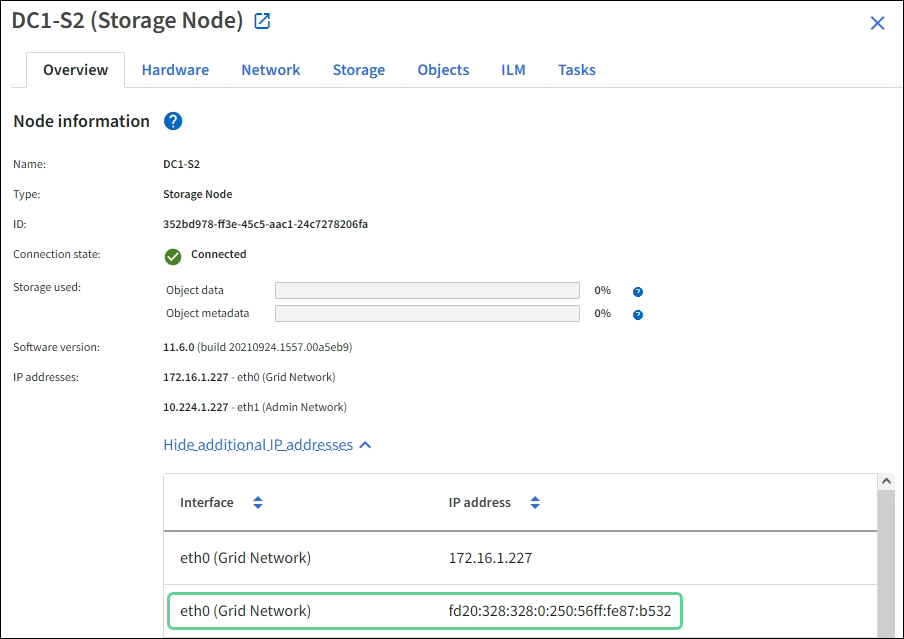

= Solucionar problemas de red, hardware y plataforma
:allow-uri-read: 
:icons: font
:imagesdir: ../media/

[role="lead"]
Existen varias tareas que puede realizar para ayudar a determinar el origen de los problemas relacionados con la red, el hardware y la plataforma de StorageGRID.

== Solucionar errores "'422: Entidad no procesable'"

El error 422: Entidad no procesable puede ocurrir en varias circunstancias. Compruebe el mensaje de error para determinar la causa del problema.

Si ve uno de los mensajes de error de la lista, realice la acción recomendada.

[cols="2a,2a"]
|===
| Mensaje de error | Causa raíz y acción correctiva 

 a| 
[listing]
----
422: Unprocessable Entity

Validation failed. Please check
the values you entered for
errors. Test connection failed.
Please verify your
configuration. Unable to
authenticate, please verify
your username and password:
LDAP Result Code 8 "Strong
Auth Required": 00002028:
LdapErr: DSID-0C090256,
comment: The server requires
binds to turn on integrity
checking if SSL\TLS are not
already active on the
connection, data 0, v3839
---- a| 
Este mensaje puede aparecer si selecciona la opción *no utilizar TLS* para Seguridad de la capa de transporte (TLS) al configurar la federación de identidades mediante Active Directory de Windows (AD).

El uso de la opción *no usar TLS* no es compatible con servidores AD que aplican la firma LDAP. Debe seleccionar la opción *Use STARTTLS* o la opción *Use LDAPS* para TLS.

 a| 
[listing]
----
422: Unprocessable Entity

Validation failed. Please check
the values you entered for
errors. Test connection failed.
Please verify your
configuration.Unable to
begin TLS, verify your
certificate and TLS
configuration: LDAP Result
Code 200 "Network Error":
TLS handshake failed
    (EOF)
---- a| 
Este mensaje aparece si intenta utilizar un cifrado no compatible para establecer una conexión TLS (Seguridad de la capa de transporte) desde StorageGRID a un sistema externo utilizado para identificar los grupos de almacenamiento de la federación o de la nube.

Compruebe los códigos que ofrece el sistema externo. El sistema debe usar uno de los cifrados compatibles con StorageGRID para conexiones TLS salientes, tal y como se muestra en las instrucciones para administrar StorageGRID.

|===
.Información relacionada
xref:../admin/index.adoc[Administre StorageGRID]

== [[Troubleshose_MTU_alert]]solucione los problemas de la alerta de discrepancia de MTU de red de red de cuadrícula

La alerta *Red Grid MTU mismatch* se activa cuando la configuración de la unidad de transmisión máxima (MTU) para la interfaz Red Grid (eth0) difiere significativamente entre los nodos de la cuadrícula.

.Acerca de esta tarea
Las diferencias en la configuración de MTU podrían indicar que algunas redes eth0, pero no todas, están configuradas para tramas gigantes. Un error de coincidencia del tamaño de MTU de más de 1000 puede provocar problemas de rendimiento de la red.

.Pasos
. Enumere la configuración de MTU para eth0 en todos los nodos.
+
** Utilice la consulta proporcionada en Grid Manager.
** Vaya a. `_primary Admin Node IP address_/metrics/graph` e introduzca la siguiente consulta: `node_network_mtu_bytes{interface='eth0'}`

. Modifique la configuración de MTU según sea necesario para asegurarse de que son la misma para la interfaz de red de cuadrícula (eth0) en todos los nodos.
+
** Para los nodos del dispositivo, consulte las instrucciones de instalación y mantenimiento del dispositivo.
** Para los nodos basados en Linux y VMware, use el siguiente comando: `+/usr/sbin/change-ip.py [-h] [-n node] mtu network [network...]+`
+
*Ejemplo*: `change-ip.py -n node 1500 grid admin`

+
*Nota*: En los nodos basados en Linux, si el valor de MTU deseado para la red en el contenedor supera el valor ya configurado en la interfaz del host, primero debe configurar la interfaz del host para que tenga el valor de MTU deseado y luego utilice `change-ip.py` Script para cambiar el valor MTU de la red en el contenedor.

+
Use los siguientes argumentos para modificar la MTU en los nodos basados en Linux o VMware.

+
[cols="2a,2a"]
|===
| Argumentos posicionales | Descripción 

 a| 
`mtu`
 a| 
La MTU que se va a establecer. Debe estar entre 1280 y 9216.

 a| 
`network`
 a| 
Las redes a las que se va a aplicar la MTU. Incluya uno o varios de los siguientes tipos de red:

*** cuadrícula
*** admin
*** cliente

|===
+
[cols="2a,2a"]
|===
| Argumentos opcionales | Descripción 

 a| 
`-h, – help`
 a| 
Muestra el mensaje de ayuda y sale.

 a| 
`-n node, --node node`
 a| 
El nodo. El valor predeterminado es el nodo local.

|===

.Información relacionada
xref:../sg100-1000/index.adoc[Servicios de aplicaciones SG100 y SG1000]

xref:../sg6000/index.adoc[Dispositivos de almacenamiento SG6000]

xref:../sg5700/index.adoc[Dispositivos de almacenamiento SG5700]

xref:../sg5600/index.adoc[Dispositivos de almacenamiento SG5600]

== Solucione los problemas de la alarma error de recepción de red (NRER)

Las alarmas de error de recepción de red (NRER) pueden deberse a problemas de conectividad entre StorageGRID y el hardware de red. En algunos casos, los errores del NRER pueden aclararse sin intervención manual. Si los errores no se borran, realice las acciones recomendadas.

.Acerca de esta tarea
Las alarmas NRER pueden deberse a los siguientes problemas de hardware de red que se conecta a StorageGRID:

* Se requiere corrección de errores de reenvío (FEC) y no se utiliza
* Discrepancia entre el puerto del switch y la MTU de NIC
* Índices altos de errores de enlace
* Desbordamiento del búfer de anillo NIC

.Pasos
. Siga los pasos de solución de problemas para todas las posibles causas de la alarma NRER dada la configuración de la red.
+
** Si el error es causado por una discrepancia de FEC, realice los siguientes pasos:
+
*Nota*: Estos pasos sólo se aplican para los errores NRER causados por el discordancia de FEC en los dispositivos StorageGRID.

+
... Compruebe el estado de FEC del puerto en el interruptor conectado al dispositivo StorageGRID.
... Compruebe la integridad física de los cables del aparato al interruptor.
... Si desea cambiar los ajustes de FEC para intentar resolver la alarma NRER, asegúrese primero de que el dispositivo esté configurado para el modo *automático* en la página Configuración de vínculos del instalador de dispositivos StorageGRID (consulte las instrucciones de instalación y mantenimiento del dispositivo). A continuación, cambie la configuración de FEC en los puertos del switch. Los puertos del dispositivo StorageGRID ajustarán los ajustes del FEC para que coincidan, si es posible.
+
(No puede configurar los ajustes de FEC en dispositivos StorageGRID. En su lugar, los dispositivos intentan descubrir y duplicar los ajustes de FEC en los puertos de conmutador a los que están conectados. Si los enlaces se ven forzados a velocidades de red de 25-GbE o 100-GbE, es posible que el switch y la NIC no negocien una configuración de FEC común. Sin un ajuste FEC común, la red volverá al modo «'no-FEC». Cuando el FEC no está activado, las conexiones son más susceptibles a errores causados por el ruido eléctrico.)

+
*Nota*: Los aparatos StorageGRID admiten FEC FIRECODE (FC) y Reed Solomon (RS), así como no FEC.

+
** Si el error se debe a un error de coincidencia entre un puerto del switch y una MTU de NIC, compruebe que el tamaño de MTU configurado en el nodo sea el mismo que la configuración de MTU para el puerto del switch.
+
El tamaño de MTU configurado en el nodo puede ser más pequeño que la configuración en el puerto del switch al que está conectado el nodo. Si un nodo StorageGRID recibe una trama de Ethernet mayor que su MTU, lo cual es posible con esta configuración, se podría notificar la alarma NRER. Si cree que esto es lo que está sucediendo, cambie la MTU del puerto del switch para que coincida con la MTU de la interfaz de red de StorageGRID o cambie la MTU de la interfaz de red de StorageGRID para que coincida con el puerto del switch, según sus objetivos o requisitos de MTU completos.

+

IMPORTANT: Para obtener el mejor rendimiento de red, todos los nodos deben configurarse con valores MTU similares en sus interfaces de Grid Network. La alerta *Red de cuadrícula MTU* se activa si hay una diferencia significativa en la configuración de MTU para la Red de cuadrícula en nodos individuales. Los valores de MTU no tienen que ser iguales para todos los tipos de red.

+

NOTE: Para cambiar la configuración de MTU, consulte la guía de instalación y mantenimiento del dispositivo.

** Si el error se debe a unos altos índices de errores de enlace, realice los siguientes pasos:
+
... Active FEC, si aún no está activado.
... Compruebe que el cableado de red es de buena calidad y que no está dañado o conectado incorrectamente.
... Si parece que los cables no son el problema, póngase en contacto con el soporte técnico.
+

NOTE: Es posible que note altas tasas de error en un entorno con alto nivel de ruido eléctrico.

** Si el error es un desbordamiento del búfer de anillo NIC, póngase en contacto con el soporte técnico.
+
El búfer de anillo puede desbordarse cuando el sistema StorageGRID está sobrecargado y no puede procesar eventos de red de forma oportuna.

. Después de resolver el problema subyacente, restablezca el contador de errores.
+
.. Seleccione *SUPPORT* > *Tools* > *Topología de cuadrícula*.
.. Seleccione *_site_* > *_grid node_* > *SSM* > *Recursos* > *Configuración* > *Principal*.
.. Seleccione *Restablecer recuento de errores de recepción* y haga clic en *aplicar cambios*.

.Información relacionada
<<troubleshoot_MTU_alert,Solucione problemas de la alerta de discrepancia de MTU de red de cuadrícula>>

xref:alarms-reference.adoc[Referencia de alarmas (sistema heredado)]

xref:../sg6000/index.adoc[Dispositivos de almacenamiento SG6000]

xref:../sg5700/index.adoc[Dispositivos de almacenamiento SG5700]

xref:../sg5600/index.adoc[Dispositivos de almacenamiento SG5600]

xref:../sg100-1000/index.adoc[Servicios de aplicaciones SG100 y SG1000]

== Solucionar errores de sincronización de tiempo

Es posible que observe problemas con la sincronización de la hora en la cuadrícula.

Si tiene problemas de sincronización temporal, compruebe que ha especificado al menos cuatro orígenes NTP externos, cada uno de los cuales proporciona una referencia estratum 3 o mejor, y que sus nodos StorageGRID pueden acceder a todas las fuentes NTP externas con normalidad.

NOTE: Al especificar el origen NTP externo para una instalación StorageGRID de nivel de producción, no utilice el servicio de hora de Windows (W32Time) en una versión de Windows anterior a Windows Server 2016. El servicio de tiempo en versiones anteriores de Windows no es lo suficientemente preciso y no es compatible con Microsoft para su uso en entornos de gran precisión como StorageGRID.

.Información relacionada
xref:../maintain/index.adoc[Recuperación y mantenimiento]

== Linux: Problemas de conectividad de red

Es posible que vea problemas con la conectividad de red para los nodos grid StorageGRID alojados en hosts Linux.

=== Clonación de direcciones MAC

En algunos casos, los problemas de red se pueden resolver mediante la clonación de direcciones MAC. Si utiliza hosts virtuales, establezca el valor de la clave de clonación de direcciones MAC para cada una de las redes en "true" en el archivo de configuración del nodo. Este ajuste hace que la dirección MAC del contenedor StorageGRID utilice la dirección MAC del host. Para crear archivos de configuración de nodos, consulte las instrucciones de la guía de instalación de su plataforma.

IMPORTANT: Cree interfaces de red virtual independientes que utilice el sistema operativo del host Linux. Al utilizar las mismas interfaces de red para el sistema operativo host Linux y el contenedor StorageGRID, es posible que no se pueda acceder al sistema operativo del host si no se ha habilitado el modo promiscuo en el hipervisor.

Para obtener más información sobre cómo activar la clonación de MAC, consulte las instrucciones de la guía de instalación de la plataforma.

=== Modo promiscuo

Si no desea utilizar la clonación de direcciones MAC y, más bien, permite que todas las interfaces reciban y transmitan datos para direcciones MAC distintas a las asignadas por el hipervisor, Asegúrese de que las propiedades de seguridad de los niveles de conmutador virtual y grupo de puertos están configuradas en *Aceptar* para modo promiscuous, cambios de dirección MAC y señales falsificadas. Los valores establecidos en el conmutador virtual pueden ser anulados por los valores en el nivel de grupo de puertos, por lo que asegúrese de que la configuración sea la misma en ambos lugares.

.Información relacionada
xref:../rhel/index.adoc[Instale Red Hat Enterprise Linux o CentOS]

xref:../ubuntu/index.adoc[Instalar Ubuntu o Debian]

== Linux: El estado del nodo es «'huérfano'».

Un nodo Linux en estado huérfano suele indicar que el servicio de StorageGRID o el demonio del nodo StorageGRID que controla el contenedor del nodo ha muerto inesperadamente.

.Acerca de esta tarea
Si un nodo de Linux informa de que está en el estado huérfano, debería:

* Compruebe los registros en busca de errores y mensajes.
* Intente iniciar de nuevo el nodo.
* Si es necesario, utilice los comandos del motor de contenedores para detener el contenedor de nodo existente.
* Reinicie el nodo.

.Pasos
. Compruebe los registros del demonio de servicio y del nodo huérfano para ver errores o mensajes obvios acerca de salir inesperadamente.
. Inicie sesión en el host como raíz o utilice una cuenta con permiso sudo.
. Intente iniciar nuevamente el nodo ejecutando el siguiente comando: `$ sudo storagegrid node start node-name`
+
 $ sudo storagegrid node start DC1-S1-172-16-1-172
+
Si el nodo está huérfano, la respuesta es

+
[listing]
----
Not starting ORPHANED node DC1-S1-172-16-1-172
----
. Desde Linux, detenga el motor de contenedor y todos los procesos que controlan el nodo storagegrid. Por ejemplo:``sudo docker stop --time secondscontainer-name``
+
Para `seconds`, introduzca el número de segundos que desea esperar a que se detenga el contenedor (normalmente 15 minutos o menos). Por ejemplo:

+
[listing]
----
sudo docker stop --time 900 storagegrid-DC1-S1-172-16-1-172
----
. Reinicie el nodo: `storagegrid node start node-name`
+
[listing]
----
storagegrid node start DC1-S1-172-16-1-172
----

== Linux: Solucione problemas de compatibilidad con IPv6

Es posible que deba habilitar la compatibilidad de IPv6 en el kernel si ha instalado nodos StorageGRID en hosts Linux y se debe observar que las direcciones IPv6 no se han asignado a los contenedores de nodos según lo esperado.

.Acerca de esta tarea
Puede ver la dirección IPv6 que se ha asignado a un nodo de cuadrícula en las siguientes ubicaciones en Grid Manager:

* Seleccione *NODES* y seleccione el nodo. A continuación, seleccione *Mostrar más* junto a *direcciones IP* en la ficha Descripción general.
+

* Seleccione *SUPPORT* > *Tools* > *Topología de cuadrícula*. A continuación, seleccione *_node_* > *SSM* > *Recursos*. Si se ha asignado una dirección IPv6, se muestra debajo de la dirección IPv4 en la sección *direcciones de red*.

Si no se muestra la dirección IPv6 y el nodo está instalado en un host Linux, siga estos pasos para habilitar la compatibilidad de IPv6 en el kernel.

.Pasos
. Inicie sesión en el host como raíz o utilice una cuenta con permiso sudo.
. Ejecute el siguiente comando: `sysctl net.ipv6.conf.all.disable_ipv6`
+
[listing]
----
root@SG:~ # sysctl net.ipv6.conf.all.disable_ipv6
----
+
El resultado debe ser 0.

+
[listing]
----
net.ipv6.conf.all.disable_ipv6 = 0
----
+

NOTE: Si el resultado no es 0, consulte la documentación del sistema operativo para realizar el cambio `sysctl` configuración. A continuación, cambie el valor a 0 antes de continuar.

. Introduzca el contenedor de nodo StorageGRID: `storagegrid node enter node-name`
. Ejecute el siguiente comando: `sysctl net.ipv6.conf.all.disable_ipv6`
+
[listing]
----
root@DC1-S1:~ # sysctl net.ipv6.conf.all.disable_ipv6
----
+
El resultado debería ser 1.

+
[listing]
----
net.ipv6.conf.all.disable_ipv6 = 1
----
+

NOTE: Si el resultado no es 1, este procedimiento no se aplica. Póngase en contacto con el soporte técnico.

. Salga del contenedor: `exit`
+
[listing]
----
root@DC1-S1:~ # exit
----
. Como raíz, edite el siguiente archivo: `/var/lib/storagegrid/settings/sysctl.d/net.conf`.
+
[listing]
----
sudo vi /var/lib/storagegrid/settings/sysctl.d/net.conf
----
. Localice las dos líneas siguientes y elimine las etiquetas de comentario. A continuación, guarde y cierre el archivo.
+
[listing]
----
net.ipv6.conf.all.disable_ipv6 = 0
----
+
[listing]
----
net.ipv6.conf.default.disable_ipv6 = 0
----
. Ejecute estos comandos para reiniciar el contenedor de StorageGRID:
+
[listing]
----
storagegrid node stop node-name
----
+
[listing]
----
storagegrid node start node-name
----

