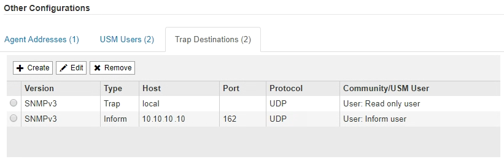

= Actualice el agente SNMP
:allow-uri-read: 
:icons: font
:imagesdir: ../media/

[role="lead"]
Puede que desee deshabilitar las notificaciones SNMP, actualizar cadenas de comunidad, o añadir o quitar direcciones de agente, usuarios USM y destinos de capturas.

.Lo que necesitará
* Debe iniciar sesión en Grid Manager mediante un xref:../admin/web-browser-requirements.adoc[navegador web compatible].
* Debe tener el permiso acceso raíz.

.Acerca de esta tarea
Siempre que actualice xref:configuring-snmp-agent.adoc[Configuración del agente SNMP], Tenga en cuenta que debe hacer clic en *Guardar* en la parte inferior de la página Agente SNMP para confirmar los cambios realizados en cada ficha.

.Pasos
. Seleccione *CONFIGURACIÓN* > *Supervisión* > *Agente SNMP*.
+
Aparece la página Agente SNMP.

. Si desea desactivar el agente SNMP en todos los nodos de cuadrícula, desactive la casilla de verificación *Activar SNMP* y haga clic en *Guardar*.
+
El agente SNMP está deshabilitado para todos los nodos de grid. Si después vuelve a habilitar el agente, se conserva cualquier configuración de SNMP anterior.

. Si lo desea, actualice los valores introducidos para *Contacto del sistema* y *ubicación del sistema*.
. Opcionalmente, anule la selección de la casilla de verificación *Activar notificaciones de agente SNMP* si ya no desea que el agente SNMP de StorageGRID envíe notificaciones de captura e informe.
+
Cuando esta casilla de verificación está desactivada, el agente SNMP admite acceso MIB de sólo lectura, pero no envía ninguna notificación SNMP.

. Opcionalmente, anule la selección de la casilla de verificación *Activar capturas de autenticación* si ya no desea que el agente SNMP de StorageGRID envíe una captura de autenticación cuando reciba un mensaje de protocolo autenticado incorrectamente.
. Si utiliza SNMPv1 o SNMPv2c, puede actualizar opcionalmente la sección Community Strings.
+
Los campos de esta sección se utilizan para la autenticación basada en la comunidad en SNMPv1 o SNMPv2c. Estos campos no se aplican a SNMPv3.

+

NOTE: Si desea quitar la cadena de comunidad predeterminada, primero debe asegurarse de que todos los destinos de capturas utilicen una cadena de comunidad personalizada.

. Si desea actualizar las direcciones del agente, seleccione la ficha direcciones del agente en la sección otras configuraciones.
+
image::../media/snmp_other_configurations_agent_addresses_table.png[Tabla direcciones del agente de otras configuraciones de SNMP]

+
Utilice esta pestaña para especificar una o más «'direcciones de escucha'». Éstas son las direcciones StorageGRID en las que el agente SNMP puede recibir consultas. Cada dirección de agente incluye un protocolo de Internet, un protocolo de transporte, una red StorageGRID y un puerto.

+
.. Para agregar una dirección de agente, haga clic en *Crear*. A continuación, consulte el paso correspondiente a las direcciones del agente en las instrucciones para configurar el agente SNMP.
.. Para editar una dirección de agente, seleccione el botón de opción de la dirección y haga clic en *Editar*. A continuación, consulte el paso correspondiente a las direcciones del agente en las instrucciones para configurar el agente SNMP.
.. Para eliminar una dirección de agente, seleccione el botón de opción de la dirección y haga clic en *Quitar*. A continuación, haga clic en *Aceptar* para confirmar que desea eliminar esta dirección.
.. Para confirmar los cambios, haga clic en *Guardar* en la parte inferior de la página Agente SNMP.

. Si desea actualizar usuarios de USM, seleccione la pestaña usuarios de USM en la sección Other Configurations.
+
image::../media/snmp_other_config_usm_users_table.png[SNMP otra tabla de usuario USM de configuración]

+
Use esta pestaña para definir los usuarios USM que están autorizados a consultar el MIB o a recibir capturas e informes.

+
.. Para añadir un usuario USM, haga clic en *Crear*. A continuación, consulte el paso para los usuarios de USM en las instrucciones para configurar el agente de SNMP.
.. Para editar un usuario USM, seleccione el botón de opción del usuario y haga clic en *Editar*. A continuación, consulte el paso para los usuarios de USM en las instrucciones para configurar el agente de SNMP.
+
El nombre de usuario de un usuario USM existente no se puede cambiar. Si necesita cambiar un nombre de usuario, debe eliminar el usuario y crear uno nuevo.

+

NOTE: Si agrega o quita un identificador de motor autorizado de un usuario y ese usuario está seleccionado actualmente para un destino, debe editar o quitar el destino, como se describe en el paso <<SNMP_TRAP_DESTINATION,Destino de capturas SNMP>>. De lo contrario, se produce un error de validación al guardar la configuración del agente SNMP.

.. Para eliminar un usuario USM, seleccione el botón de opción del usuario y haga clic en *Quitar*. A continuación, haga clic en *Aceptar* para confirmar que desea eliminar este usuario.
+

NOTE: Si el usuario que quitó está actualmente seleccionado para un destino de captura, debe editar o quitar el destino, como se describe en el paso <<SNMP_TRAP_DESTINATION,Destino de capturas SNMP>>. De lo contrario, se produce un error de validación al guardar la configuración del agente SNMP.

+
image::../media/snmp_usm_user_remove_error.png[Error al quitar el usuario USM en SNMP]

.. Para confirmar los cambios, haga clic en *Guardar* en la parte inferior de la página Agente SNMP.

. [[SNMP_TRAP_DESTINATION, start=9]]Si desea actualizar los destinos de capturas, seleccione la pestaña Destinos de captura en la sección otras configuraciones.
+

+
La pestaña Destinos de captura permite definir uno o varios destinos para las notificaciones de capturas StorageGRID o informar. Al activar el agente SNMP y hacer clic en *Guardar*, StorageGRID comienza a enviar notificaciones a cada destino definido. Las notificaciones se envían cuando se activan alertas y alarmas. También se envían notificaciones estándar para las entidades MIB-II admitidas (por ejemplo, ifdown y coldStart).

+
.. Para agregar un destino de captura, haga clic en *Crear*. A continuación, consulte el paso para los destinos de capturas en las instrucciones para configurar el agente SNMP.
.. Para editar un destino de captura, seleccione el botón de opción del usuario y haga clic en *Editar*. A continuación, consulte el paso para los destinos de capturas en las instrucciones para configurar el agente SNMP.
.. Para eliminar un destino de captura, seleccione el botón de opción del destino y haga clic en *Quitar*. A continuación, haga clic en *Aceptar* para confirmar que desea eliminar este destino.
.. Para confirmar los cambios, haga clic en *Guardar* en la parte inferior de la página Agente SNMP.

. Cuando haya actualizado la configuración del agente SNMP, haga clic en *Guardar*.

