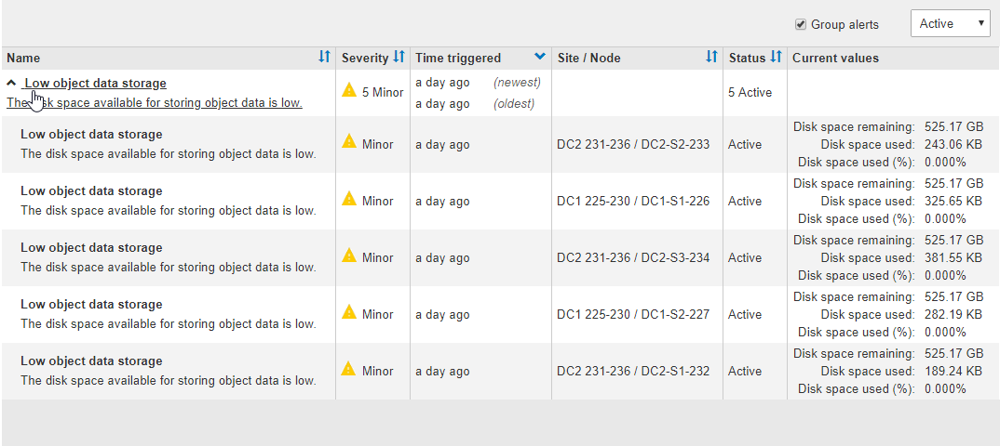
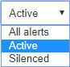

= Ver las alertas actuales
:allow-uri-read: 
:icons: font
:imagesdir: ../media/

[role="lead"]
Cuando se activa una alerta, se muestra un icono de alerta en la Consola. También se muestra un icono de alerta para el nodo en la página Nodes. También es posible enviar una notificación por correo electrónico, a menos que se haya silenciado la alerta.

.Lo que necesitará
* Debe iniciar sesión en Grid Manager mediante un xref:../admin/web-browser-requirements.adoc[navegador web compatible].
* Opcionalmente, ha visto el vídeo: https://["Vídeo: Descripción general de las alertas"^].
+
[link=https://netapp.hosted.panopto.com/Panopto/Pages/Viewer.aspx?id=2680a74f-070c-41c2-bcd3-acc5013c9cdd]
image::../media/video-screenshot-alert-overview.png[Vídeo: Descripción general de las alertas]

.Pasos
. Si una o más alertas están activas, realice una de las siguientes acciones:
+
** En el panel Estado del Panel, haga clic en el icono de alerta o haga clic en *Alertas actuales*. (Un icono de alerta y el enlace *Alertas actuales* sólo aparecen si al menos una alerta está activa.)
** Seleccione *ALERTS* > *Current*.
+
Aparece la página Alertas actuales. Enumera todas las alertas que actualmente afectan a su sistema StorageGRID.

+
image::../media/alerts_current_page.png[Página Alertas actuales]

+
De forma predeterminada, las alertas se muestran del siguiente modo:

** Primero se muestran las alertas activadas más recientemente.
** Se muestran varias alertas del mismo tipo como un grupo.
** No se muestran las alertas que se han silenciado.
** Para una alerta específica de un nodo específico, si los umbrales se alcanzan para más de una gravedad, solo se muestra la alerta más grave. Es decir, si se alcanzan los umbrales de alerta para las gravedades leve, grave y crítica, solo se muestra la alerta crítica.

+
La página Alertas actuales se actualiza cada dos minutos.

. Revise la información de la tabla.
+
[cols="1a,3a"]
|===
| Encabezado de columna | Descripción 

 a| 
Nombre
 a| 
El nombre de la alerta y su descripción.

 a| 
Gravedad
 a| 
La gravedad de la alerta. Si se agrupan varias alertas, la fila del título muestra cuántas instancias de esa alerta se producen en cada gravedad.

** *Crítico* image:../media/icon_alert_red_critical.png["Alerta de icono Rojo crítico"]: Existe una condición anormal que ha detenido las operaciones normales de un nodo StorageGRID o servicio. Debe abordar el problema subyacente de inmediato. Se pueden producir interrupciones del servicio y pérdida de datos si no se resuelve el problema.
** *Mayor* image:../media/icon_alert_orange_major.png["Alerta de icono naranja principal"]: Existe una condición anormal que afecta a las operaciones actuales o se acerca al umbral de una alerta crítica. Debe investigar las alertas principales y solucionar cualquier problema subyacente para garantizar que esta condición no detenga el funcionamiento normal de un nodo o servicio de StorageGRID.
** *Menor* image:../media/icon_alert_yellow_minor.png["Alerta de icono menor amarilla"]: El sistema funciona normalmente, pero existe una condición anormal que podría afectar la capacidad de funcionamiento del sistema si continúa. Deberá supervisar y resolver las alertas menores que no se despicen por sí mismas para asegurarse de que no provoquen un problema más grave.

 a| 
Tiempo activado
 a| 
¿Cuánto tiempo hace que se activó la alerta? Si se agrupan varias alertas, la fila de título muestra las horas de la instancia más reciente de la alerta (_Newest_) y la instancia más antigua de la alerta (_oldest_).

 a| 
Sitio/nodo
 a| 
El nombre del sitio y del nodo donde se produce la alerta. Si se agrupan varias alertas, los nombres de sitio y nodo no se muestran en la fila del título.

 a| 
Estado
 a| 
Si la alerta está activa o ha sido silenciada. Si se agrupan varias alertas y se selecciona *todas las alertas* en la lista desplegable, la fila de título muestra cuántas instancias de esa alerta están activas y cuántas instancias se han silenciado.

 a| 
Valores actuales
 a| 
El valor actual de la métrica que provocó la activación de la alerta. En el caso de algunas alertas, se muestran valores adicionales que le ayudarán a comprender e investigar la alerta. Por ejemplo, los valores mostrados para una alerta *almacenamiento de datos de objeto bajo* incluyen el porcentaje de espacio en disco utilizado, la cantidad total de espacio en disco y la cantidad de espacio en disco utilizado.

*Nota:* Si se agrupan varias alertas, los valores actuales no se muestran en la fila de título.

|===
. Para expandir y contraer grupos de alertas:
+
** Para mostrar las alertas individuales de un grupo, haga clic en el signo de intercalación hacia abajo image:../media/icon_alert_caret_down.png["icono de signo de intercalación abajo"] en el encabezado o haga clic en el nombre del grupo.
** Para ocultar las alertas individuales de un grupo, haga clic en el signo de intercalación arriba image:../media/icon_alert_caret_up.png["Icono de signo de intercalación arriba"] en el encabezado o haga clic en el nombre del grupo.
+

. Para mostrar alertas individuales en lugar de grupos de alertas, anule la selección de la casilla de verificación *Alertas de grupo* en la parte superior de la tabla.
+
image::../media/alerts_page_group_alerts_button.png[Botón de alertas de grupo]

. Para ordenar las alertas o los grupos de alertas, haga clic en las flechas arriba/abajo image:../media/icon_alert_sort_column.png["Icono de flechas de ordenación"] en cada encabezado de columna.
+
** Cuando se selecciona *Alertas de grupo*, se ordenan tanto los grupos de alertas como las alertas individuales de cada grupo. Por ejemplo, es posible que desee ordenar las alertas de un grupo por *tiempo activado* para encontrar la instancia más reciente de una alerta específica.
** Cuando *Alertas de grupo* no está seleccionada, se ordena toda la lista de alertas. Por ejemplo, es posible que desee ordenar todas las alertas por *nodo/Sitio* para ver todas las alertas que afectan a un nodo específico.

. Para filtrar las alertas por estado, use el menú desplegable que hay en la parte superior de la tabla.
+

+
** Seleccione *todas las alertas* para ver todas las alertas actuales (alertas activas y silenciadas).
** Seleccione *activo* para ver sólo las alertas actuales que están activas.
** Seleccione *silenciado* para ver sólo las alertas actuales que se han silenciado. Consulte xref:silencing-alert-notifications.adoc[Silenciar notificaciones de alerta].

. Para ver los detalles de una alerta específica, seleccione la alerta en la tabla.
+
Se muestra un cuadro de diálogo de la alerta. Consulte xref:viewing-specific-alert.adoc[Ver una alerta específica].

