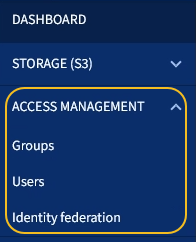

= Explore el responsable de inquilinos
:allow-uri-read: 
:icons: font
:imagesdir: ../media/

[role="lead"]
El administrador de inquilinos es la interfaz gráfica basada en navegador a la que los usuarios inquilinos acceden para configurar, gestionar y supervisar sus cuentas de almacenamiento.

Cuando los usuarios de inquilinos inician sesión en el Administrador de inquilinos, se conectan a un nodo de administración.

== Consola de tenant Manager

Una vez que un administrador de grid crea una cuenta de inquilino mediante Grid Manager o la API de gestión de grid, los usuarios de inquilinos pueden iniciar sesión en el Administrador de inquilinos.

La consola de Gestor de inquilinos permite a los usuarios inquilinos supervisar el uso del almacenamiento de un vistazo. El panel Storage Usage contiene una lista de los bloques más grandes (S3) o contenedores (Swift) para el inquilino. El valor espacio utilizado es la cantidad total de datos de objeto del bloque o contenedor. El gráfico de barras representa los tamaños relativos de estos cubos o contenedores.

El valor mostrado encima del gráfico de barras es una suma del espacio utilizado para todos los cubos o contenedores del arrendatario. Si se especificó el número máximo de gigabytes, terabytes o petabytes disponibles para el inquilino cuando se creó la cuenta, también se muestra la cantidad de cuota utilizada y restante.

image::../media/tenant_dashboard_with_buckets.png[Consola de tenant Manager]

== Menú de almacenamiento (solo inquilinos de S3)

El menú Storage se proporciona únicamente para cuentas de inquilinos de S3. Este menú permite a los usuarios de S3 gestionar claves de acceso, crear y eliminar bloques, y gestionar extremos de servicio de la plataforma.

image::../media/s3_menu.png[Menú S3]

=== Mis claves de acceso

Los usuarios de inquilinos S3 pueden gestionar las claves de acceso de la siguiente manera:

* Los usuarios que tienen el permiso gestionar sus propias credenciales de S3 pueden crear o quitar sus propias claves de acceso S3.
* Los usuarios que tienen el permiso Root Access pueden gestionar las claves de acceso de la cuenta raíz de S3, su propia cuenta y el resto de usuarios. Las claves de acceso raíz también proporcionan acceso completo a los bloques y objetos del inquilino, a menos que una política de bloque lo deshabilite explícitamente.
+

NOTE: La gestión de las claves de acceso de otros usuarios se realiza desde el menú Access Management.

=== Cucharones

Los usuarios del inquilino S3 con los permisos adecuados pueden realizar las siguientes tareas relacionadas con los bloques:

* Crear cubos
* Habilite el bloqueo de objetos de S3 para un bloque nuevo (asume que la función de bloqueo de objetos de S3 está habilitada para el sistema StorageGRID)
* Actualice la configuración de los niveles de coherencia
* Aplicar una configuración de retención predeterminada
* Configurar el uso compartido de recursos de origen cruzado (CORS)
* Activar y desactivar la configuración de la última actualización de tiempo de acceso para los segmentos que pertenecen al arrendatario
* Eliminar cubos vacíos
* Gestione los objetos de un bloque mediante el xref:../tenant/use-s3-console.adoc[Consola de S3 de experimental]

Si un administrador de grid habilitó el uso de servicios de plataforma para la cuenta de inquilino, un usuario inquilino de S3 con los permisos correspondientes también puede realizar estas tareas:

* Configure las notificaciones de eventos S3, que se pueden enviar a un servicio de destino compatible con AWS simple Notification Service™ (SNS).
* Configure la replicación de CloudMirror, que permite que el inquilino replique automáticamente objetos en un bloque de S3 externo.
* Configurar la integración de búsqueda, que envía metadatos de objetos a un índice de búsqueda de destino siempre que se crea, se elimina o actualiza un objeto o sus metadatos o etiquetas.

=== Extremos de servicios de plataforma

Si un administrador de grid habilitó el uso de servicios de plataforma para la cuenta de inquilino, un usuario de inquilino de S3 con el permiso Manage Endpoints puede configurar un extremo de destino para cada servicio de plataforma.

== Menú Access Management

El menú Access Management permite a los inquilinos StorageGRID importar grupos de usuarios desde un origen de identidades federado y asignar permisos de gestión. Los inquilinos también pueden gestionar los usuarios y los grupos de inquilinos locales, a menos que el inicio de sesión único (SSO) esté vigente para todo el sistema StorageGRID.

.Información relacionada
* xref:exploring-grid-manager.adoc[Explore Grid Manager]
* xref:../tenant/index.adoc[Usar una cuenta de inquilino]

