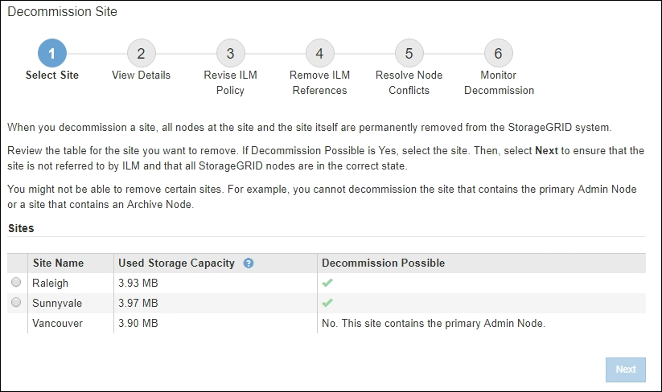

= Realizar el mantenimiento
:allow-uri-read: 
:icons: font
:imagesdir: ../media/

[role="lead"]
Realiza varios procedimientos de mantenimiento para mantener el sistema StorageGRID actualizado y garantizar que el rendimiento se realiza de forma eficiente. Grid Manager proporciona herramientas y opciones para facilitar el proceso de realización de tareas de mantenimiento.

== Actualizaciones de software

Puede realizar tres tipos de actualizaciones de software desde la página actualización de software de Grid Manager:

* Actualización de software StorageGRID
* Revisión StorageGRID
* Actualización de SANtricity OS

== Actualizaciones de software StorageGRID

Cuando existe una nueva versión de la función StorageGRID disponible, la página actualización de software le guiará durante el proceso de cargar el archivo necesario y actualizar el sistema StorageGRID. Debe actualizar todos los nodos de grid para todos los sitios del centro de datos desde el nodo de administración principal.

Durante una actualización del software StorageGRID, las aplicaciones cliente pueden seguir procesamiento y recuperación de datos de objetos.

== Revisiones

Si se detectan y resuelven problemas con el software entre versiones de características, es posible que deba aplicar una revisión al sistema StorageGRID.

Las correcciones urgentes de StorageGRID contienen cambios de software que se pueden hacer disponibles fuera de una función o una versión de revisión. Los mismos cambios se incluyen en una versión futura.

La página de corrección de StorageGRID, que se muestra a continuación, permite cargar un archivo de revisión.

image::../media/hotfix_choose_file.png[StorageGRID primera página de revisión]

La revisión se aplica primero al nodo de administración principal. A continuación, debe aprobar la aplicación de la revisión a otros nodos de cuadrícula hasta que todos los nodos de su sistema StorageGRID ejecuten la misma versión de software. Puede personalizar la secuencia de aprobación seleccionando aprobar nodos de cuadrícula individuales, grupos de nodos de cuadrícula o todos los nodos de cuadrícula.

NOTE: Mientras todos los nodos de cuadrícula se actualizan con la nueva versión de revisión, los cambios reales en una revisión sólo pueden afectar a servicios específicos de tipos de nodos específicos. Por ejemplo, una revisión sólo podría afectar al servicio LDR en nodos de almacenamiento.

== Actualizaciones del sistema operativo SANtricity

Es posible que necesite actualizar el software de sistema operativo SANtricity en las controladoras de almacenamiento de sus dispositivos de almacenamiento si las controladoras no funcionan de forma óptima. Puede cargar el archivo del sistema operativo SANtricity en el nodo de administración principal del sistema StorageGRID y aplicar la actualización desde el Administrador de grid.

La página SANtricity, que se muestra a continuación, permite cargar el archivo de actualización del sistema operativo SANtricity.

image::../media/santricity_os_upgrade_first.png[StorageGRID primera página de SANtricity OS]

Después de cargar el archivo, puede aprobar la actualización en nodos de almacenamiento individuales o en todos los nodos. La capacidad para aprobar nodos de forma selectiva facilita la programación de la actualización. Después de aprobar un nodo para la actualización, el sistema realiza una comprobación del estado e instala la actualización si es aplicable al nodo.

== Procedimientos de expansión

Puede expandir un sistema StorageGRID añadiendo volúmenes de almacenamiento a nodos de almacenamiento, agregando nuevos nodos grid a un sitio existente o añadiendo un nuevo sitio de centro de datos. Si tiene nodos de almacenamiento que usan el dispositivo de almacenamiento SG6060 o SG6060X, puede añadir una o dos bandejas de expansión al doble o triple de la capacidad de almacenamiento del nodo.

Puede realizar ampliaciones sin interrumpir el funcionamiento del sistema actual. Cuando agrega nodos o un sitio, primero implementa los nuevos nodos y después ejecuta el procedimiento de expansión desde la página expansión de cuadrícula.

image::../media/grid_expansion_progress.png[Esta imagen se explica por el texto circundante.]

== Procedimientos de recuperación de nodos

Los nodos de grid pueden fallar si un error de hardware, virtualización, sistema operativo o software hace que el nodo no se pueda utilizar o no sea fiable.

Los pasos para recuperar un nodo de cuadrícula dependen de la plataforma en la que se aloje el nodo de grid y del tipo de nodo de cuadrícula. Cada tipo de nodo de cuadrícula tiene un procedimiento de recuperación específico, que se debe seguir exactamente. En general, intenta conservar los datos del nodo de cuadrícula con errores cuando es posible, reparar o reemplazar el nodo con errores, utilizar la página recuperación para configurar el nodo de sustitución y restaurar los datos del nodo.

Por ejemplo, este diagrama de flujo muestra el procedimiento de recuperación si un nodo de administración ha fallado.

image::../media/overview_admin_node_recovery.png[Descripción general: Admin Node Recovery]

== Procedimientos de retirada

Tal vez desee eliminar de forma permanente nodos grid o un sitio de centro de datos completo de su sistema StorageGRID.

Por ejemplo, podría retirar uno o varios nodos de grid en estos casos:

* Añadió un nodo de almacenamiento de mayor tamaño al sistema y desea quitar uno o más nodos de almacenamiento más pequeños mientras conserva los objetos al mismo tiempo.
* Necesita menos almacenamiento total.
* Ya no necesita un nodo de puerta de enlace ni un nodo de administrador que no sea primario.
* El grid incluye un nodo desconectado que no se puede recuperar ni volver a conectar.

Puede utilizar la página nodos de misión no deseados en Grid Manager para eliminar los siguientes tipos de nodos de cuadrícula:

* Los nodos de almacenamiento, a menos que no haya suficientes nodos, permanecerán en el sitio para admitir ciertos requisitos
* Nodos de puerta de enlace
* Nodos de administrador no primario

image::../media/decommission_nodes_page_all_connected.png[Captura de pantalla de la página de la misión]

Puede utilizar la página Sitio de retirada en Grid Manager para quitar un sitio. La retirada de un sitio conectado quita un sitio operativo y conserva los datos. Una retirada de sitio desconectada quita un sitio que ha fallado pero no conserva los datos. El asistente del sitio de retirada le guía a través del proceso de selección del sitio, visualización de detalles del sitio, revisión de la política de ILM, eliminación de referencias del sitio de las reglas de ILM y resolución de conflictos de nodos.

== Procedimientos de mantenimiento de red

Algunos de los procedimientos de mantenimiento de red que debe realizar son los siguientes:

* Actualización de las subredes en la red de cuadrícula
* Uso de la herramienta Change IP para cambiar la configuración de red establecida inicialmente durante la implementación de grid
* Agregar, quitar o actualizar servidores de sistema de nombres de dominio (DNS)
* Agregar, eliminar o actualizar servidores de protocolo de tiempo de redes (NTP) para garantizar que los datos se sincronizan con precisión entre los nodos de grid
* Restauración de conectividad de red a los nodos que pueden haberse aislado del resto del grid

== Procedimientos de middleware y a nivel de host

Algunos procedimientos de mantenimiento son específicos de los nodos StorageGRID que se implementan en Linux o VMware, o bien son específicos de otros componentes de la solución de StorageGRID. Por ejemplo, puede que desee migrar un nodo de cuadrícula a un host Linux diferente o realizar tareas de mantenimiento en un nodo de archivado conectado a Tivoli Storage Manager (TSM).

== Clonado de nodos de dispositivos

El clonado de nodos de dispositivos le permite sustituir fácilmente un nodo de dispositivos existente en el grid por un dispositivo de diseño más reciente o mayores funcionalidades que forman parte del mismo sitio lógico de StorageGRID. El proceso transfiere todos los datos al dispositivo nuevo, situándolos en servicio para sustituir el nodo de dispositivo antiguo y dejar el dispositivo antiguo en estado previo a la instalación. La clonación ofrece un proceso de actualización de hardware que es fácil de ejecutar y proporciona un método alternativo para reemplazar dispositivos.

== Procedimientos de los nodos de grid

Es posible que deba realizar ciertos procedimientos en un nodo de grid específico. Por ejemplo, es posible que deba reiniciar un nodo de grid o detener y reiniciar manualmente un servicio de nodo de grid específico. Algunos procedimientos de nodo de cuadrícula se pueden realizar desde Grid Manager; otros requieren que inicie sesión en el nodo de cuadrícula y que utilice la línea de comandos del nodo.

.Información relacionada
* xref:../admin/index.adoc[Administre StorageGRID]
* xref:../upgrade/index.adoc[Actualizar el software de]
* xref:../expand/index.adoc[Amplíe su grid]
* xref:../maintain/index.adoc[Recuperación y mantenimiento]

