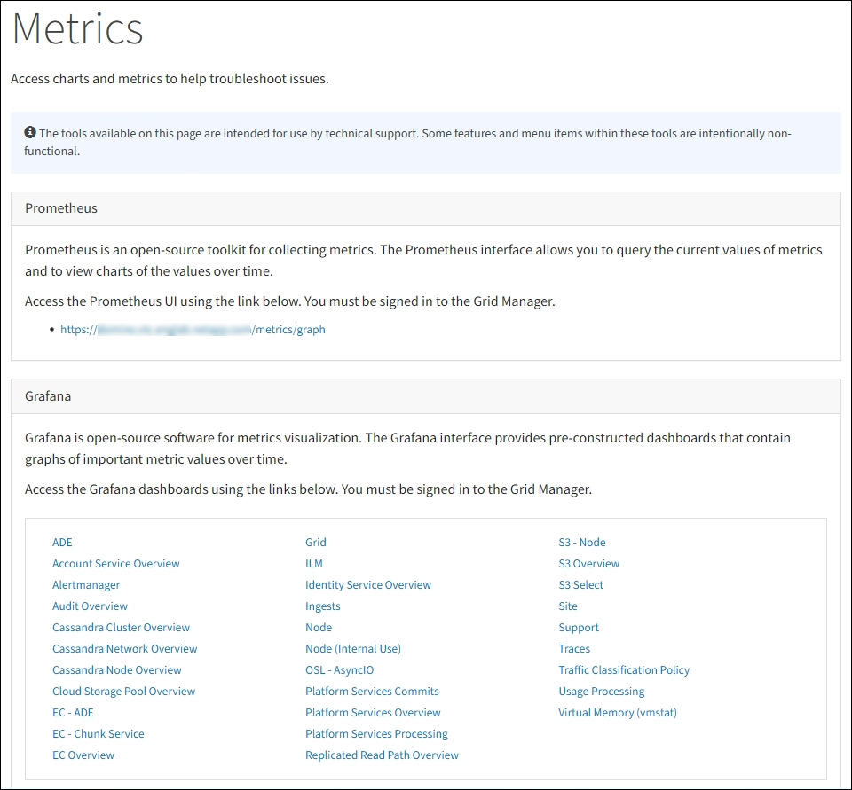

= Use las opciones de soporte de StorageGRID
:allow-uri-read: 
:icons: font
:imagesdir: ../media/

[role="lead"]
Grid Manager ofrece opciones para ayudarle a trabajar con el soporte técnico en caso de que surja un problema con el sistema StorageGRID.

== Configure AutoSupport

La función AutoSupport permite que el sistema StorageGRID envíe mensajes de estado y estado al soporte técnico. El uso de AutoSupport puede acelerar significativamente la detección y resolución de problemas. El soporte técnico también puede supervisar las necesidades de almacenamiento del sistema y ayudarle a determinar si necesita añadir nodos o sitios nuevos. De manera opcional, puede configurar los mensajes de AutoSupport para que se envíen a un destino adicional.

La configuración de AutoSupport se realiza mediante el Administrador de cuadrícula (*SUPPORT* > *Tools* > *AutoSupport*). La página *AutoSupport* tiene dos fichas: *Ajustes* y *resultados*.

image::../media/autosupport_accessing_settings.png[AutoSupport en el Administrador de grid]

=== Información incluida en los mensajes de AutoSupport

Los mensajes de AutoSupport incluyen información como la siguiente:

* Versión del software StorageGRID
* Versión del sistema operativo
* Información de atributos a nivel de sistema y ubicación
* Alertas y alarmas recientes (sistema heredado)
* Estado actual de todas las tareas de cuadrícula, incluidos los datos históricos
* Uso de la base de datos del nodo de administrador
* Número de objetos perdidos o faltantes
* Ajustes de configuración de cuadrícula
* Entidades NMS
* Política de ILM activa
* Archivo de especificación de grid aprovisionado
* Métricas de diagnóstico

Puede habilitar la función AutoSupport y las opciones individuales de AutoSupport cuando instale StorageGRID por primera vez, o bien puede habilitarlas más adelante. Si AutoSupport no está habilitado, aparecerá un mensaje en el Panel de Grid Manager. El mensaje incluye un enlace a la página de configuración de AutoSupport.

image::../media/autosupport_disabled_message.png[Mensaje AutoSupport deshabilitado]

Si cierra el mensaje, no volverá a aparecer hasta que se borre la caché del explorador, aunque AutoSupport permanezca deshabilitado.

=== Utilice el Asesor digital

El asesor digital de Active IQ está basado en la nube y aprovecha el análisis predictivo y los conocimientos de la comunidad de la base instalada de NetApp. Sus evaluaciones de riesgos continuas, las alertas predictivas, las directrices prescriptivas y las acciones automatizadas le ayudan a evitar problemas antes de que se produzcan, lo que mejora el estado del sistema y aumenta la disponibilidad del sistema.

Debe habilitar AutoSupport si desea usar las consolas y la funcionalidad del asesor digital en el sitio de soporte de NetApp.

https://docs.netapp.com/us-en/active-iq/index.html["Documentación del asesor digital"^]

== Recopile registros de StorageGRID

Para ayudar a resolver un problema, es posible que deba recoger archivos de registro y reponerlos al soporte de.

StorageGRID utiliza los archivos de registro para capturar eventos, mensajes de diagnóstico y condiciones de error. El archivo bycast.log se mantiene para cada nodo de grid y es el archivo principal de solución de problemas. StorageGRID también crea archivos de registro para servicios StorageGRID individuales, archivos de registro relacionados con actividades de implementación y mantenimiento y archivos de registro relacionados con aplicaciones de terceros.

Los usuarios que dispongan de los permisos adecuados y que conozcan la contraseña de acceso de aprovisionamiento para el sistema StorageGRID pueden utilizar la página registros en el administrador de grid para recopilar archivos de registro, datos del sistema y datos de configuración. Cuando recoja registros, seleccione un nodo o nodos y especifique un período de tiempo. Los datos se recogen y archivan en un `.tar.gz` archivo, que puede descargar en un equipo local. Dentro de este archivo hay un archivo de registro para cada nodo de cuadrícula.

image::../media/support_logs_select_nodes.png[Captura de pantalla de la IU de recopilación de registros]

== Utilice métricas y ejecute diagnósticos

Al solucionar problemas, puede trabajar con el soporte técnico para revisar métricas y gráficos detallados para su sistema StorageGRID. También puede ejecutar consultas de diagnóstico prediseñadas para evaluar de forma proactiva valores clave en su sistema StorageGRID.

=== Página de métricas

La página Metrics proporciona acceso a las interfaces de usuario de Prometheus y Grafana. Prometheus es un software de código abierto para recopilar métricas. Grafana es un software de código abierto para la visualización de métricas.

IMPORTANT: Las herramientas disponibles en la página Métricas están destinadas al soporte técnico. Algunas funciones y elementos de menú de estas herramientas no son intencionalmente funcionales y están sujetos a cambios.

El enlace de la sección Prometheus de la página Metrics le permite consultar los valores actuales de las métricas de StorageGRID y ver gráficos de los valores a lo largo del tiempo.

image::../media/metrics_page_prometheus.png[Prometeo de la página de métricas]

NOTE: Las métricas que incluyen _private_ en sus nombres están destinadas únicamente a uso interno y están sujetas a cambios entre versiones de StorageGRID sin previo aviso.

Los enlaces de la sección Grafana de la página Metrics le permiten acceder a paneles preconstruidos que contienen gráficos de métricas de StorageGRID a lo largo del tiempo.

image::../media/metrics_page_grafana.png[Página de métricas Grafana]

=== Página Diagnóstico

La página Diagnósticos realiza un conjunto de comprobaciones de diagnóstico preconstruidas sobre el estado actual de la cuadrícula. En el ejemplo, todos los diagnósticos tienen un estado normal.

image::../media/support_diagnostics_page.png[Página de diagnóstico de soporte]

Al hacer clic en un diagnóstico específico puede ver detalles sobre el diagnóstico y sus resultados actuales.

En este ejemplo, se muestra el uso actual de la CPU para cada nodo de un sistema StorageGRID. Todos los valores de nodo están por debajo de los umbrales de atención y precaución, por lo que el estado general del diagnóstico es normal.

image::../media/support_diagnostics_cpu_utilization.png[Respalde el diagnóstico de utilización de CPU]

.Información relacionada
* xref:../admin/index.adoc[Administre StorageGRID]
* xref:configuring-network-settings.adoc[Configure los ajustes de red]

