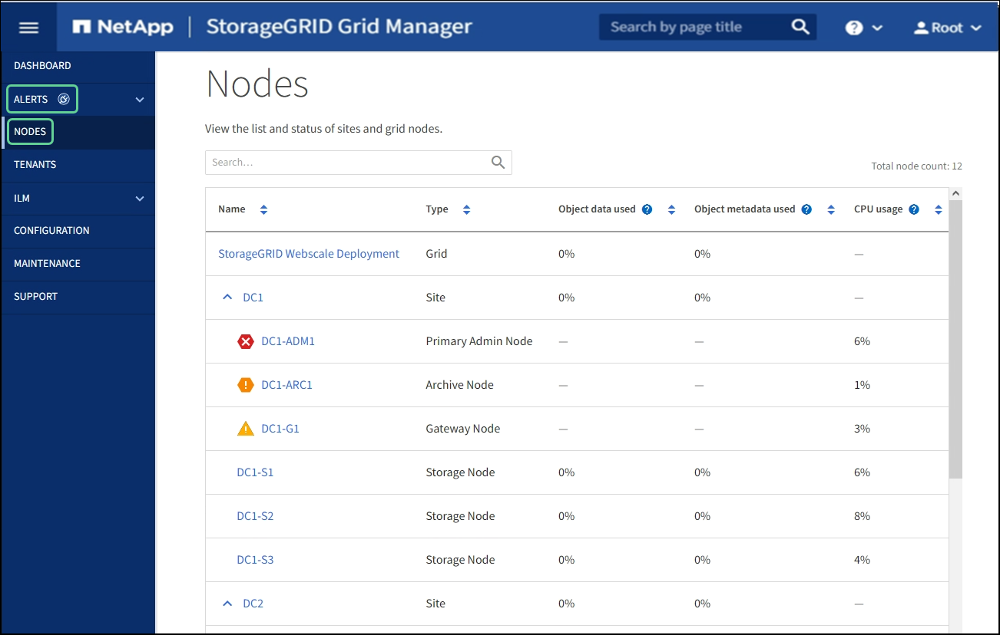

= Vea la página Nodes
:allow-uri-read: 
:icons: font
:imagesdir: ../media/

[role="lead"]
Si necesita información más detallada sobre el sistema StorageGRID de la que proporciona la consola, puede usar la página nodos para ver métricas de toda la cuadrícula, cada sitio de la cuadrícula y cada nodo de un sitio.

En la tabla Nodes, se muestran todos los sitios y los nodos del sistema StorageGRID. La información de resumen se muestra para cada nodo. Si un nodo tiene una alerta activa, aparece un icono junto al nombre del nodo. Si el nodo está conectado y no tiene alertas activas, no se muestra ningún icono.

== Iconos de estado de conexión

* *No conectado - Desconocido* image:../media/icon_alarm_blue_unknown.png["icono de signo de interrogación azul"]: El nodo no está conectado a la cuadrícula por una razón desconocida. Por ejemplo, se ha perdido la conexión de red entre los nodos o se ha apagado el suministro eléctrico. La alerta *no se puede comunicar con el nodo* también puede activarse. Es posible que otras alertas estén activas también. Esta situación requiere atención inmediata.
+

NOTE: Es posible que un nodo aparezca como desconocido durante las operaciones de apagado gestionadas. Puede ignorar el estado Desconocido en estos casos.

* *No conectado - administrativamente abajo* image:../media/icon_alarm_gray_administratively_down.png["icono de questionmark gris"]: El nodo no está conectado a la cuadrícula por un motivo esperado. Por ejemplo, el nodo o los servicios del nodo se han apagado correctamente, el nodo se está reiniciando o se está actualizando el software. Una o más alertas también pueden estar activas.

Si un nodo está desconectado de la cuadrícula, puede tener una alerta subyacente, pero sólo aparece el icono "'no conectado'". Para ver las alertas activas de un nodo, seleccione el nodo.

== Iconos de alerta

Si hay una alerta activa de un nodo, aparece uno de los siguientes iconos junto al nombre del nodo:

* *Crítico* image:../media/icon_alert_red_critical.png["Alerta de icono Rojo crítico"]: Existe una condición anormal que ha detenido las operaciones normales de un nodo StorageGRID o servicio. Debe abordar el problema subyacente de inmediato. Se pueden producir interrupciones del servicio y pérdida de datos si no se resuelve el problema.
* *Mayor* image:../media/icon_alert_orange_major.png["Alerta de icono naranja principal"]: Existe una condición anormal que afecta a las operaciones actuales o se acerca al umbral de una alerta crítica. Debe investigar las alertas principales y solucionar cualquier problema subyacente para garantizar que esta condición no detenga el funcionamiento normal de un nodo o servicio de StorageGRID.
* *Menor* image:../media/icon_alert_yellow_minor.png["Alerta de icono menor amarilla"]: El sistema funciona normalmente, pero existe una condición anormal que podría afectar la capacidad de funcionamiento del sistema si continúa. Deberá supervisar y resolver las alertas menores que no se despicen por sí mismas para asegurarse de que no provoquen un problema más grave.

== Detalles de un sistema, sitio o nodo

Para ver la información disponible, seleccione el nombre de la cuadrícula, sitio o nodo de la siguiente manera:

* Seleccione el nombre de la cuadrícula para ver un resumen de las estadísticas de todo el sistema StorageGRID. (La captura de pantalla muestra un sistema denominado StorageGRID Deployment).
* Seleccione un sitio de centro de datos específico para ver un resumen de las estadísticas de todos los nodos de ese sitio.
* Seleccione un nodo concreto para ver información detallada de ese nodo.

== Pestañas de la página Nodes

Las pestañas de la parte superior de la página Nodes se basan en lo que seleccione en el árbol de la izquierda.

[cols="1a,2a,1a"]
|===
| Nombre de la ficha | Descripción | Incluido para 

 a| 
Descripción general
 a| 
* Proporciona información básica sobre cada nodo.
* Muestra las alertas activas que afectan al nodo.

 a| 
Todos los nodos

 a| 
Hardware subyacente
 a| 
* Muestra el uso de CPU y de memoria para cada nodo
* Para los nodos del dispositivo, proporciona información adicional de hardware.

 a| 
Todos los nodos

 a| 
Red
 a| 
Muestra un gráfico que muestra el tráfico de red recibido y enviado a través de las interfaces de red. La vista de un único nodo muestra información adicional para el nodo.
 a| 
Todos los nodos, cada sitio y el grid completo

 a| 
Reducida
 a| 
* Proporciona detalles para los dispositivos de disco y volúmenes de cada nodo.
* Para los nodos de almacenamiento, cada sitio y todo el grid, incluye gráficos que muestran el almacenamiento de datos de objetos y el almacenamiento de metadatos usado con el tiempo.

 a| 
Todos los nodos, cada sitio y el grid completo

 a| 
Objetos
 a| 
* Proporciona información sobre las tasas de procesamiento y recuperación de S3 y Swift.
* En el caso de los nodos de almacenamiento, proporciona información sobre el recuento de objetos y las consultas del almacén de metadatos y la verificación en segundo plano.

 a| 
Nodos de almacenamiento, cada sitio y el grid completo

 a| 
ILM
 a| 
Proporciona información acerca de las operaciones de gestión del ciclo de vida de la información (ILM).

* En el caso de los nodos de almacenamiento, se proporcionan detalles sobre la evaluación del ILM y la verificación en segundo plano para objetos codificados de borrado.
* Muestra un gráfico de la cola de ILM a lo largo del tiempo de cada sitio y de la cuadrícula en su totalidad.
* En todo el grid, ofrece el tiempo estimado para completar un análisis completo de ILM de todos los objetos.

 a| 
Nodos de almacenamiento, cada sitio y el grid completo

 a| 
Equilibrador de carga
 a| 
Incluye gráficos de rendimiento y diagnóstico relacionados con el servicio Load Balancer.

* Para cada sitio, proporciona un resumen agregado de las estadísticas para todos los nodos de ese sitio.
* Para toda la cuadrícula, proporciona un resumen agregado de las estadísticas de todos los sitios.

 a| 
Los nodos de administrador y de puerta de enlace, cada sitio y todo el grid

 a| 
Servicios de plataforma
 a| 
Proporciona información sobre cualquier operación de servicio de plataforma S3 en un sitio.
 a| 
Cada sitio

 a| 
System Manager de SANtricity
 a| 
Ofrece acceso a SANtricity System Manager. En SANtricity System Manager, puede revisar la información de diagnóstico de hardware y entorno de la controladora de almacenamiento, así como los problemas relacionados con las unidades.
 a| 
Nodos del dispositivo de almacenamiento

*Nota*: La ficha Administrador del sistema de SANtricity no aparecerá si el firmware del controlador en el dispositivo de almacenamiento es anterior a 8.70 (11.70).

|===

== Métricas de Prometheus

El servicio Prometheus en nodos de administración recopila métricas de series temporales de los servicios de todos los nodos.

La métrica recopilada por Prometheus se utiliza en varios lugares de Grid Manager:

* *Página de nodos*: Los gráficos y gráficos de las fichas disponibles en la página Nodes utilizan la herramienta de visualización Grafana para mostrar las métricas de series de tiempo recogidas por Prometheus. Grafana muestra los datos de la serie Time en formatos de gráficos y gráficos, mientras que Prometheus sirve como origen de datos del back-end.
+
image::../media/nodes_page_network_traffic_graph.png[Gráfico Prometheus]

* *Alertas*: Las alertas se activan en niveles de gravedad específicos cuando las condiciones de regla de alerta que utilizan las métricas Prometheus se evalúan como verdaderas.
* *API de gestión de grid*: Puede utilizar métricas Prometheus en reglas de alerta personalizadas o con herramientas de automatización externas para supervisar su sistema StorageGRID. Puede consultar una lista completa de la métrica Prometheus en la API de Grid Management. (En la parte superior de Grid Manager, seleccione el icono de ayuda y seleccione *Documentación de API* > *métricas*.) Si bien hay más de mil métricas disponibles, solo se requiere una cantidad relativamente pequeña para supervisar las operaciones de StorageGRID más importantes.
+

NOTE: Las métricas que incluyen _private_ en sus nombres están destinadas únicamente a uso interno y están sujetas a cambios entre versiones de StorageGRID sin previo aviso.

* La página *SUPPORT* > *Tools* > *Diagnostics* y la página *SUPPORT* > *Tools* > *Metrics*: Estas páginas, que están principalmente destinadas a ser utilizadas por el soporte técnico, proporcionan una serie de herramientas y gráficos que usan los valores de las métricas Prometheus.
+

NOTE: Algunas funciones y elementos de menú de la página Métricas no son intencionalmente funcionales y están sujetos a cambios.

== Atributos de la StorageGRID

Los atributos notifican valores y Estados para muchas de las funciones del sistema StorageGRID. Los valores de los atributos están disponibles para cada nodo de la cuadrícula, cada sitio y toda la cuadrícula.

Los atributos StorageGRID se utilizan en varios lugares del Gestor de grid:

* *Página nodos*: Muchos de los valores mostrados en la página nodos son atributos StorageGRID. (Las métricas de Prometheus también se muestran en las páginas de nodos.)
* *Alarmas*: Cuando los atributos alcanzan valores de umbral definidos, las alarmas StorageGRID (sistema heredado) se activan a niveles de gravedad específicos.
* *Árbol de topología de cuadrícula*: Los valores de atributo se muestran en el árbol de topología de cuadrícula (*SUPPORT* > *Tools* > *topología de cuadrícula*).
* *Eventos*: Los eventos del sistema se producen cuando ciertos atributos registran un error o condición de fallo para un nodo, incluidos errores como errores de red.

=== Valores de atributo

Los atributos se notifican con el mejor esfuerzo y son aproximadamente correctos. Las actualizaciones de atributos se pueden perder en determinadas circunstancias, como el bloqueo de un servicio o el fallo y la reconstrucción de un nodo de cuadrícula.

Además, los retrasos de propagación pueden ralentizar la generación de informes de atributos. Los valores actualizados de la mayoría de los atributos se envían al sistema StorageGRID a intervalos fijos. Puede tardar varios minutos en que una actualización sea visible en el sistema, y se pueden notificar dos atributos que cambian más o menos simultáneamente en momentos ligeramente diferentes.

.Información relacionada
* xref:../monitor/index.adoc[Supervisión y solución de problemas]
* xref:monitoring-and-managing-alerts.adoc[Supervisar y gestionar alertas]
* xref:using-storagegrid-support-options.adoc[Use las opciones de soporte de StorageGRID]

