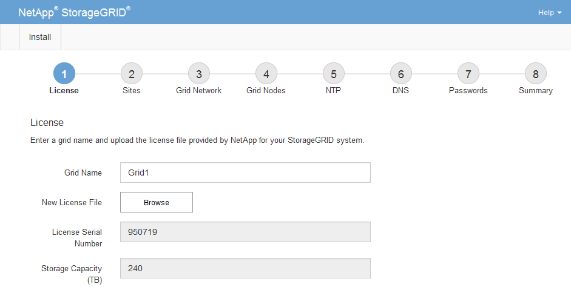

= Especifique la información de licencia de StorageGRID
:allow-uri-read: 
:icons: font
:imagesdir: ../media/

[role="lead"]
Debe especificar el nombre del sistema StorageGRID y cargar el archivo de licencia proporcionado por NetApp.

.Pasos
. En la página Licencia, introduzca un nombre significativo para su sistema StorageGRID en *Nombre de cuadrícula*.
+
Tras la instalación, el nombre se muestra en la parte superior del menú nodos.

. Haga clic en *Browse*, busque el archivo de licencia de NetApp (`NLFunique_id.txt`) Y haga clic en *Abrir*.
+
El archivo de licencia se valida y se muestran el número de serie y la capacidad de almacenamiento con licencia.

+

NOTE: El archivo de instalación de StorageGRID incluye una licencia gratuita que no proporciona ningún derecho de soporte para el producto. Puede actualizar a una licencia que ofrezca soporte tras la instalación.

+

. Haga clic en *Siguiente*.

