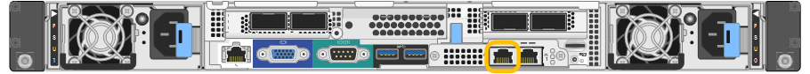

= Acceda al instalador de dispositivos de StorageGRID
:allow-uri-read: 
:icons: font
:imagesdir: ../media/

[role="lead"]
Debe acceder al instalador de dispositivos de StorageGRID para configurar las conexiones entre el dispositivo y las tres redes StorageGRID: La red de grid, la red de administrador (opcional) y la red de cliente (opcional).

.Lo que necesitará
* Está usando cualquier cliente de gestión que pueda conectarse a la red administrativa de StorageGRID.
* El cliente tiene un xref:../admin/web-browser-requirements.adoc[navegador web compatible].
* El dispositivo de servicios está conectado a todas las redes StorageGRID que tiene previsto utilizar.
* Conoce la dirección IP, la puerta de enlace y la subred del dispositivo de servicios de estas redes.
* Configuró los switches de red que planea utilizar.

.Acerca de esta tarea
Para acceder inicialmente al instalador de dispositivos StorageGRID, puede utilizar la dirección IP asignada por DHCP para el puerto de la red de administración en el dispositivo de servicios (suponiendo que esté conectado a la red de administración) o puede conectar un portátil de servicio directamente al dispositivo de servicios.

.Pasos
. Si es posible, utilice la dirección DHCP del puerto de red de administración en el dispositivo de servicios para acceder al instalador de StorageGRID Appliance.
+
*SG100 Puerto de red de administración*

+
image:../media/sg100_admin_network_port.png["Puerto de red de administración en el SG100"]

+
*SG1000 Admin Network Port*

+

+
.. Localice la etiqueta de dirección MAC en la parte frontal del dispositivo servicios y determine la dirección MAC del puerto de red de administración.
+
La etiqueta de dirección MAC incluye la dirección MAC para el puerto de gestión del BMC.

+
Para determinar la dirección MAC del puerto de red de administración, debe agregar *2* al número hexadecimal de la etiqueta. Por ejemplo, si la dirección MAC de la etiqueta termina en *09*, la dirección MAC del puerto de administración finalizará en *0B*. Si la dirección MAC de la etiqueta termina en *(_y_)FF*, la dirección MAC del puerto de administración finalizará en *(_y_+1)01*. Puede realizar este cálculo fácilmente abriendo Calculadora en Windows, establecerlo en modo Programador, seleccionando hex, escribiendo la dirección MAC y, a continuación, escribiendo *+ 2 =*.

.. Proporcione la dirección MAC al administrador de red, de modo que puedan buscar la dirección DHCP del dispositivo en la red de administración.
.. Desde el cliente, introduzca esta URL para el instalador de dispositivos StorageGRID: +
`*https://_services-appliance_IP_:8443*`
+
Para `_services-appliance_IP_`, Utilice la dirección DHCP.

.. Si se le solicita una alerta de seguridad, vea e instale el certificado con el asistente de instalación del explorador.
+
La alerta no aparecerá la próxima vez que acceda a esta URL.

+
Aparece la página de inicio del instalador de dispositivos de StorageGRID. La información y los mensajes que se muestran cuando accede por primera vez a esta página dependen de cómo el dispositivo está conectado actualmente a redes StorageGRID. Pueden aparecer mensajes de error que se resolverán en pasos posteriores.

. Como alternativa, si no puede obtener una dirección IP mediante DHCP, utilice una conexión local de enlace para acceder al instalador de dispositivos de StorageGRID.
+
.. Conecte un ordenador portátil de servicio directamente al puerto RJ-45 más derecho del dispositivo de servicios mediante un cable Ethernet.
+
*Conexión local de enlace SG100*

+
image::../media/sg100_link_local_port.png[Conexión local de enlace SG100]

+
*Conexión local de enlace SG1000*

+
image::../media/sg1000_link_local_port.png[Conexión de enlace local SG1000]

.. Abra un explorador web.
.. Introduzca esta URL para el instalador del dispositivo StorageGRID: +
`*\https://169.254.0.1:8443*`
+
Aparece la página de inicio del instalador de dispositivos de StorageGRID. La información y los mensajes que se muestran cuando accede por primera vez a esta página dependen de cómo el dispositivo está conectado actualmente a redes StorageGRID. Pueden aparecer mensajes de error que se resolverán en pasos posteriores.

+

NOTE: Si no puede acceder a la página de inicio a través de una conexión local de enlace, configure la dirección IP del portátil de servicio como `169.254.0.2`y vuelva a intentarlo.

. Revise los mensajes que se muestran en la página Inicio y configure la configuración del vínculo y la configuración IP, según sea necesario.
+
image::../media/appliance_installer_home_services_appliance.png[Casa del instalador de dispositivos - SG100 y SG1000]

