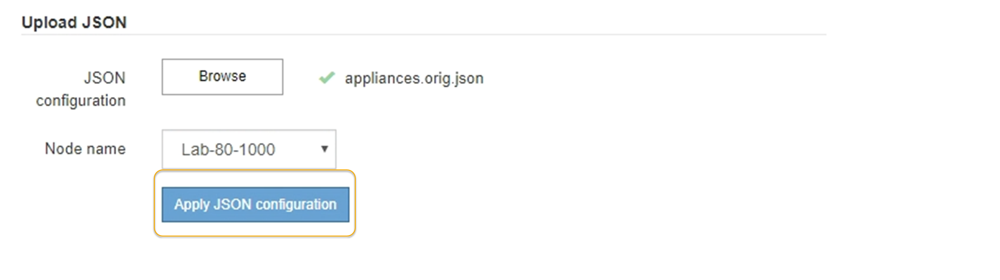

= Automatice la configuración del dispositivo con StorageGRID Appliance Installer
:allow-uri-read: 
:icons: font
:imagesdir: ../media/

[role="lead"]
Puede automatizar la configuración de un dispositivo mediante un archivo JSON que contiene la información de configuración. El archivo se carga con el instalador de dispositivos de StorageGRID.

.Lo que necesitará
* El dispositivo debe tener el firmware más reciente compatible con StorageGRID 11.5 o superior.
* Debe estar conectado al instalador de dispositivos de StorageGRID en el dispositivo que esté configurando mediante un xref:../admin/web-browser-requirements.adoc[navegador web compatible].

.Acerca de esta tarea
Puede automatizar las tareas de configuración de los dispositivos, como la configuración de las siguientes opciones:

* Redes de grid, red de administración y direcciones IP de red de cliente
* Interfaz BMC
* Enlaces de red
+
** Modo de enlace de puerto
** Modo de enlace de red
** Velocidad de enlace

La configuración del dispositivo con un archivo JSON cargado suele ser más eficaz que realizar la configuración manualmente mediante múltiples páginas en el instalador del dispositivo StorageGRID, especialmente si tiene que configurar muchos nodos. Debe aplicar el archivo de configuración para cada nodo de uno en uno.

NOTE: Los usuarios con experiencia que desean automatizar tanto la instalación como la configuración de sus dispositivos pueden hacerlo xref:automating-installation-configuration-appliance-nodes-configure-sga-py-script.adoc[utilice el script configure-sga.py].

.Pasos
. Genere el archivo JSON mediante uno de los siguientes métodos:
+
** La https://["Aplicación ConfigBuilder"^].
** La xref:automating-installation-configuration-appliance-nodes-configure-sga-py-script.adoc[configure-sga.py secuencia de comandos de configuración del dispositivo]. Puede descargar la secuencia de comandos desde el instalador del dispositivo StorageGRID (*Ayuda* *secuencia de comandos de configuración del dispositivo*).
+
Los nombres de nodos en el archivo JSON deben seguir estos requisitos:

+
*** Debe ser un nombre de host válido que contenga al menos 1 y no más de 32 caracteres
*** Puede usar letras, números y guiones
*** No se puede iniciar o finalizar con un guión
*** No puede contener solo números
+

IMPORTANT: Asegúrese de que los nombres de nodo (los nombres de nivel superior) del archivo JSON son únicos o de que no pueda configurar más de un nodo mediante el archivo JSON.

. Seleccione *Avanzado* > *Actualizar configuración del dispositivo*.
+
Aparece la página Actualizar configuración del dispositivo.

+

. Seleccione el archivo JSON con la configuración que desea cargar.
+
.. Seleccione *examinar*.
.. Localice y seleccione el archivo.
.. Seleccione *Abrir*.
+
El archivo se carga y se valida. Una vez completado el proceso de validación, se muestra el nombre del archivo junto a una Marca de verificación verde.

+

IMPORTANT: Es posible que pierda la conexión con el dispositivo si la configuración del archivo JSON incluye secciones de "link_config", "Networks" o ambas. Si no vuelve a conectarse en 1 minuto, vuelva a introducir la URL del dispositivo utilizando una de las otras direcciones IP asignadas al dispositivo.

+
image::../media/update_appliance_configuration_valid_json.png[Actualice la configuración del dispositivo JSON cargada]

+
La lista desplegable *Nombre de nodo* se rellena con los nombres de nodo de nivel superior definidos en el archivo JSON.

+

NOTE: Si el archivo no es válido, el nombre del archivo se muestra en rojo y se muestra un mensaje de error en un banner amarillo. El archivo no válido no se ha aplicado al dispositivo. Puede utilizar ConfigBuilder para asegurarse de tener un archivo JSON válido.

. Seleccione un nodo de la lista de la lista desplegable *Nombre de nodo*.
+
El botón *aplicar configuración JSON* está activado.

+

. Seleccione *aplicar configuración JSON*.
+
La configuración se aplica al nodo seleccionado.

