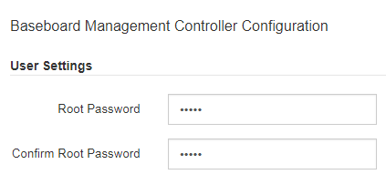

= Cambie la contraseña raíz de la interfaz de BMC
:allow-uri-read: 
:icons: font
:imagesdir: ../media/

[role="lead"]
Por motivos de seguridad, debe cambiar la contraseña del usuario raíz del BMC.

.Lo que necesitará
El cliente de gestión está usando un xref:../admin/web-browser-requirements.adoc[navegador web compatible].

.Acerca de esta tarea
Al instalar el dispositivo por primera vez, el BMC utiliza una contraseña predeterminada para el usuario raíz (`root/calvin`). Debe cambiar la contraseña del usuario raíz para proteger el sistema.

.Pasos
. Desde el cliente, introduzca la URL del instalador de dispositivos de StorageGRID: +
`*https://_services_appliance_IP_:8443*`
+
Para `services_appliance_IP`, Utilice la dirección IP del dispositivo en cualquier red StorageGRID.

+
Aparece la página de inicio del instalador de dispositivos de StorageGRID.

. Seleccione *Configurar hardware* *Configuración de BMC*.
+
image::../media/bmc_configuration_page.gif[Captura de pantalla que muestra la opción Configuración avanzada del BMC]

+
Aparece la página Configuración de la controladora de gestión de placa base.

. Introduzca una nueva contraseña para la cuenta raíz en los dos campos proporcionados.
+

. Haga clic en *Guardar*.

