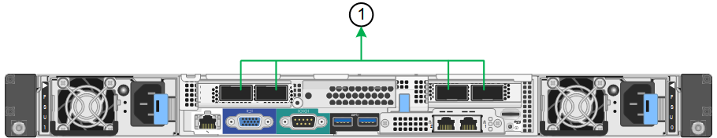
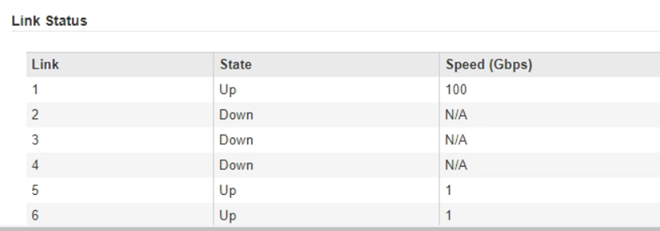
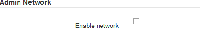

= Configurar enlaces de red (SG100 y SG1000)
:allow-uri-read: 
:icons: font
:imagesdir: ../media/

[role="lead"]
Puede configurar los enlaces de red para los puertos utilizados para conectar el dispositivo a la red de grid, la red de cliente y la red de administración. Puede establecer la velocidad de enlace, así como los modos de enlace de red y puerto.

.Lo que necesitará
* Ha obtenido el equipo adicional necesario para su tipo de cable y velocidad de enlace.
* Ha conectado los puertos de red a los switches que admiten la velocidad elegida.

Si planea utilizar el modo de enlace de puerto de agregado, el modo de enlace de red LACP o el etiquetado de VLAN:

* Conectó los puertos de red del dispositivo a los switches que admiten VLAN y LACP.
* Si varios switches participan en el enlace LACP, los switches admiten grupos de agregación de enlaces de varios chasis (MLAG) o equivalente.
* Comprende cómo configurar los switches para que utilicen VLAN, LACP y MLAG o equivalente.
* Conoce la etiqueta de VLAN única que se utilizará para cada red. Esta etiqueta VLAN se añadirá a cada paquete de red para garantizar que el tráfico de red se dirija a la red correcta.

.Acerca de esta tarea
Las figuras muestran cómo los cuatro puertos de red están Unidos en el modo de enlace de puerto fijo (configuración predeterminada).

*Modo de enlace de puerto fijo SG100*

image::../media/sg100_fixed_port_draft.png[Modo de enlace de puerto fijo SG100]

*Modo de enlace de puerto fijo SG1000*

image::../media/sg1000_fixed_port.png[Modo de enlace de puerto fijo SG1000]

|===
| Llamada | Qué puertos están Unidos 

 a| 
C
 a| 
Los puertos 1 y 3 se unen para la red cliente, si se utiliza esta red.

 a| 
G
 a| 
Los puertos 2 y 4 están Unidos para la red de cuadrícula.

|===
En esta figura, se muestra cómo los cuatro puertos de red están Unidos en el modo de enlace de puerto agregado.

*Modo de enlace de puerto agregado SG100*

image::../media/sg100_aggregate_ports.png[Modo de enlace de puerto agregado SG100]

*Modo de enlace de puerto agregado SG1000*

|===
| Llamada | Qué puertos están Unidos 

 a| 
1
 a| 
Los cuatro puertos se agrupan en un enlace LACP único, lo que permite que se usen todos los puertos para el tráfico de red de grid y de red de cliente.

|===
La tabla resume las opciones para configurar los cuatro puertos de red. La configuración predeterminada se muestra en negrita. Sólo tiene que configurar los ajustes en la página Configuración de vínculos si desea utilizar un valor no predeterminado.

NOTE: De forma predeterminada, la política hash de transmisión LACP se establece en layer2+3 mode. Si es necesario, puede utilizar la API de gestión de grid para cambiarla al modo layer3+4.

* *Modo de enlace de puerto fijo (predeterminado)*
+
|===
| Modo de enlace de red | Red de cliente desactivada (predeterminada) | Red de cliente habilitada 

 a| 
Active-Backup (predeterminado)
 a| 
** Los puertos 2 y 4 utilizan un vínculo de copia de seguridad activa para la red Grid.
** Los puertos 1 y 3 no se usan.
** Una etiqueta de VLAN es opcional.

 a| 
** Los puertos 2 y 4 utilizan un vínculo de copia de seguridad activa para la red Grid.
** Los puertos 1 y 3 utilizan un vínculo de backup activo para la red cliente.
** Es posible especificar etiquetas de VLAN para ambas redes.

 a| 
LACP (802.3ad)
 a| 
** Los puertos 2 y 4 utilizan un enlace LACP para la red de grid.
** Los puertos 1 y 3 no se usan.
** Una etiqueta de VLAN es opcional.

 a| 
** Los puertos 2 y 4 utilizan un enlace LACP para la red de grid.
** Los puertos 1 y 3 utilizan un enlace LACP para la red de cliente.
** Es posible especificar etiquetas de VLAN para ambas redes.

|===
* *Modo de enlace de puerto agregado*
+
|===
| Modo de enlace de red | Red de cliente desactivada (predeterminada) | Red de cliente habilitada 

 a| 
Solo LACP (802.3ad)
 a| 
** Los puertos 1-4 utilizan un enlace LACP único para la red de grid.
** Una única etiqueta VLAN identifica los paquetes de red Grid.

 a| 
** Los puertos 1-4 utilizan un enlace LACP único para la red de grid y la red de cliente.
** Dos etiquetas VLAN permiten que los paquetes de red de cuadrícula se separen de los paquetes de red de cliente.

|===

Para obtener información adicional, consulte el artículo sobre las conexiones de puerto GbE para el dispositivo de servicios.

Esta figura muestra cómo los dos puertos de gestión de 1 GbE de SG100 están Unidos en el modo de enlace de red Active-Backup para la red Admin.

Estas figuras muestran cómo los dos puertos de gestión de 1-GbE del dispositivo están Unidos en el modo de enlace de red de Active-Backup para la red de administración.

*SG100 puertos de red de administración asociados*

image::../media/sg100_bonded_management_ports.png[Puertos de red de administración con conexión SG100]

*SG1000 puertos de red de administración asociados*

image::../media/sg1000_bonded_management_ports.png[Puertos de red de administración con conexión SG1000]

.Pasos
. En la barra de menús del instalador del dispositivo StorageGRID, haga clic en *Configurar redes* > *Configuración de vínculo*.
+
La página Network Link Configuration muestra un diagrama del dispositivo con los puertos de red y administración numerados.

+
*Puertos SG100*

+
image::../media/sg100_configuring_network_ports.png[Conectores traseros SG100]

+
*Puertos SG1000*

+
image::../media/sg1000_configuring_network_ports.png[Puertos SG1000]

+
La tabla Estado del vínculo muestra el estado y la velocidad de los puertos numerados (se muestra SG1000).

+

+
La primera vez que acceda a esta página:

+
** *Velocidad de enlace* se ajusta en *Auto*.
** *El modo de enlace de puerto* está establecido en *fijo*.
** *El modo de enlace de red* se establece en *Active-Backup* para la red de cuadrícula.
** La *Red de administración* está activada y el modo de enlace de red se establece en *independiente*.
** La *Red cliente* está desactivada.
+
image::../media/sg1000_network_link_configuration_fixed.png[Configuración fija de Network Link]

. Seleccione la velocidad de enlace para los puertos de red en la lista desplegable *velocidad de enlace*.
+
Los switches de red que utiliza para la red de cuadrícula y la red de cliente también deben ser compatibles y configurados para esta velocidad. Debe utilizar los adaptadores o transceptores adecuados para la velocidad de enlace configurada. Utilice la velocidad de enlace automático cuando sea posible porque esta opción negocia tanto la velocidad de enlace como el modo de corrección de error de avance (FEC) con el interlocutor de enlace.

. Habilite o deshabilite las redes StorageGRID que tiene previsto utilizar.
+
Se requiere la red de red. No se puede deshabilitar esta red.

+
.. Si el dispositivo no está conectado a la red de administración, anule la selección de la casilla de verificación *Activar red* para la red de administración.
+

.. Si el dispositivo está conectado a la red cliente, seleccione la casilla de verificación *Activar red* de la red cliente.
+
Ahora se muestra la configuración de la red de cliente para los puertos NIC de datos.

. Consulte la tabla y configure el modo de enlace de puerto y el modo de enlace de red.
+
Este ejemplo muestra:

+
** *Agregado* y *LACP* seleccionados para la red Grid y las redes cliente. Debe especificar una etiqueta de VLAN exclusiva para cada red. Puede seleccionar valores entre 0 y 4095.
** *Active-Backup* seleccionado para la red de administración.
+
image::../media/sg1000_network_link_configuration_aggregate.png[Agregado de configuración de Network Link]

. Cuando esté satisfecho con sus selecciones, haga clic en *Guardar*.
+

NOTE: Puede perder la conexión si ha realizado cambios en la red o el enlace que está conectado a través de. Si no vuelve a conectarse en un minuto, vuelva a introducir la URL del instalador de dispositivos StorageGRID utilizando una de las otras direcciones IP asignadas al dispositivo: +
`*https://_services_appliance_IP_:8443*`

.Información relacionada
xref:obtaining-additional-equipment-and-tools-sg100-and-sg1000.adoc[Obtener equipamiento y herramientas adicionales (SG100 y SG1000)]
