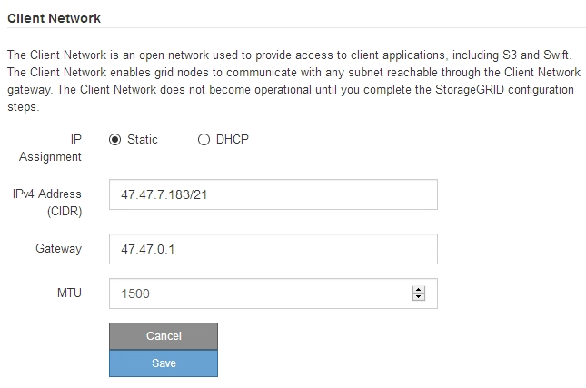

= Configure las direcciones IP de StorageGRID
:allow-uri-read: 
:icons: font
:imagesdir: ../media/

[role="lead"]
El instalador de dispositivos StorageGRID se utiliza para configurar las direcciones IP y la información de enrutamiento utilizadas para el dispositivo de servicios en las redes Grid, Admin y Cliente de StorageGRID.

.Acerca de esta tarea
Debe asignar una IP estática al dispositivo en cada red conectada o asignar una concesión permanente a la dirección del servidor DHCP.

Si desea cambiar la configuración del enlace, consulte las instrucciones para cambiar la configuración del vínculo del dispositivo de servicios.

.Pasos
. En el instalador del dispositivo StorageGRID, seleccione *Configurar redes* > *Configuración IP*.
+
Aparece la página Configuración de IP.

. Para configurar Grid Network, seleccione *Static* o *DHCP* en la sección *Grid Network* de la página.
+
image::../media/grid_network_static.png[IP de red de grid]

. Si ha seleccionado *estático*, siga estos pasos para configurar la red de cuadrícula:
+
.. Introduzca la dirección IPv4 estática utilizando la notación CIDR.
.. Introduzca la puerta de enlace.
+
Si la red no tiene una puerta de enlace, vuelva a introducir la misma dirección IPv4 estática.

.. Si desea utilizar tramas gigantes, cambie el campo MTU a un valor adecuado para tramas gigantes, como 9000. De lo contrario, mantenga el valor predeterminado de 1500.
+

IMPORTANT: El valor de MTU de la red debe coincidir con el valor configurado en el puerto del switch al que está conectado el nodo. De lo contrario, pueden ocurrir problemas de rendimiento de red o pérdida de paquetes.

+

IMPORTANT: Para obtener el mejor rendimiento de red, todos los nodos deben configurarse con valores MTU similares en sus interfaces de Grid Network. La alerta *Red de cuadrícula MTU* se activa si hay una diferencia significativa en la configuración de MTU para la Red de cuadrícula en nodos individuales. Los valores de MTU no tienen que ser iguales para todos los tipos de red.

.. Haga clic en *Guardar*.
+
Al cambiar la dirección IP, la pasarela y la lista de subredes también pueden cambiar.

+
Si pierde la conexión con el instalador de dispositivos StorageGRID, vuelva a introducir la URL con la nueva dirección IP estática que acaba de asignar. Por ejemplo, +
`*https://_services_appliance_IP_:8443*`

.. Confirme que la lista de subredes de red es correcta.
+
Si tiene subredes de cuadrícula, se requiere la puerta de enlace de red de cuadrícula. Todas las subredes de la cuadrícula especificadas deben ser accesibles a través de esta puerta de enlace. Estas subredes de red de cuadrícula también deben definirse en la Lista de subredes de red de cuadrícula del nodo de administración principal al iniciar la instalación de StorageGRID.

+

NOTE: La ruta predeterminada no aparece en la lista. Si la red de cliente no está activada, la ruta predeterminada utilizará la puerta de enlace de red de cuadrícula.

+
*** Para agregar una subred, haga clic en el icono de inserción image:../media/icon_plus_sign_black_on_white.gif["insertar icono"] a la derecha de la última entrada.
*** Para eliminar una subred no utilizada, haga clic en el icono de eliminación image:../media/icon_nms_delete_new.gif["icono de eliminar"].

.. Haga clic en *Guardar*.

. Si ha seleccionado *DHCP*, siga estos pasos para configurar Grid Network:
+
.. Después de seleccionar el botón de opción *DHCP*, haga clic en *Guardar*.
+
Los campos *Dirección IPv4*, *Puerta de enlace* y *subredes* se rellenan automáticamente. Si el servidor DHCP está configurado para asignar un valor MTU, el campo *MTU* se rellena con ese valor y el campo pasa a ser de sólo lectura.

+
El navegador web se redirige automáticamente a la nueva dirección IP para el instalador de dispositivos StorageGRID.

.. Confirme que la lista de subredes de red es correcta.
+
Si tiene subredes de cuadrícula, se requiere la puerta de enlace de red de cuadrícula. Todas las subredes de la cuadrícula especificadas deben ser accesibles a través de esta puerta de enlace. Estas subredes de red de cuadrícula también deben definirse en la Lista de subredes de red de cuadrícula del nodo de administración principal al iniciar la instalación de StorageGRID.

+

NOTE: La ruta predeterminada no aparece en la lista. Si la red de cliente no está activada, la ruta predeterminada utilizará la puerta de enlace de red de cuadrícula.

+
*** Para agregar una subred, haga clic en el icono de inserción image:../media/icon_plus_sign_black_on_white.gif["insertar icono"] a la derecha de la última entrada.
*** Para eliminar una subred no utilizada, haga clic en el icono de eliminación image:../media/icon_nms_delete_new.gif["icono de eliminar"].

.. Si desea utilizar tramas gigantes, cambie el campo MTU a un valor adecuado para tramas gigantes, como 9000. De lo contrario, mantenga el valor predeterminado de 1500.
+

IMPORTANT: El valor de MTU de la red debe coincidir con el valor configurado en el puerto del switch al que está conectado el nodo. De lo contrario, pueden ocurrir problemas de rendimiento de red o pérdida de paquetes.

+

IMPORTANT: Para obtener el mejor rendimiento de red, todos los nodos deben configurarse con valores MTU similares en sus interfaces de Grid Network. La alerta *Red de cuadrícula MTU* se activa si hay una diferencia significativa en la configuración de MTU para la Red de cuadrícula en nodos individuales. Los valores de MTU no tienen que ser iguales para todos los tipos de red.

.. Haga clic en *Guardar*.

. Para configurar la Red de administración, seleccione *estático* o *DHCP* en la sección Red de administración de la página.
+

NOTE: Para configurar la Red de administración, debe activar la Red de administración en la página Configuración de vínculos.

+
image::../media/admin_network_static.png[IP de red de administrador]

. Si ha seleccionado *estático*, siga estos pasos para configurar la red de administración:
+
.. Introduzca la dirección IPv4 estática, mediante la notación CIDR, para el puerto de gestión 1 del dispositivo.
+
El puerto de gestión 1 está a la izquierda de los dos puertos RJ45 de 1-GbE del extremo derecho del dispositivo.

.. Introduzca la puerta de enlace.
+
Si la red no tiene una puerta de enlace, vuelva a introducir la misma dirección IPv4 estática.

.. Si desea utilizar tramas gigantes, cambie el campo MTU a un valor adecuado para tramas gigantes, como 9000. De lo contrario, mantenga el valor predeterminado de 1500.
+

IMPORTANT: El valor de MTU de la red debe coincidir con el valor configurado en el puerto del switch al que está conectado el nodo. De lo contrario, pueden ocurrir problemas de rendimiento de red o pérdida de paquetes.

.. Haga clic en *Guardar*.
+
Al cambiar la dirección IP, la pasarela y la lista de subredes también pueden cambiar.

+
Si pierde la conexión con el instalador de dispositivos StorageGRID, vuelva a introducir la URL con la nueva dirección IP estática que acaba de asignar. Por ejemplo, +
`*https://_services_appliance_:8443*`

.. Confirme que la lista de subredes de la red administrativa es correcta.
+
Debe verificar que se pueda acceder a todas las subredes mediante la puerta de enlace que ha proporcionado.

+

NOTE: No se puede realizar la ruta predeterminada para utilizar la puerta de enlace de red de administración.

+
*** Para agregar una subred, haga clic en el icono de inserción image:../media/icon_plus_sign_black_on_white.gif["insertar icono"] a la derecha de la última entrada.
*** Para eliminar una subred no utilizada, haga clic en el icono de eliminación image:../media/icon_nms_delete_new.gif["icono de eliminar"].

.. Haga clic en *Guardar*.

. Si ha seleccionado *DHCP*, siga estos pasos para configurar la red de administración:
+
.. Después de seleccionar el botón de opción *DHCP*, haga clic en *Guardar*.
+
Los campos *Dirección IPv4*, *Puerta de enlace* y *subredes* se rellenan automáticamente. Si el servidor DHCP está configurado para asignar un valor MTU, el campo *MTU* se rellena con ese valor y el campo pasa a ser de sólo lectura.

+
El navegador web se redirige automáticamente a la nueva dirección IP para el instalador de dispositivos StorageGRID.

.. Confirme que la lista de subredes de la red administrativa es correcta.
+
Debe verificar que se pueda acceder a todas las subredes mediante la puerta de enlace que ha proporcionado.

+

NOTE: No se puede realizar la ruta predeterminada para utilizar la puerta de enlace de red de administración.

+
*** Para agregar una subred, haga clic en el icono de inserción image:../media/icon_plus_sign_black_on_white.gif["insertar icono"] a la derecha de la última entrada.
*** Para eliminar una subred no utilizada, haga clic en el icono de eliminación image:../media/icon_nms_delete_new.gif["icono de eliminar"].

.. Si desea utilizar tramas gigantes, cambie el campo MTU a un valor adecuado para tramas gigantes, como 9000. De lo contrario, mantenga el valor predeterminado de 1500.
+

IMPORTANT: El valor de MTU de la red debe coincidir con el valor configurado en el puerto del switch al que está conectado el nodo. De lo contrario, pueden ocurrir problemas de rendimiento de red o pérdida de paquetes.

.. Haga clic en *Guardar*.

. Para configurar la red de cliente, seleccione *Static* o *DHCP* en la sección *Client Network* de la página.
+

NOTE: Para configurar la red de cliente, debe activar la red de cliente en la página Configuración de vínculos.

+

. Si ha seleccionado *estático*, siga estos pasos para configurar la red de cliente:
+
.. Introduzca la dirección IPv4 estática utilizando la notación CIDR.
.. Haga clic en *Guardar*.
.. Confirme que la dirección IP de la puerta de enlace de red de cliente es correcta.
+

NOTE: Si la red de cliente está activada, se muestra la ruta predeterminada. La ruta predeterminada utiliza la puerta de enlace de red de cliente y no se puede mover a otra interfaz mientras la red de cliente está activada.

.. Si desea utilizar tramas gigantes, cambie el campo MTU a un valor adecuado para tramas gigantes, como 9000. De lo contrario, mantenga el valor predeterminado de 1500.
+

IMPORTANT: El valor de MTU de la red debe coincidir con el valor configurado en el puerto del switch al que está conectado el nodo. De lo contrario, pueden ocurrir problemas de rendimiento de red o pérdida de paquetes.

.. Haga clic en *Guardar*.

. Si ha seleccionado *DHCP*, siga estos pasos para configurar la red de cliente:
+
.. Después de seleccionar el botón de opción *DHCP*, haga clic en *Guardar*.
+
Los campos *Dirección IPv4* y *Puerta de enlace* se rellenan automáticamente. Si el servidor DHCP está configurado para asignar un valor MTU, el campo *MTU* se rellena con ese valor y el campo pasa a ser de sólo lectura.

+
El navegador web se redirige automáticamente a la nueva dirección IP para el instalador de dispositivos StorageGRID.

.. Confirme que la puerta de enlace es correcta.
+

NOTE: Si la red de cliente está activada, se muestra la ruta predeterminada. La ruta predeterminada utiliza la puerta de enlace de red de cliente y no se puede mover a otra interfaz mientras la red de cliente está activada.

.. Si desea utilizar tramas gigantes, cambie el campo MTU a un valor adecuado para tramas gigantes, como 9000. De lo contrario, mantenga el valor predeterminado de 1500.
+

IMPORTANT: El valor de MTU de la red debe coincidir con el valor configurado en el puerto del switch al que está conectado el nodo. De lo contrario, pueden ocurrir problemas de rendimiento de red o pérdida de paquetes.

.Información relacionada
xref:changing-link-configuration-of-services-appliance.adoc[Cambiar la configuración del vínculo del dispositivo de servicios]
