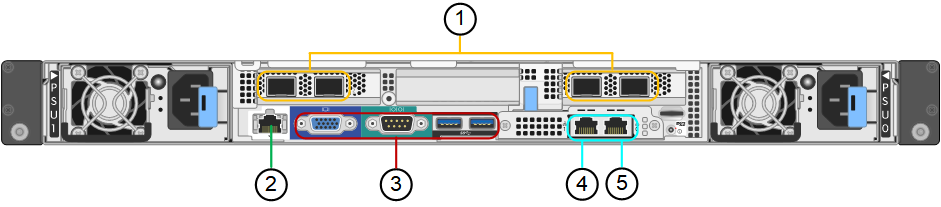

= Descripción general de los dispositivos SG100 y SG1000
:allow-uri-read: 
:icons: font
:imagesdir: ../media/

[role="lead"]
La aplicación de servicios SG100 de StorageGRID y la aplicación de servicios SG1000 pueden funcionar como nodo de puerta de enlace y como nodo de administración para ofrecer servicios de equilibrio de carga de alta disponibilidad en un sistema StorageGRID. Ambos dispositivos pueden funcionar como nodos de puerta de enlace y nodos de administración (primarios o no primarios) al mismo tiempo.

== Funciones de los dispositivos

Ambos modelos del dispositivo de servicios ofrecen las siguientes características:

* Funciones del nodo de puerta de enlace o del nodo de administración para un sistema StorageGRID.
* El instalador de dispositivos StorageGRID para simplificar la puesta en marcha y la configuración de nodos.
* Cuando se implementa, puede acceder al software StorageGRID desde un nodo de administración existente o desde el software descargado en una unidad local. Para simplificar aún más el proceso de implementación, se incluye una versión reciente del software en el dispositivo durante la fabricación.
* Un controlador de administración en placa base (BMC) para supervisar y diagnosticar parte del hardware del dispositivo.
* La capacidad de conectarse a las tres redes StorageGRID, incluidas la red de grid, la red de administración y la red de cliente:
+
** El SG100 admite hasta cuatro conexiones de 10 o 25 GbE a la red Grid y a la red de clientes.
** El SG1000 admite hasta cuatro conexiones de 10, 25, 40 o 100 GbE a la red Grid y a la red de clientes.

== Diagramas SG100 y SG1000

Esta figura muestra la parte frontal del SG100 y el SG1000 con el bisel retirado.

NOTE: Desde la parte frontal, los dos aparatos son idénticos a excepción del nombre del producto en el bisel.

Las dos unidades de estado sólido (SSD), indicadas en el contorno naranja, se utilizan para almacenar el sistema operativo StorageGRID y se reflejan con RAID1 para redundancia. Cuando el dispositivo de servicios SG100 o SG1000 se configura como un nodo de administración, estas unidades se utilizan para almacenar registros de auditoría, métricas y tablas de bases de datos.

Las ranuras de unidades restantes están vacías.

image::../media/sg1000_front_with_ssds.png[Frontal con SSD SG100 y SG1000]

== Conectores en la parte trasera de SG100

Esta figura muestra los conectores de la parte posterior del SG100.

|===
|  | Puerto | Tipo | Uso 

 a| 
1
 a| 
Puertos de red 1-4
 a| 
10/25-GbE, según el tipo de transceptor cable o SFP (se admiten los módulos SFP28 y SFP+), la velocidad del switch y la velocidad de enlace configurada
 a| 
Conéctese a la red de red y a la red de cliente para StorageGRID.

 a| 
2
 a| 
Puerto de gestión de BMC
 a| 
1 GbE (RJ-45).
 a| 
Conéctese al controlador de administración de la placa base del dispositivo.

 a| 
3
 a| 
Puertos de diagnóstico y soporte
 a| 
* VGA
* Serie, 115200 8-N-1
* USB

 a| 
Reservado para uso del soporte técnico.

 a| 
4
 a| 
Puerto de red de administrador 1
 a| 
1 GbE (RJ-45).
 a| 
Conecte el dispositivo a la red de administración para StorageGRID.

 a| 
5
 a| 
Puerto de red de administrador 2
 a| 
1 GbE (RJ-45).
 a| 
Opciones:

* Bond con el puerto de gestión 1 para una conexión redundante con la red de administrador para StorageGRID.
* Deje desconectado y disponible para acceso local temporal (IP 169.254.0.1).
* Durante la instalación, utilice el puerto 2 para la configuración de IP si las direcciones IP asignadas por DHCP no están disponibles.

|===

== Conectores en la parte trasera de SG1000

Esta figura muestra los conectores de la parte posterior del SG1000.

image::../media/sg1000_rear_connectors.png[Conectores posteriores SG1000]

|===
|  | Puerto | Tipo | Uso 

 a| 
1
 a| 
Puertos de red 1-4
 a| 
10/25/40/100-GbE, basado en el tipo de cable o transceptor, la velocidad del switch y la velocidad de enlace configurada. Se admiten QSFP28 y QSFP+ (40 GbE) de forma nativa y se pueden utilizar transceptores SFP28/SFP+ con una QSA (se vende por separado) para utilizar velocidades de 10 GbE.
 a| 
Conéctese a la red de red y a la red de cliente para StorageGRID.

 a| 
2
 a| 
Puerto de gestión de BMC
 a| 
1 GbE (RJ-45).
 a| 
Conéctese al controlador de administración de la placa base del dispositivo.

 a| 
3
 a| 
Puertos de diagnóstico y soporte
 a| 
* VGA
* Serie, 115200 8-N-1
* USB

 a| 
Reservado para uso del soporte técnico.

 a| 
4
 a| 
Puerto de red de administrador 1
 a| 
1 GbE (RJ-45).
 a| 
Conecte el dispositivo a la red de administración para StorageGRID.

 a| 
5
 a| 
Puerto de red de administrador 2
 a| 
1 GbE (RJ-45).
 a| 
Opciones:

* Bond con el puerto de gestión 1 para una conexión redundante con la red de administrador para StorageGRID.
* Deje desconectado y disponible para acceso local temporal (IP 169.254.0.1).
* Durante la instalación, utilice el puerto 2 para la configuración de IP si las direcciones IP asignadas por DHCP no están disponibles.

|===