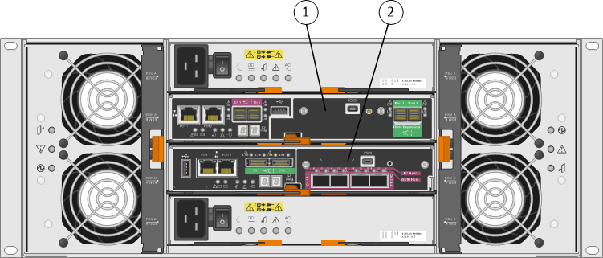

= Diagramas de hardware
:allow-uri-read: 
:icons: font
:imagesdir: ../media/

[role="lead"]
Los modelos SG5612 y SG5660 del dispositivo StorageGRID incluyen una controladora E2700 y una controladora E5600SG. Debe revisar los diagramas para conocer las diferencias entre los modelos y las controladoras.

== Modelo SG5612 2U: Vista posterior de la controladora E2700 y la controladora E5600SG

image::../media/sg5612_2u_rear_view.gif[Vista posterior de SG5612 con dos controladoras]

|===
| Llamada | Descripción 

 a| 
1
 a| 
Controladora E2700

 a| 
2
 a| 
Controladora E5600SG

|===

== Modelo SG5660 4U: Vista trasera de la controladora E2700 y de la controladora E5600SG

La controladora E2700 está por encima de la controladora E5600SG.

|===
| Llamada | Descripción 

 a| 
1
 a| 
Controladora E2700

 a| 
2
 a| 
Controladora E5600SG

|===

== Parte posterior de la controladora E2700

image::../media/sga_controller_2700_diagram_callouts.gif[Diagrama de E2700]

|===
| Llamada | Descripción 

 a| 
1
 a| 
Puerto de gestión 1 (conéctese a la red donde está instalado SANtricity Storage Manager).

 a| 
2
 a| 
Puerto de gestión 2 (utilice durante la instalación para conectarse a un portátil).

 a| 
3
 a| 
Puerto 1 de interconexión SAS

 a| 
4
 a| 
Puerto de interconexión SAS 2

 a| 
5
 a| 
Puerto de conexión serie

 a| 
6
 a| 
Pantalla de siete segmentos

|===

NOTE: Los dos puertos SAS con la etiqueta Drive Expansion (verde) en la parte posterior del controlador E2700 no se utilizan. El dispositivo StorageGRID no admite bandejas de unidades de ampliación.

== Vista trasera de la controladora E5600SG

image::../media/sga_controller_5600_diagram_callouts.gif[Diagrama de E5600]

|===
| Llamada | Descripción 

 a| 
1
 a| 
El puerto de gestión 1se conecta a la red de administración para StorageGRID.

 a| 
2
 a| 
Opciones del puerto de gestión 2:

* Bond con el puerto de gestión 1 para una conexión redundante con la red de administrador para StorageGRID.
* Deje sin cables y disponible para acceso local temporal (IP 169.254.0.1).
* Durante la instalación, utilice esta opción para la configuración IP si las direcciones IP asignadas por DHCP no están disponibles.

 a| 
3
 a| 
Puerto 1 de interconexión SAS

 a| 
4
 a| 
Puerto de interconexión SAS 2

 a| 
5
 a| 
LED de fallo y activo para el puerto de red 10-GbE 1

 a| 
6
 a| 
LED de fallo y activo para el puerto de red de 10 GbE 2

 a| 
7
 a| 
LED de fallo y activo para el puerto de red 10-GbE 3

 a| 
8
 a| 
LED de fallo y activo para el puerto de red 10-GbE 4

 a| 
9
 a| 
Necesita el LED de atención

 a| 
10
 a| 
Pantalla de siete segmentos

 a| 
11
 a| 
Puerto de red 10 GbE 1

 a| 
12
 a| 
Puerto de red de 10 GbE 2

 a| 
13
 a| 
Puerto de red 10-GbE 3

 a| 
14
 a| 
Puerto de red 10-GbE 4

|===

NOTE: La tarjeta de interfaz del host (HIC) en la controladora del dispositivo StorageGRID E5600SG admite solo conexiones Ethernet de 10 GB. No se puede utilizar para conexiones iSCSI.
