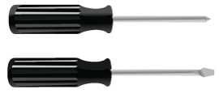
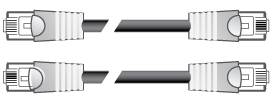

= Obtener herramientas y equipos adicionales (SG5600)
:allow-uri-read: 
:icons: font
:imagesdir: ../media/

[role="lead"]
Antes de instalar el dispositivo SG5600, confirme que dispone de todos los equipos y herramientas adicionales que necesita.

* *Destornilladores*
+

+
Phillips no 2 destornillador

+
Destornilladores de hoja plana medianos

* *Muñequera ESD*
+
image::../media/appliance_wriststrap.gif[Muñequera ESD]

* *Cables Ethernet*
+

* *Interruptor Ethernet*
+
image::../media/appliance_ethernet_switch_network_hub.gif[Concentrador Ethernet]

* *Portátil de servicio*xref:../admin/web-browser-requirements.adoc[Navegador web compatible]
+
image::../media/appliance_laptop.gif[Estación de gestión]

