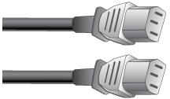
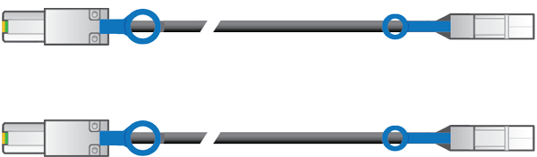

= Cajas de desempaquetado (SG5600)
:allow-uri-read: 
:icons: font
:imagesdir: ../media/

[role="lead"]
Antes de instalar el aparato StorageGRID, desembale todas las cajas y compare el contenido con los artículos del recibo de embalaje.

* *Carcasa SG5660, un chasis 4U con 60 unidades*
+
image::../media/appliance_enclosure.gif[Compartimento de 4 U.]

* *SG5612, un chasis 2U con 12 unidades*
+
image::../media/appliance_enclosure_2u.gif[Chasis DE1600 2U]

* *Cubierta 4U o tapas 2U*
+
image:../media/appliance_bezel.gif["Cubierta protectora de 4 U."] image:../media/appliance_bezel_2u_endcaps.gif["Extremos de 2U"]

* *Unidades NL-SAS*
+
image::../media/appliance_drive.gif[Unidad]

+
Las unidades están preinstalados en 2U SG5612, pero no en 4U SG5660 para seguridad de envío.

* *Controlador E5600SG*
+
image::../media/sga_controller_5600_diagram.gif[Controladora E5600]

* *Controladora E2700*
+
image::../media/sga_controller_2700_diagram.gif[Controladora E2700]

* *Raíles y tornillos de montaje*
+
image::../media/appliance_mounting_rail_kit.png[Kit de montaje de raíl]

* *Asas de gabinete (sólo carcasas 4U)*
+
image::../media/appliance_enclosure_handles.gif[Asas del compartimento]

== Cables y conectores

El envío del dispositivo StorageGRID incluye los siguientes cables y conectores:

* *Cables de alimentación para su país*
+

+
El aparato se suministra con dos cables de alimentación de CA para conectarse a una fuente de alimentación externa, como un enchufe de pared. Es posible que el armario tenga cables de alimentación especiales que utilice en lugar de los cables de alimentación que se suministran con el aparato.

* *Cables de interconexión SAS*
+

+
Dos cables de interconexión SAS de 0.5 metros con conectores mini-SAS-HD y mini-SAS.

+
El conector cuadrado se conecta a la controladora E2700 y el conector rectangular se conecta a la controladora E5600SG.

