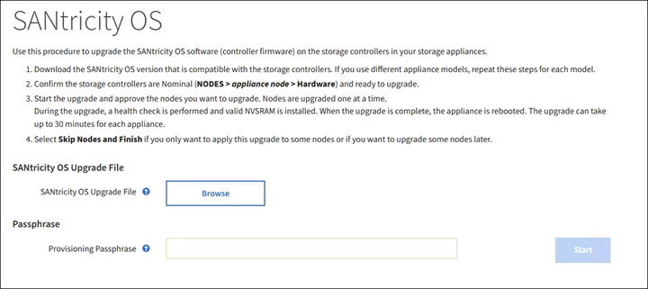

= Actualizar el sistema operativo SANtricity en controladoras de almacenamiento mediante Grid Manager
:allow-uri-read: 
:icons: font
:imagesdir: ../media/

[role="lead"]
Para aplicar una actualización, se deben usar Grid Manager para las controladoras de almacenamiento que actualmente utilizan SANtricity OS 08.42.20.00 (11.42) o posterior.

.Lo que necesitará
* Ha consultado con la herramienta de matriz de interoperabilidad (IMT) de NetApp para confirmar que la versión del sistema operativo SANtricity que utiliza para la actualización es compatible con su dispositivo.
* Tiene el permiso de mantenimiento o acceso raíz.
* Ha iniciado sesión en Grid Manager mediante un xref:../admin/web-browser-requirements.adoc[navegador web compatible].
* Tiene la clave de acceso de aprovisionamiento.
* Tiene acceso a la página de descargas de NetApp para SANtricity OS.

.Acerca de esta tarea
No puede realizar otras actualizaciones de software (actualización de software StorageGRID o revisión) hasta que haya completado el proceso de actualización de sistema operativo SANtricity. Si intenta iniciar una revisión o una actualización de software de StorageGRID antes de que haya finalizado el proceso de actualización de SANtricity OS, se le redirigirá a la página de actualización de SANtricity OS.

No se completará el procedimiento hasta que la actualización del sistema operativo SANtricity se haya aplicado correctamente a todos los nodos aplicables seleccionados para la actualización. Es posible que tardar más de 30 minutos cargar el sistema operativo SANtricity en cada nodo (de forma secuencial) y hasta 90 minutos para reiniciar cada dispositivo de almacenamiento StorageGRID.

CAUTION: Los siguientes pasos sólo son aplicables cuando se utiliza Grid Manager para realizar la actualización. No es posible actualizar las controladoras de almacenamiento en el dispositivo mediante Grid Manager cuando las controladoras utilizan SANtricity OS anteriores a 08.42.20.00 (11.42).

NOTE: Este procedimiento actualizará automáticamente la NVSRAM a la versión más reciente asociada con la actualización del sistema operativo SANtricity. No es necesario aplicar un archivo de actualización de NVSRAM aparte.

.Pasos
. [[Download_santricity_os]] Descargar el nuevo archivo de software de sistema operativo SANtricity del sitio de soporte de NetApp.
+
Asegúrese de elegir la versión de sistema operativo SANtricity para las controladoras de almacenamiento.

+
https://mysupport.netapp.com/site/products/all/details/storagegrid-appliance/downloads-tab["Descargas de NetApp: Dispositivo de StorageGRID"^]

. Seleccione *MANTENIMIENTO* > *sistema* > *actualización de software*.
+
image::../media/software_update_landing.png[Página de destino de la actualización del software]

. En la sección actualización del sistema operativo SANtricity, seleccione *Actualizar*.
+
Se muestra la página actualización de sistema operativo SANtricity.

+

. Seleccione el archivo de actualización del sistema operativo SANtricity que descargó del sitio de soporte de NetApp.
+
.. Seleccione *examinar*.
.. Localice y seleccione el archivo.
.. Seleccione *Abrir*.
+
El archivo se carga y se valida. Cuando se realiza el proceso de validación, se muestra el nombre del archivo junto al botón *examinar*.

+

NOTE: No cambie el nombre del archivo ya que forma parte del proceso de verificación.

. Introduzca la clave de acceso de aprovisionamiento.
+
El botón *Iniciar* está activado.

+
image::../media/santricity_start_button.png[Captura de pantalla que muestra la página StorageGRID First SANtricity OS]

. Seleccione *Iniciar*.
+
Aparece un cuadro de advertencia que indica que es posible que se pierda temporalmente la conexión del explorador como se reinician los servicios de los nodos actualizados.

+
image::../media/santricity_upgrade_warning.png[la captura de pantalla que muestra la conexión se perderá temporalmente]

. Seleccione *Aceptar* para almacenar el archivo de actualización del sistema operativo SANtricity en el nodo de administración principal.
+
Cuando se inicia la actualización del sistema operativo SANtricity:

+
.. Se ejecuta la comprobación del estado. Este proceso comprueba que ningún nodo tenga el estado de necesita atención.
+

NOTE: Si se informa de algún error, solucione y seleccione *Iniciar* de nuevo.

.. Se muestra la tabla progreso de actualización de sistema operativo SANtricity. En esta tabla se muestran todos los nodos de almacenamiento del grid y la fase actual de la actualización de cada nodo.
+

NOTE: La tabla muestra todos los nodos de almacenamiento del dispositivo. No se muestran los nodos de almacenamiento basados en software. Seleccione *aprobar* para todos los nodos que requieran la actualización.

+
image::../media/santricity_upgrade_progress_table.png[Captura de pantalla que muestra la parte del progreso de la actualización del sistema operativo SANtricity de la página actualización del sistema operativo SANtricity]

. Opcionalmente, ordene la lista de nodos en orden ascendente o descendente por *Sitio*, *Nombre*, *progreso*, *etapa*, *Detalles*, O *Versión actual del firmware de la controladora*. O bien, introduzca un término en el cuadro *Buscar* para buscar nodos específicos.
+
Puede desplazarse por la lista de nodos utilizando las flechas izquierda y derecha de la esquina inferior derecha de la sección.

. Apruebe los nodos de cuadrícula que está listo para agregar a la cola de actualización. Los nodos aprobados del mismo tipo se actualizan de uno en uno.
+

IMPORTANT: No apruebe la actualización de SANtricity OS para un nodo de almacenamiento de dispositivos a menos que esté seguro de que el nodo esté listo para detenerse y reiniciar. Cuando la actualización de SANtricity OS se aprueba en un nodo, los servicios de ese nodo se detienen y comienza el proceso de actualización. Más tarde, cuando el nodo finaliza la actualización, el nodo del dispositivo se reinicia. Estas operaciones pueden provocar interrupciones del servicio en los clientes que se comunican con el nodo.

+
** Seleccione uno de los botones *aprobar todo* para agregar todos los nodos de almacenamiento a la cola de actualización de SANtricity OS.
+

NOTE: Si el orden en el que se actualizan los nodos es importante, apruebe los nodos o grupos de nodos de uno en uno y espere a que la actualización se complete en cada nodo antes de aprobar los siguientes nodos.

** Seleccione uno o más botones *aprobar* para agregar uno o más nodos a la cola de actualización de SANtricity OS.
+
Después de seleccionar *aprobar*, el proceso de actualización determina si se puede actualizar el nodo. Si se puede actualizar un nodo, se agrega a la cola de actualización.

+
En algunos nodos, el archivo de actualización seleccionado no se aplica de forma intencional, y se puede completar el proceso de actualización sin actualizar estos nodos específicos. Los nodos no actualizados intencionalmente muestran una etapa de completado (intento de actualización) y muestran el motivo por el que el nodo no se actualizó en la columna Details.

. Si necesita eliminar un nodo o todos los nodos de la cola de actualización de SANtricity OS, seleccione *Quitar* o *Quitar todo*.
+
Cuando la etapa avanza más allá de la cola, el botón *Quitar* está oculto y ya no puede quitar el nodo del proceso de actualización de SANtricity OS.

. Espere mientras la actualización del SO SANtricity se aplica a cada nodo de grid aprobado.
+
** Si alguno de los nodos muestra una etapa de error mientras se aplica la actualización del sistema operativo SANtricity, se produjo un error en la actualización del nodo. Con la ayuda del soporte técnico, es posible que deba colocar el dispositivo en modo de mantenimiento para recuperarlo.
** Si el firmware del nodo es demasiado antiguo para actualizarse con Grid Manager, el nodo muestra una etapa de error con los detalles: "'debe utilizar el modo de mantenimiento para actualizar SANtricity OS en este nodo. Consulte las instrucciones de instalación y mantenimiento del aparato. Tras la actualización, puede utilizar esta utilidad para futuras actualizaciones». Para resolver el error, haga lo siguiente:
+
... Utilice el modo de mantenimiento para actualizar SANtricity OS en el nodo que muestre una etapa de error.
... Utilice el Administrador de grid para reiniciar y completar la actualización de SANtricity OS.

+
Una vez completada la actualización de SANtricity OS en todos los nodos aprobados, la tabla de progreso de la actualización de SANtricity OS se cierra y un banner verde muestra la fecha y la hora en que se completó la actualización de SANtricity OS.

image::../media/santricity_upgrade_finish_banner.png[Captura de pantalla de la página de actualización de SANtricity OS una vez completada la actualización]

. Si no se puede actualizar un nodo, tenga en cuenta el motivo que se muestra en la columna Details y realice la acción adecuada:
+
** «Ya se ha actualizado el nodo de almacenamiento». No es necesario realizar ninguna otra acción.
** «'la actualización de SANtricity OS no es aplicable a este nodo». El nodo no tiene una controladora de almacenamiento que pueda gestionar el sistema StorageGRID. Complete el proceso de actualización sin actualizar el nodo que muestra este mensaje.
** «'el archivo del sistema operativo SANtricity no es compatible con este nodo». El nodo requiere un archivo de SANtricity OS diferente al que seleccionó. Después de completar la actualización actual, descargue el archivo de sistema operativo SANtricity correcto para el nodo y repita el proceso de actualización.

IMPORTANT: El proceso de actualización del sistema operativo SANtricity no se completará hasta que apruebe la actualización del sistema operativo SANtricity en todos los nodos de almacenamiento enumerados.

. Si desea finalizar la aprobación de nodos y volver a la página de SANtricity OS para permitir la carga de un nuevo archivo de SANtricity OS, haga lo siguiente:
+
.. Seleccione *Omitir nodos y Finalizar*.
+
Aparece una advertencia en la que se pregunta si está seguro de que desea finalizar el proceso de actualización sin actualizar todos los nodos.

.. Seleccione *Aceptar* para volver a la página *SANtricity OS*.
.. Cuando esté listo para continuar aprobando nodos, vaya a. <<download_santricity_os,Descargue el sistema operativo SANtricity>> para reiniciar el proceso de actualización.

+

NOTE: Los nodos ya aprobados y actualizados sin errores siguen actualizando.

. Repita este procedimiento de actualización para todos los nodos con una etapa de finalización que requieran un archivo de actualización de sistema operativo SANtricity diferente.
+

NOTE: Para cualquier nodo con el estado necesita atención, utilice el modo de mantenimiento para realizar la actualización.

+

NOTE: Cuando repita el procedimiento de actualización, deberá aprobar los nodos actualizados anteriormente.

.Información relacionada
https://mysupport.netapp.com/matrix["Herramienta de matriz de interoperabilidad de NetApp"^]

xref:upgrading-santricity-os-on-e2700-controller-using-maintenance-mode.adoc[Actualice el sistema operativo SANtricity en la controladora E2700 mediante modo de mantenimiento]
