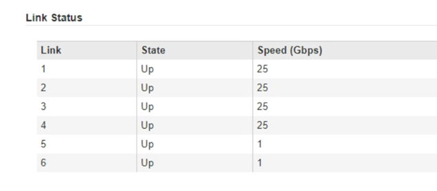

= Configurar enlaces de red (SG5700)
:allow-uri-read: 
:icons: font
:imagesdir: ../media/

[role="lead"]
Puede configurar los enlaces de red para los puertos utilizados para conectar el dispositivo a la red de grid, la red de cliente y la red de administración. Puede establecer la velocidad de enlace, así como los modos de enlace de red y puerto.

.Lo que necesitará
Si tiene pensado utilizar la velocidad de enlace de 25-GbE para los puertos de 10/25-GbE:

* Ha instalado transceptores SFP28 en los puertos que tiene previsto utilizar.
* Ya ha conectado los puertos a switches que admiten estas funciones.
* Comprende cómo configurar los switches para que utilicen esta mayor velocidad.

Si planea utilizar el modo de enlace de puerto agregado, el modo de enlace de red LACP o el etiquetado de VLAN para los puertos 10/25-GbE:

* Conectó los puertos del dispositivo a los switches que pueden ser compatibles con VLAN y LACP.
* Si varios switches participan en el enlace LACP, los switches admiten grupos de agregación de enlaces de varios chasis (MLAG) o equivalente.
* Comprende cómo configurar los switches para que utilicen VLAN, LACP y MLAG o equivalente.
* Conoce la etiqueta de VLAN única que se utilizará para cada red. Esta etiqueta VLAN se añadirá a cada paquete de red para garantizar que el tráfico de red se dirija a la red correcta.
* Si planea utilizar el modo Active-Backup para la red administrativa, habrá conectados cables Ethernet a ambos puertos de gestión de la controladora.

.Acerca de esta tarea
Esta figura muestra cómo los cuatro puertos 10/25-GbE se bonifican en modo de enlace de puerto fijo (configuración predeterminada).

image::../media/e5700sg_fixed_port.gif[Imagen que muestra cómo los puertos 10/25-GbE de la controladora E5700SG se vinculan en modo fijo]

|===
| Llamada | Qué puertos están Unidos 

 a| 
C
 a| 
Los puertos 1 y 3 se unen para la red cliente, si se utiliza esta red.

 a| 
G
 a| 
Los puertos 2 y 4 están Unidos para la red de cuadrícula.

|===
Esta figura muestra cómo los cuatro puertos 10/25-GbE están Unidos en modo de enlace de puerto agregado.

image::../media/e5700sg_aggregate_port.gif[Imagen que muestra cómo los puertos 10/25-GbE de la controladora E5700SG se vinculan en modo de agregado]

|===
| Llamada | Qué puertos están Unidos 

 a| 
1
 a| 
Los cuatro puertos se agrupan en un enlace LACP único, lo que permite que se usen todos los puertos para el tráfico de red de grid y de red de cliente.

|===
La tabla resume las opciones para configurar los cuatro puertos 10/25-GbE. La configuración predeterminada se muestra en negrita. Sólo tiene que configurar los ajustes en la página Configuración de vínculos si desea utilizar un valor no predeterminado.

* *Modo de enlace de puerto fijo (predeterminado)*
+
|===
| Modo de enlace de red | Red de cliente desactivada (predeterminada) | Red de cliente habilitada 

 a| 
Active-Backup (predeterminado)
 a| 
** Los puertos 2 y 4 utilizan un vínculo de copia de seguridad activa para la red Grid.
** Los puertos 1 y 3 no se usan.
** Una etiqueta de VLAN es opcional.

 a| 
** Los puertos 2 y 4 utilizan un vínculo de copia de seguridad activa para la red Grid.
** Los puertos 1 y 3 utilizan un vínculo de backup activo para la red cliente.
** Es posible especificar etiquetas de VLAN para ambas redes.

 a| 
LACP (802.3ad)
 a| 
** Los puertos 2 y 4 utilizan un enlace LACP para la red de grid.
** Los puertos 1 y 3 no se usan.
** Una etiqueta de VLAN es opcional.

 a| 
** Los puertos 2 y 4 utilizan un enlace LACP para la red de grid.
** Los puertos 1 y 3 utilizan un enlace LACP para la red de cliente.
** Es posible especificar etiquetas de VLAN para ambas redes.

|===
* *Modo de enlace de puerto agregado*
+
|===
| Modo de enlace de red | Red de cliente desactivada (predeterminada) | Red de cliente habilitada 

 a| 
Solo LACP (802.3ad)
 a| 
** Los puertos 1-4 utilizan un enlace LACP único para la red de grid.
** Una única etiqueta VLAN identifica los paquetes de red Grid.

 a| 
** Los puertos 1-4 utilizan un enlace LACP único para la red de grid y la red de cliente.
** Dos etiquetas VLAN permiten que los paquetes de red de cuadrícula se separen de los paquetes de red de cliente.

|===

Consulte la información acerca de las conexiones de puertos 10/25-GbE para la controladora E5700SG para obtener más información acerca de los modos de enlace de puerto y enlace de red.

En esta figura, se muestra cómo los dos puertos de gestión de 1-GbE de la controladora E5700SG están Unidos en el modo de enlace de red Active-Backup para la red Admin.

image::../media/e5700sg_bonded_management_ports.gif[Puertos de gestión con conexión SG6000]

.Pasos
. En la barra de menús del instalador del dispositivo StorageGRID, haga clic en *Configurar redes* > *Configuración de vínculo*.
+
La página Network Link Configuration muestra un diagrama del dispositivo con los puertos de red y administración numerados.

+
image::../media/sg5712_configuring_network_ports.png[Puertos de red y gestión SG5712]

+
La tabla Estado del enlace muestra el estado de los vínculos (arriba/abajo) y la velocidad (1/10/25/40/100 Gbps) de los puertos numerados.

+

+
La primera vez que acceda a esta página:

+
** *Velocidad de enlace* se ajusta a *10 GbE*.
** *El modo de enlace de puerto* está establecido en *fijo*.
** *El modo de enlace de red* para la red Grid se establece en *Active-Backup*.
** La *Red de administración* está activada y el modo de enlace de red se establece en *independiente*.
** La *Red cliente* está desactivada.
+
image::../media/network_link_configuration_fixed.png[Captura de pantalla que muestra los ajustes predeterminados de la configuración de vínculos]

. Si planea utilizar la velocidad de enlace de 25 GbE para los puertos de 10/25 GbE, seleccione *25GbE* en la lista desplegable velocidad de enlace.
+
Los switches de red que utiliza para la red de cuadrícula y la red de cliente también deben ser compatibles y configurados para esta velocidad. Los transceptores SFP28 deben estar instalados en los puertos.

. Habilite o deshabilite las redes StorageGRID que tiene previsto utilizar.
+
Se requiere la red de red. No se puede deshabilitar esta red.

+
.. Si el dispositivo no está conectado a la red de administración, anule la selección de la casilla de verificación *Activar red* para la red de administración.
+
image::../media/admin_network_disabled.gif[Captura de pantalla que muestra la casilla de verificación para activar o desactivar la red de administración]

.. Si el dispositivo está conectado a la red cliente, seleccione la casilla de verificación *Activar red* de la red cliente.
+
Ahora se muestran los ajustes de red de clientes para los puertos de 10/25-GbE.

. Consulte la tabla y configure el modo de enlace de puerto y el modo de enlace de red.
+
El ejemplo muestra:

+
** *Agregado* y *LACP* seleccionados para las redes Grid y Client. Debe especificar una etiqueta de VLAN exclusiva para cada red. Puede seleccionar valores entre 0 y 4095.
** *Active-Backup* seleccionado para la red de administración.
+
image::../media/network_link_configuration_aggregate.gif[Captura de pantalla que muestra los ajustes de configuración de vínculos para el modo agregado]

. Cuando esté satisfecho con sus selecciones, haga clic en *Guardar*.
+

NOTE: Puede perder la conexión si ha realizado cambios en la red o el enlace que está conectado a través de. Si no vuelve a conectarse en un minuto, vuelva a introducir la URL del instalador de dispositivos StorageGRID utilizando una de las otras direcciones IP asignadas al dispositivo: +
`*https://_E5700SG_Controller_IP_:8443*`

.Información relacionada
xref:port-bond-modes-for-e5700sg-controller-ports.adoc[Modos de enlace de puerto para puertos de controladora E5700SG]
